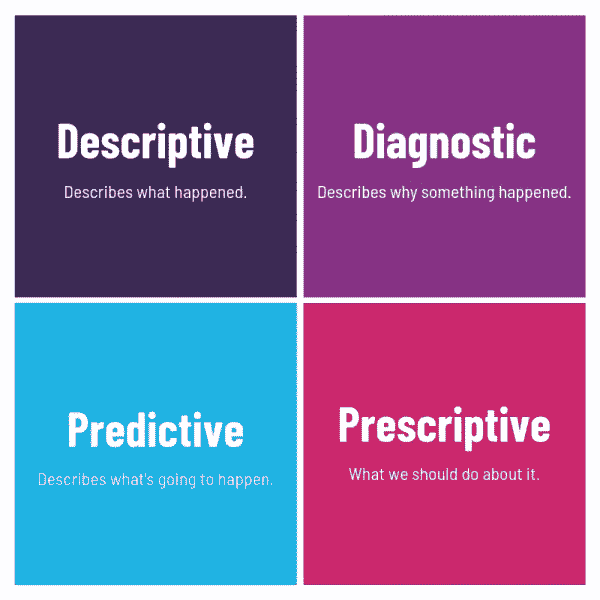
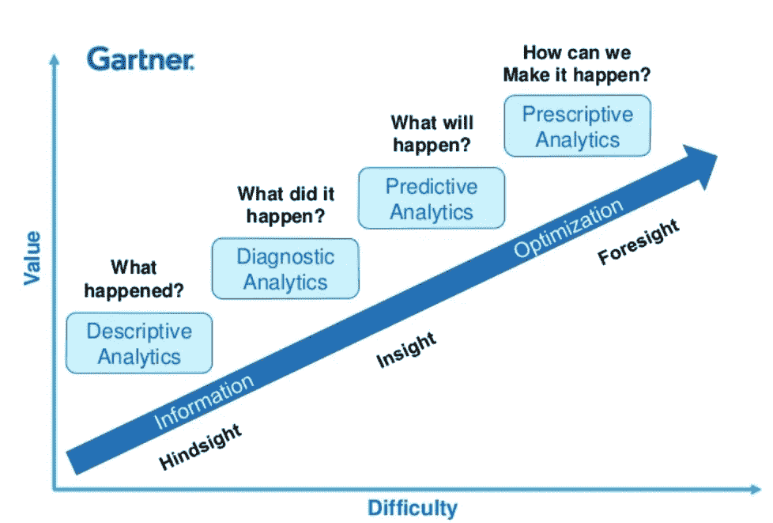

# 不同类型的分析！

> 原文：<https://medium.com/analytics-vidhya/different-types-of-analytics-cd151034442b?source=collection_archive---------5----------------------->

# 描述性分析(过去发生了什么？)

描述性分析或统计学顾名思义:它们“描述”或总结原始数据，并使之成为人类可以理解的东西。它们是描述过去的分析。过去是指事件发生的任何时间点，无论是一分钟前还是一年前。描述性分析是有用的，因为它们允许我们从过去的行为中学习，并理解它们如何影响未来的结果。

**什么时候使用描述性分析？**

当你需要从总体上了解你的公司正在发生什么，以及当你想要总结和描述你的业务的不同方面时，使用描述性分析。

例如:报告、仪表板、可视化等……..

> 目标是把数据变成信息，信息变成洞察~

# **诊断分析学(为什么过去发生了一些事情？)**

**诊断分析**将描述性数据向前推进了一步，并提供了更深入的分析来回答这个问题:为什么会发生这种情况？通常，诊断分析被称为根本原因分析。这包括使用数据发现、数据挖掘、向下钻取和钻取等流程。

这是一个诊断分析的例子，“业务收入增加，可能的原因是对目标营销方法的投资增加，该领域的主要竞争对手关闭。”请注意，描述性分析无法为“我们如何避免这个问题”或“我们如何复制这个解决方案”等重要问题提供答案这些都包含在诊断分析中。

**何时使用诊断分析？**

当您需要了解过去发生的任何事情的 RCA，或者希望了解我的销售额下降的原因以及我们如何控制它时，请使用诊断分析。诊断分析有助于决策，因此当你需要在探索过去的数据后做出任何决定时，它将发挥至关重要的作用。

> 夏天导致的愚蠢。这就是诊断结果…

# **预测分析(未来会怎样？)**

**预测分析**获取历史数据，并将其输入到考虑关键趋势和模式的机器学习模型中。然后将该模型应用于当前数据，以预测接下来会发生什么。

预测分析植根于“预测”可能发生的事情的能力。这些分析是关于理解未来的。预测分析为公司提供基于数据的可行见解。预测分析提供对未来结果可能性的估计。重要的是要记住，没有一种统计算法能够 100%确定地“预测”未来。公司利用这些统计数据来预测未来可能发生的事情。这是因为预测分析的基础是基于概率。

这是一个预测分析产生信用评分的例子。金融服务使用这些分数来确定客户未来按时进行信用支付的概率。

**何时使用预测分析？**

任何时候，当你需要了解未来或者补充你没有的信息时，使用预测分析。

> “你能**预测**未来**的唯一方法就是去创造它。”**

# **规定性**分析(我们如何让它发生？)

相对较新的规定分析领域允许用户“规定”一些不同的可能行动，并引导他们找到解决方案。简而言之，这些分析都是为了提供建议。规范性分析试图量化未来决策的影响，以便在决策实际做出之前对可能的结果提出建议。在最好的情况下，说明性分析不仅预测将会发生什么，还预测为什么会发生，提供关于将利用预测的行动的建议。

假设你是一家航空公司的 CEO，你想让公司利润最大化。说明性分析可以帮助您做到这一点，它可以根据众多因素(包括客户需求、天气和汽油价格)自动调整票价和可用性。例如，当算法识别出今年从洛杉矶到纽约的圣诞节前机票销售落后于去年时，它可以自动降低价格，同时确保在今年油价较高的情况下不会将价格降得太低。

**何时使用说明性分析？**

在你需要向用户提供采取什么行动的建议时，随时使用说明性分析。

> 我相信处方药。我相信感觉会更好。

加特纳