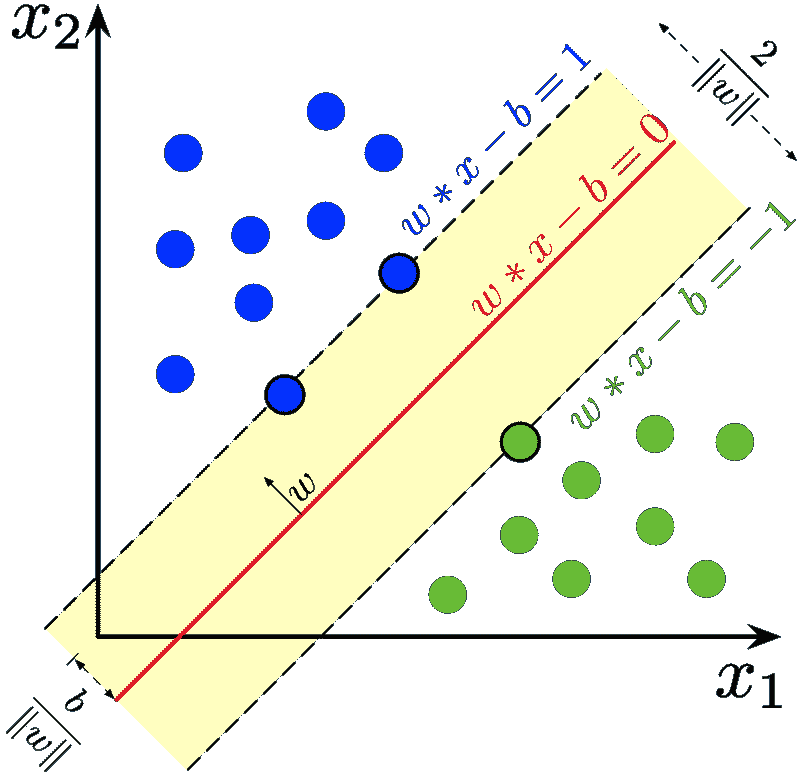

# 不同类型的分类-机器学习基础

> 原文：<https://medium.com/analytics-vidhya/different-types-of-classification-machine-learning-basics-cd9cf354143a?source=collection_archive---------28----------------------->


摄影:克里斯·利维拉尼

> 根据 Andrew NG 的说法，“人工智能是新的电力”

过去两年，人工智能和机器学习领域的发展令人难以置信。

在这个快速发展的世界中，为了与竞争对手竞争，对改进的需求是永恒的。不能忽视产品或服务的改进需求。如果正确和有效地使用，ML(机器学习)提供了这种改进。

在这篇博客中，我将解释分类类型以及如何使用 Python 中的 *scikitlearn* 库来实现它们

**ML 中的分类类型:**

*   二元分类
*   多类分类

1.  **二进制分类:**

在二进制分类中，输出/标签包括两种分类，如真或假、0 或 1、对象 A 或对象 B 等。。输出可以预测为其中任何一个，但不能两者都预测。

二进制分类广泛用于天气预报、医学测试、垃圾邮件检测、信用卡欺诈交易检测等。。

有许多范例可以用来学习二元分类器，例如:

*   逻辑回归
*   决策树
*   随机森林
*   神经网络
*   支持向量机
*   SGD 分类器

我将使用 SVM(支持向量机)分类器来训练一个模型，以解决癌症预测问题

支持向量机是一种监督学习算法，用于基于特征值预测标签。



来源:维基百科

使用 Python 实现 SVM:

*   导入必要的库

```
import pandas as pd
import numpy as np
import sklearn
from sklearn import datasets
```

*   获取数据

```
cancer = datasets.load_breast_cancer()
```

*   了解数据集

```
dir(cancer)
cancer.feature_names
cancer.target
cancer.target_names
```

*   将数据分成训练集和测试集

```
from sklearn.model_selection import train_test_splitX_train, X_test, y_train, y_test = train_test_split(cancer.data,   cancer.target, test_size = 0.33 , random_state=0)print(X_train.shape, X_test.shape, y_train.shape, y_test.shape)
```

*   导入分类器

```
from sklearn.svm import SVC
```

*   训练数据

```
model = SVC(kernel = 'linear')     *#The parameter can be changed*
model.fit(X_train, y_train)
```

*   为了检查模型效率，我们将预测 X_test 并将其与原始值(y_test)进行比较。用于计算效率的指标是 ***准确度。***

```
ypred = model.predict(X_test)    #Predicting the valuesfrom sklearn import metricsprint('Accuracy:',metrics.accuracy_score(y_test,ypred)) 
```

可以通过改变超参数或者通过尝试不同的模型等等来微调该模型。但是，现在我们实现了一个简单的二进制分类模型。

**2。多类分类:**

与二元分类不同，在多类分类中有两个以上的标签/输出。该特征属于输出的 N 个不同类别中的任何一个。

这种类型的分类用于图像识别(例如，从美国前总统的照片中识别巴拉克·奥巴马，或者从森林中的一群动物中识别狮子)。

可用于多类分类问题的算法有:

*   k-最近邻
*   逻辑回归
*   决策树
*   随机森林分类器
*   神经网络
*   朴素贝叶斯
*   SVM

在二元分类中，使用了 SVM。这里，逻辑回归用于使用 ***iris 数据集对叶子进行分类。***


**乙状结肠(σ)功能** *(来源:维基百科)*

使用 Python 实现逻辑回归:

*   导入必要的库

```
import pandas as pd
import numpy as np
import sklearn
from sklearn import datasets
```

*   读取数据集

```
from sklearn.datasets import load_iris
iris=load_iris()
```

*   理解数据

```
type(iris)
dir(iris)
iris.data
iris.target_names
iris.feature_names
```

*   分割数据集

```
from sklearn.model_selection import train_test_splitX_train, X_test, y_train, y_test = train_test_split(iris.data, iris.target, test_size=0.2, random_state=1)print(X_train.shape, X_test.shape, y_train.shape, y_test.shape)
```

*   训练模型

```
from sklearn.linear_model import LogisticRegressionmodel = LogisticRegression()
model.fit(X_train,y_train)
```

*   使用准确性度量估计模型效率

```
ypred = model.predict(X_test)    #Predicting the valuesfrom sklearn import metricsprint('Accuracy:',metrics.accuracy_score(y_test,ypred))
```

因此，对虹膜分类数据集实现了简单的逻辑回归模型，并且获得了大约 98%的准确度。

这个博客纯粹是给一个刚踏入机器学习领域的初学者写的。这些事情背后都有大量的数学计算。我会推荐你去读各种 ML 的书来了解更多。要了解更多关于 ML 背后的数学知识，我推荐你从麻省理工学院的线性代数课程开始。YouTube 上有很多不错的频道，比如 3Blue 1Brown、Data school、Code Basics 等。

> 这是我的第一个博客。欢迎随时给我留言和反馈，非常感谢！！感谢您阅读这篇文章。希望对大家有帮助！如果你喜欢这篇文章，请留下一些掌声以示感谢。