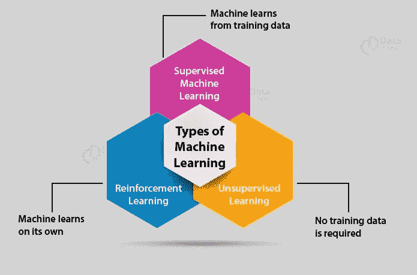
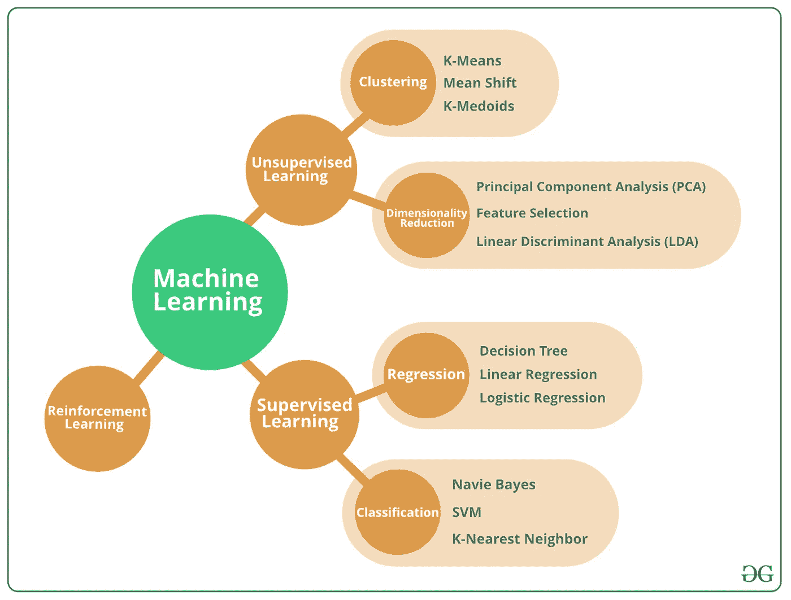
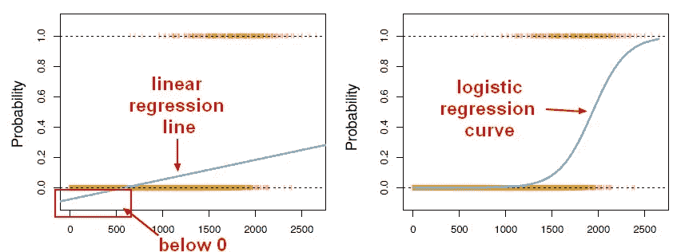
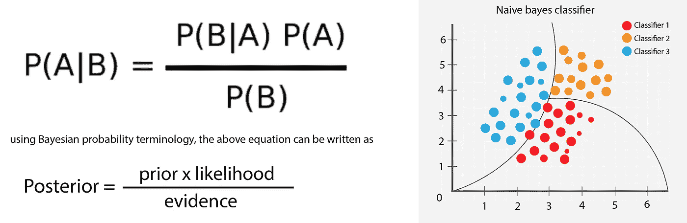
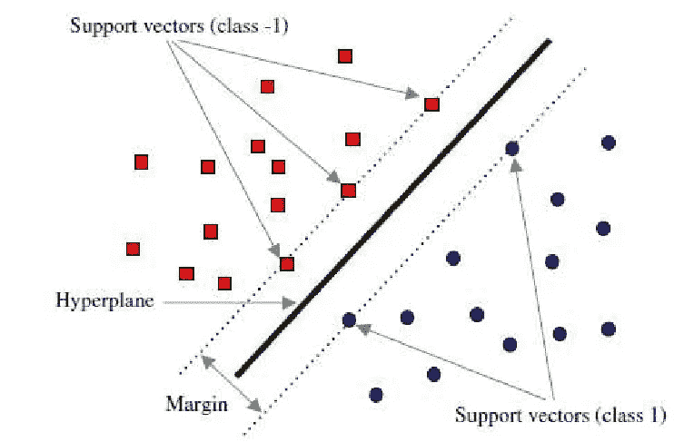
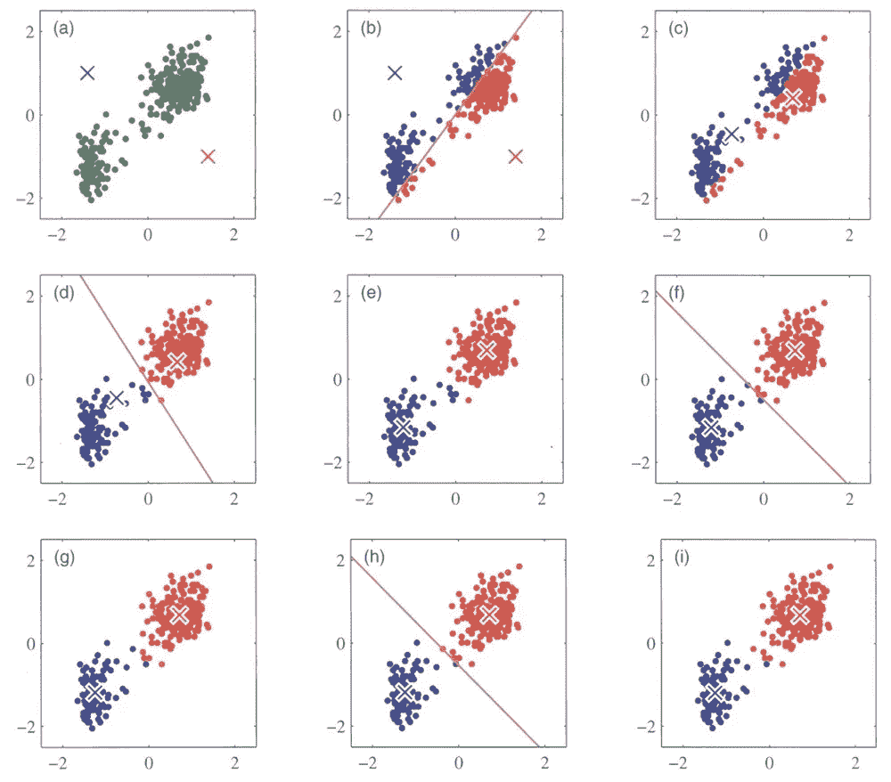
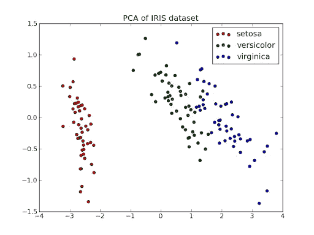

# 不同类型的机器学习算法

> 原文：<https://medium.com/analytics-vidhya/different-types-of-machine-learning-algorithm-b4f76b5730fd?source=collection_archive---------21----------------------->

([https://data-flair . training/blogs/WP-content/uploads/sites/2/2019/07/machine-learning-types . jpg](https://data-flair.training/blogs/wp-content/uploads/sites/2/2019/07/machine-learning-types.jpg))

1.  **监督学习** : *监督学习所需* ***训练标记数据。***

在监督学习中，我们在带标签的数据集上训练你的模型，这意味着我们既有原始输入数据，也有它的结果。我们将数据分为训练数据集和测试数据集，其中训练数据集用于训练我们的模型，而测试数据集用作预测结果或查看模型准确性的新数据。

2.**无监督学习** : *无监督学习不需要明确地标记或分类数据。*

在无监督学习中，用于训练的信息在数据集中既没有分类也没有标记。无监督学习研究系统如何从未标记的数据中推断出描述隐藏结构的函数。无监督学习的主要任务是**在数据中寻找模式**。

3.**强化** : *强化是一种动态规划，它使用奖励和惩罚系统来训练算法。代理通过与其环境交互来学习。*

([https://media . geeks forgeeks . org/WP-content/cdn-uploads/20190522174744/machine learning . png](https://media.geeksforgeeks.org/wp-content/cdn-uploads/20190522174744/MachineLearning.png))

**监督学习分为两类算法**:

*   **分类** : *分类产生* ***离散值*** *并对数据集进行严格的分类。当我们希望我们的结果反映数据集中数据点的归属时，我们使用分类。*

一个分类问题是当输出变量是一个类别时，比如“苹果”或“香蕉”或“红色”和“蓝色”。

*   **回归** : *回归给我们* ***连续的*** *结果，让你更好的区分个别点。*

一个回归问题是当输出变量是一个实值，如“美元”或“重量”。

**无监督学习分为两类算法**:

*   **聚类**:聚类问题是你想要发现数据中的内在分组，比如按照购买行为对客户进行分组。
*   **关联**:关联规则学习问题是您想要发现描述大部分数据的规则。

# 使用最广泛的监督学习算法有 **:**

*   逻辑回归。
*   线性**回归**。
*   朴素贝叶斯。
*   支持向量机。
*   决策树。
*   k 最近邻算法。
*   随机森林

# **逻辑回归**

*   *逻辑回归根据一组给定的独立变量估计离散值。*
*   它预测值在 0-1 之间的概率 logit 函数。这是一种预测二元类的统计方法。结果或目标在本质上将是二元的。
*   这是一种分类算法，而不是回归算法。
*   *逻辑模型用于模拟某一类别或事件存在的概率，如通过或失败、赢或输、活着或死了、健康或生病。*

([https://i.stack.imgur.com/rhVmk.jpg](https://i.stack.imgur.com/rhVmk.jpg))

# 线性回归

*   *线性回归是监督学习技术下最简单的机器学习算法之一，用于解决回归问题。*
*   它用于在自变量的帮助下预测连续的因变量。线性回归的目标是找到能够准确预测连续因变量输出的最佳拟合线。
*   通过寻找最佳拟合线，算法建立了因变量和自变量之间的关系。
*   线性回归的输出应该只是连续值，如价格、年龄、工资等。

# 朴素贝叶斯

*   朴素贝叶斯分类器假设一个类中特定特征的存在与任何其他特征的存在无关。
*   *Navive Bayes 分类器考虑数据的所有属性或特征，以独立地对某个类或事件的概率做出贡献。*

([https://miro . medium . com/max/6190/1 * 39 u1ln 3 tsdfqsfqy 6 ndxoa . png](https://miro.medium.com/max/6190/1*39U1Ln3tSdFqsfQy6ndxOA.png))

*   *这种算法需要一个* ***少量的训练数据*** *来估计必要的参数。*
*   与更复杂的方法相比，朴素贝叶斯分类器非常快。

# 支持向量机

*SVM 的目标是训练一个模型，把新的看不见的物体分配到一个特定的类别。*

([https://www . researchgate . net/profile/Hamid _ Baghaee/publication/330557084/figure/fig 5/AS:770135056977924 @ 1560625914689/General-class ification-hyperplane-re presentation-of-SVM 算法. png](https://www.researchgate.net/profile/Hamid_Baghaee/publication/330557084/figure/fig5/AS:770135056977924@1560625914689/General-classification-hyperplane-representation-of-SVM-algorithm.png) )

*在 SVM，我们将特征空间线性划分为两类。基于新的看不见的物体的特征，它将物体放置在分离平面之上或之下，导致分类。*

*这使得它成为非概率线性分类器的一个例子。*

.

.

# 决策树

*   *决策树以树结构的形式建立分类或回归模型。*
*   *它将一个数据集分解成越来越小的子集，同时一个相关的决策树被增量开发。*

([https://miro . medium . com/max/1430/1 * rSQIIAboJftqAv _ bren IPG . png](https://miro.medium.com/max/1430/1*rSQIIAboJftqAv_BReNipg.png))

*   *最后的结果是一个有决策节点和叶节点的树，叶节点代表一个决策或分类。*
*   *决策树可以处理分类数据和数值数据。*

.

.

# k-最近邻(KNN)

*K 最近邻是一种简单的算法，它存储所有可用的案例，并根据相似性度量对新案例进行分类。*

*分类是通过对其邻居的多数投票来完成的。*

([https://RES . cloud inary . com/dyd 911 kmh/image/upload/f _ auto，q _ auto:best/v 1531424125/KNN _ final _ a1mrv 9 . png](https://res.cloudinary.com/dyd911kmh/image/upload/f_auto,q_auto:best/v1531424125/KNN_final_a1mrv9.png))

*数据被分配给具有最近邻居的类。*

*随着最近邻数量的增加，k 值的准确度可能会增加。*

.

.

.

# 最广泛使用的无监督学习算法有:

*   k 均值聚类。
*   主成分分析。
*   关联规则。

# k 均值聚类

*   K-Means 是最流行的“聚类”算法之一。
*   *k-means 聚类是一种无监督聚类算法，只需要一组未标记的点。*

([https://trend oid . sk/WP-content/uploads/2013/01/kmean simg-scaled 1000 . jpg](https://dendroid.sk/wp-content/uploads/2013/01/kmeansimg-scaled1000.jpg))

*   *该算法将采用未标记的点，并通过计算不同离散点之间距离的平均值，逐步学习如何将它们聚类成组。*
*   K-mean 使用质心之间的垂直平分线将聚类分成不同的类别，然后重新分配质心，直到我们将所有数据点分类。

.

.

# 主成分分析

*   *PCA 的目标是识别数据中的模式并检测变量之间的相关性。*
*   *主成分分析是一种用于强调数据集中的变化和突出强模式的技术。*
*   它通常用于使数据易于探索和可视化。

下面是虹膜数据集的 PCA ~

([https://lh3 . Google user content . com/proxy/dyk 1 a 9 kskdacsmmbcidqcfnt 7 gxaxrn 0 eupqwpygg 5 _ ki 0 hrxzrkonux _ shsrsgsz 4 bbiyumhtc 8 z 75 vbtnfvv _ xy gu 9 IQ eqfp 3 SFI 2364n-TRN](https://lh3.googleusercontent.com/proxy/dYK1A9KskdaCSmMbCidqCfnT7GXaXrN0eupqWPyGg5_ki0HRXZrKoNux_ShSrsgSZ4wBbiYUMHtc8z75vBtnFvV_Xygu9IQEqfP3sfI2364n-TRN))

***—纳夫乔特·辛格***

> 谢谢你抽出宝贵的时间