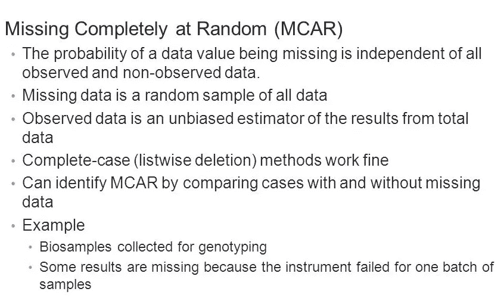

# 不同类型的缺失数据。

> 原文：<https://medium.com/analytics-vidhya/different-types-of-missing-data-59c87c046bf7?source=collection_archive---------4----------------------->

缺失数据也是数据科学或分析领域的人都会认同的常见问题之一。

统计上有三种不同类型的缺失数据(即 MCAR，马尔，MNAR)，但在现实世界的数据中，可以找到第四种类型的缺失数据，称为结构化缺失数据。

米卡·鲍梅斯特在 [Unsplash](https://unsplash.com?utm_source=medium&utm_medium=referral) 上的照片

## 让我们来分别了解它们:

**1。结构化缺失数据:-**

由于有效原因而从数据中缺失的数据称为结构化缺失数据。这意味着数据丢失，因为考虑到其他变量，它不应该发生。

**2。随机缺失(三月):-**

随机缺失意味着数据点缺失的趋势与缺失数据本身无关，但与数据集中的一些观察数据有关。

这里的要点是，缺失数据的值可以从数据集中的一些其他变量中预测出来。

当数据随机缺失时，意味着我们需要使用先进的插补方法，如*多重插补、*或专门为随机缺失*数据*设计的分析方法。

**3。完全随机失踪(MCAR):-**

某个值缺失的事实与其假定值无关，也与其他变量的值无关。

MCAR 数据在实践中会发生，尽管如果你设计一个实验，你决定随机消除一小部分(比如说 5-10%)的数据元素，那么 MCAR 条件就会得到满足。

当数据完全随机缺失时，这意味着我们可以仅使用具有完整数据的特征进行分析，如果我们有足够多的这样的特征的话。

MCAR 和 T21 的假设很少是好的假设。只有在由于一些真正的随机现象而导致数据缺失的情况下(例如，如果人们在问卷中被随机问到 15 个问题中的 10 个)，这种情况才可能是真的。

> 随机缺失( **MAR** )永远是比完全随机缺失( **MCAR** )更安全的假设，因为任何假设数据完全随机缺失时有效的分析，在数据随机缺失的假设下也会有效，但反之则不然。

**4。非随机缺失(MNAR):-**

未被标记的数据为称为**未被随机丢失的数据** ( **NMAR** )。从查找和处理数据的角度来看，MNAR 数据是最复杂的。数据缺失的事实与未观察到的数据有关，即我们没有的数据，缺失与我们没有考虑的因素有关。

> 通常假设数据被标记为**,除非有充分理由相信并非如此。此外，大多数处理缺失数据的程序都依赖于 **MAR** 假设。当数据不是随机缺失时( **MNAR** ，这意味着我们不能使用任何标准方法来处理缺失数据(例如，插补，或专门为缺失值设计的算法)。如果缺失数据不是随机缺失的，任何标准计算都会给出错误的答案。**

****缺失数据类型的小备忘单！****

********

**喜欢我的文章？请为我鼓掌并分享它，因为这将增强我的信心。此外，我每周日都会发布新文章，所以请保持联系，以了解数据科学和机器学习基础系列的未来文章。**

**另外，请务必在 linkedIn 上与我联系。**

****

**由 [Alex](https://unsplash.com/@alx_andru?utm_source=medium&utm_medium=referral) 在 [Unsplash](https://unsplash.com?utm_source=medium&utm_medium=referral) 拍摄的照片**