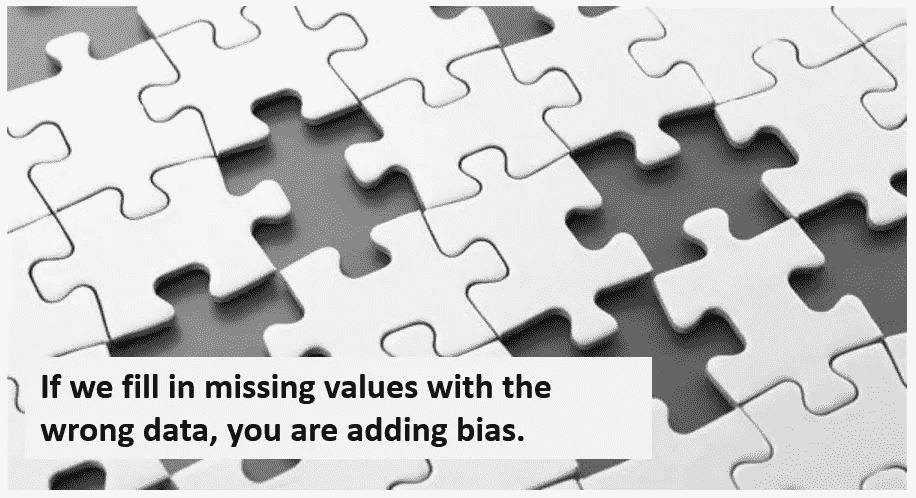

# 价值观缺失的不同类型及处理方法

> 原文：<https://medium.com/analytics-vidhya/different-types-of-missing-values-approaches-to-deal-with-them-1f67c617374c?source=collection_archive---------16----------------------->

缺少值

在处理缺失值之前，我们必须知道数据科学世界中存在的所有可能类型。基本上有三种类型在网络上随处可见，但在一些核心研究论文中，还有一种类型。让我给你简单介绍一下他们-

1.  **结构性缺失数据-** 让我告诉你一个例子…