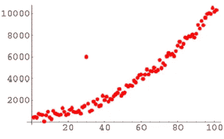
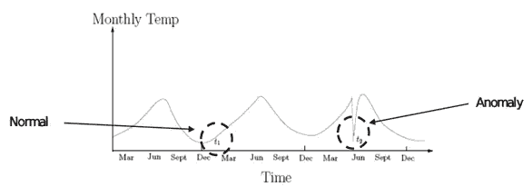
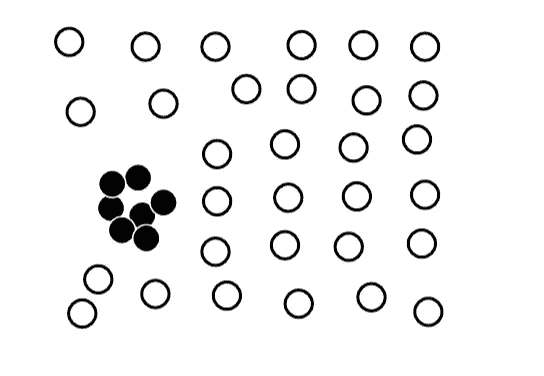

# 不同类型的异常值。

> 原文：<https://medium.com/analytics-vidhya/different-types-of-outliers-dd6363983744?source=collection_archive---------6----------------------->

威尔·梅尔斯在 [Unsplash](https://unsplash.com?utm_source=medium&utm_medium=referral) 上拍照

## 三种不同类型的异常值:

在统计学和数据科学中，有 3 种主要类型的异常值:

1.  **全局异常值(又名点 anamoly):**

如果一个数据点的值远在该数据点所在的数据集的整体之外，则该数据点被认为是全局异常值(类似于计算机程序中的“全局变量”可以被程序中的任何函数访问)。

**全局异常值**是相对于数据集中的所有值具有非常高或非常低的值的测量样本点。例如，如果 10 个点中的 9 个点具有 20 和 30 之间的值，但是第 10 个点具有 85 的值，则第 10 个点可能是**全局异常值**。

2.**上下文异常值(也称为条件异常值):**

如果单个数据点在特定的上下文或条件下是不同的(而不是相反)，那么它被称为上下文异常值。数据对象的属性应分为两组:

⦁上下文属性:定义上下文，例如时间和位置

⦁行为属性:用于异常值评估的对象特征，例如温度

如果没有背景信息，背景异常值基本上很难发现。如果您不知道这些值是夏季的温度，它可能会被视为有效的数据点。

3.**集体异常值:**

如果数据点的集合相对于整个数据集完全不同，则称之为集体异常值。

如果作为集合的这些值明显偏离整个数据集，则称数据集中的数据点子集是不同的，然而每个数据点的值在上下文或全局意义上没有不同。

喜欢我的文章？请为我鼓掌并分享它，因为这将增强我的信心。此外，我每周日都会发布新文章，所以请保持联系，以了解数据科学和机器学习基础系列的未来文章。

另外，如果你想的话，可以在 linkedIn 上联系我。

马特·博茨福德在 [Unsplash](https://unsplash.com?utm_source=medium&utm_medium=referral) 拍摄的照片