# 不同类型的 SQL 连接

> 原文：<https://medium.com/analytics-vidhya/different-types-of-sql-joins-6e9cca26304e?source=collection_archive---------23----------------------->

在查询中使用 **JOIN** 子句，我们可以使用这个键将两个单独的表中的行数据组合起来。

**内部连接**

**内部连接**是一个过程，它匹配第一个表和第二个表中具有相同键的行，以创建一个包含两个表中合并列的结果行。

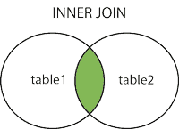

**标准语法**

SELECT 列，Second_table_column，…FROM first table**first table . id = Second _ table . id**其中*条件* ORDER BY 列，… ASC/DESC 限制数 _ 限制偏移量数 _ 偏移量；

创建桌上巧克力(SlNo int，BrandName Varchar(20)，DomesticSales int，distributor pincode int)；
插入巧克力值(1，' Eclairs '，23987789，598263)，(2，' DairyMiLk '，23765580，560001)，(3，' Nestle '，93748262，6001204)，(4，' Milkychoo '，97867564，560023)；

创建表 BrandValue (ChocoSlNo int，InternationalSales int，profit percentage int)；
插入 BrandValue 值(3，98793022，43)，(2，98754776，88)，(1，922345466，76)，(4，78675654，36)；

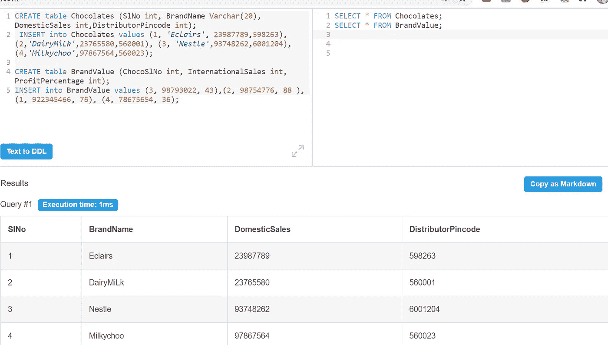

餐桌巧克力

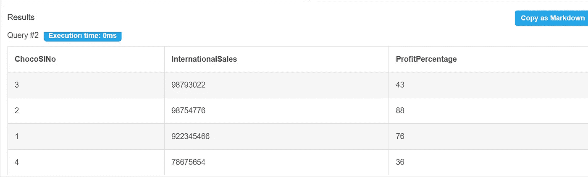

表品牌价值

**计算每个品牌的国内和国际销售额**
从巧克力中选择品牌、国内销售额、国际销售额

加入巧克力的品牌价值。SlNo =品牌价值。ChocoSlNo

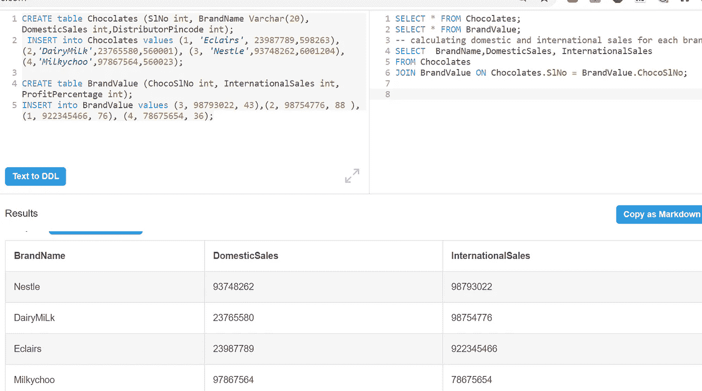

**展示每个品牌在国际上比在国内表现更好的销售数字**
从巧克力中选择品牌名称、国内销售、国际销售

加入巧克力品牌价值。SlNo =品牌价值。巧克力
国际销售>国内销售；

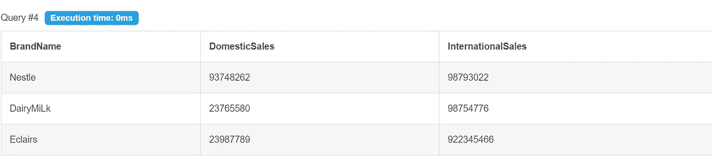

**按利润百分比升序列出所有巧克力**
从巧克力中选择品牌名称，利润百分比
加入巧克力的品牌价值。SLNO =品牌价值。按利润百分比排序的巧克力订单；

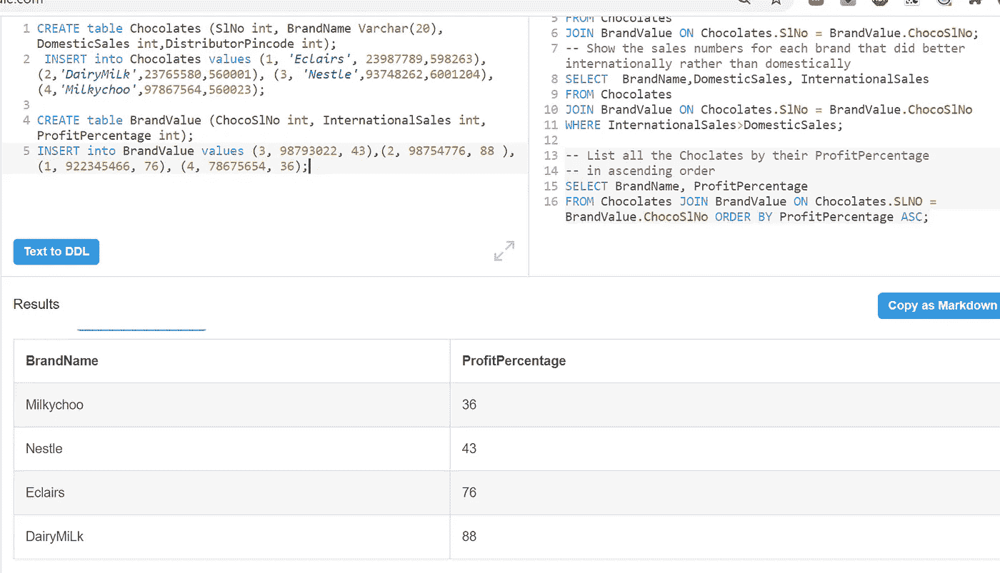

**左连接/左外连接**

当将表 1 联接到表 2 时，左联接包括表 1 中的行，而不管在表 2 中是否找到匹配的行。

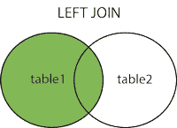

**右连接/右外连接**

右连接包括表 2 中的行，不管在表 1 中是否找到匹配的行。

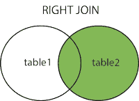

**完全连接/完全外部连接**

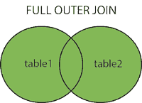

SQL **完全连接**结合了左外部连接和右外部连接的结果。

连接的表将包含两个表中的所有记录，并为任一侧缺失的匹配项填充空值。

**标准语法**

SELECT column，another_column，…FROM first table**INNER/LEFT/RIGHT/FULL JOIN second _ table ON first table . id = second _ table . matching _ id**其中*条件* ORDER BY column，… ASC/DESC 限制数 _ 限制偏移量数 _ 偏移量；

邪恶的笑（Evil Grin 的缩写）

创建表格公寓(Apartment_Name Varchar(20)，Houses int)；
插入公寓值(' MountainView '，16)，(' DaisyDew '，12)，(' Nydel '，8)，(' Palmtree '，6)，(' SouthAvenue '，223)，(' Zenmode '，24)；

创建表所有者(Name Varchar(20)，ApartmentBlock varchar(15)，YearofPurchase int)；
插入业主价值观(' Neil '，' DaisyDew '，2002)，(' Sayna '，' SouthAvenue '，2000)，(' Nithin '，' Palmtree '，2011)，(' Satvik '，' Zenmode '，2020)，(' Ananth '，' Nydel '，2008)，(' Rita '，' MountainView '，2009)，(' Basu '，' Newlight '，2002)，(' Antara '，' DaisyDew '，2004)，(' Ryan '，' Sunrise '，2019)；

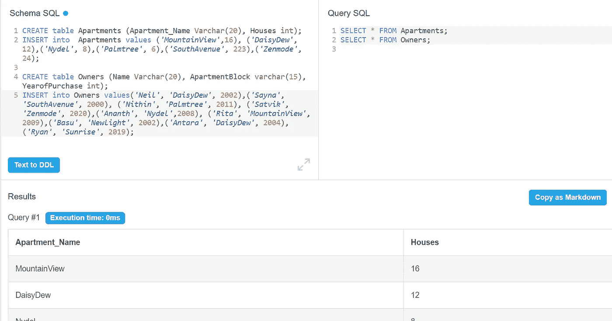

**查找公寓名称列表。**
从公寓中选择不同的公寓名称；

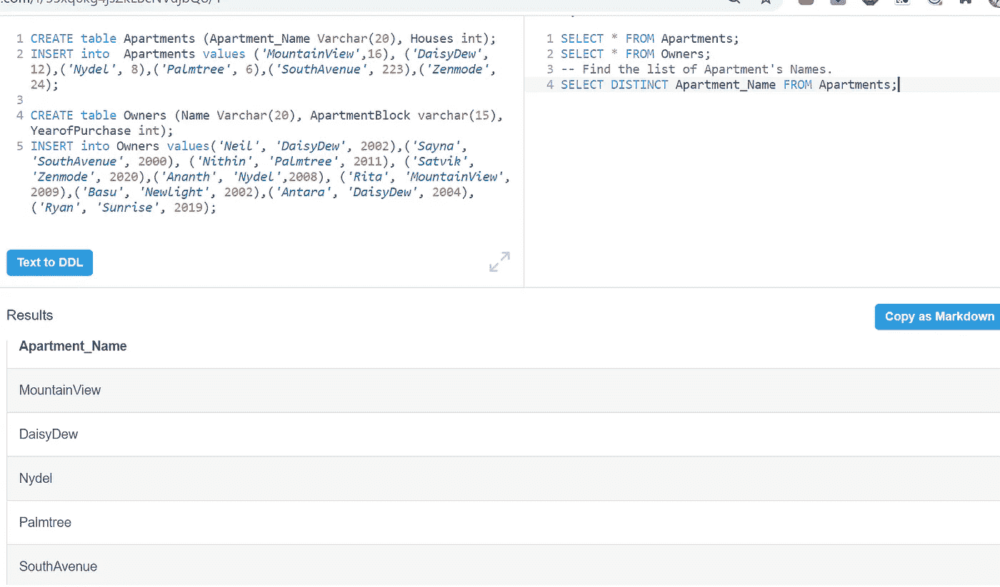

列出所有建筑以及每栋建筑中不同的员工角色(包括空建筑)

SELECT**DISTINCT**building _ name，role
FROM buildings
LEFT JOINemployees
ON building _ name = building；

如果这些都没有帮助，这肯定有帮助

快乐学习，更多内容敬请关注。