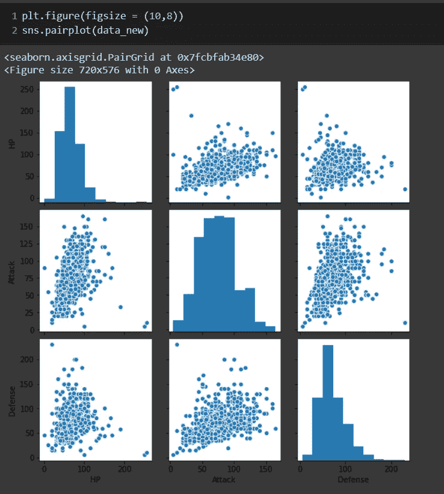

# 不同的可视化技术！

> 原文：<https://medium.com/analytics-vidhya/different-visualization-techniques-a2a461c31dff?source=collection_archive---------12----------------------->

## 主题:

1.  **改善可视化的方法**
2.  **不同的可视化技术**
    ***单变量分析*** *柱状图
    *面积图
    *饼状图
    *分布图
    *箱线图
    *小提琴图
    ***双变量分析*** *柱状图
    *箱线图
    *小提琴图
    *散点图
    *
3.  **结论**

# 提高可视化的方法。

在继续使用不同的技术之前，这里有一些让你的视觉化更有效的提示:

1.  保持简单。
2.  不要包含多余的细节。
3.  使用柔和的颜色。
4.  仅显示重要特征。

下图指出了用视觉化构建你的“讲故事”技巧的完美方式。

众所周知，当涉及到数据科学和机器学习时，可视化是多么有效，让我们看看不同的可视化技术。

> 如果你想知道数据可视化的重要性，看看这个([链接](/analytics-vidhya/importance-of-data-visualization-be16e585ee09))。

# 不同的可视化技术:

## 1.单变量分析:

当分析只涉及一个变量时。

*   **直方图** *直方图**是一种让您发现并显示一组连续数据的潜在频率分布(形状)的图。
    *这允许检查数据的基本分布(如正态分布)、异常值、偏斜度等。**

****

**增加图形的容器大小将有助于更准确地显示分布。**

****

*   ****条形图** **条形图**或**条形图**是一种图表或图形，用矩形条表示分类数据，矩形条的高度或长度与它们所代表的值成比例。条形图可以垂直或水平绘制。**

****

> **细黑线是误差线，在这里阅读。**

*   ****面积图** *一个**面积图**或**面积图**以图形方式显示定量数据。它基于折线图。
    *轴和线之间的区域通常用颜色、纹理和阴影来强调。
    *通常用面积图比较两个或更多的量。
    *绘制面积图时，首先在笛卡尔坐标网格上绘制数据点，在点之间连接一条线，最后填充完成的线下方的空间。
    *面积图用于显示一段时间间隔或一段时间内数量值的发展。**

****

*   ****饼图** *在饼图中，每个切片的弧长(及其圆心角和面积)与其所代表的数量成正比。
    *饼图在商业世界和大众媒体中被广泛使用。**

****

*   ****分布图

    *您可以用三种不同的方式显示此图表，您可以只显示显示分布的数值点，或者您可以显示显示范围的边界框，或者使用两者的组合。****

****

*   ****箱线图** *在描述统计学中，**箱线图**或**箱线图**是一种通过四分位数以图形方式描绘一组数值数据的方法。
    *盒状图也可能有从盒状图延伸的线(*须状图*)，表示上下四分位数之外的可变性，因此有术语**盒须状图**和**盒须状图**。
    *异常值可绘制为单个点。
    *箱线图是非参数的:它们显示统计总体样本的变化，而不对潜在的统计分布做出任何假设。
    *方框不同部分之间的间距表示数据的分散(扩散)和偏斜程度，并显示异常值。**

****

*   ****Violin Plot** * Violin Plot 类似于箱线图，只是它们也显示不同值的数据的概率密度，通常由核密度估计器平滑。
    *通常情况下，violin 图将包括箱线图中的所有数据:数据中值的标记；指示四分位范围的方框或标记；并且如果样本数量不太高，可能包括所有的样本点。
    *一个小提琴的情节比一个普通的盒子情节更能提供信息。虽然箱线图仅显示汇总统计数据，如平均值/中位数和四分位数范围，但 violin 图显示了数据的完整分布。
    *当数据分布是多模态的(多于一个峰值)时，这种差异特别有用。在这种情况下，小提琴图显示了不同峰值的存在、它们的位置和相对振幅。**

****

## **2.双变量分析:**

**当分析涉及两个变量时。**

*   ****柱状图****

****

*   ****方框图****

****

*   ****小提琴剧情****

****

> **上述图表类似于单值分析，但是这些图表可以通过在代码中添加两个参数来用于双值分析。**

*   ****散点图
    *散点图**是一种使用笛卡尔坐标来显示一组数据的典型两个变量的值的图。
    *如果点被编码(颜色/形状/尺寸)，可以显示一个额外的变量。
    *数据显示为点的集合，每个点的一个变量值决定水平轴上的位置，另一个变量值决定垂直轴上的位置。**

****

*   ****折线图** *折线图或**折线图**或**折线图**或**曲线图**是一种图表，将信息显示为由直线段连接的一系列称为“标记”的数据点。
    *是很多领域常见的一种基本图表类型。
    *它类似于散点图，除了测量点是有序的(通常按其 x 轴值)并用直线段连接。**

> ***折线图通常用于显示时间间隔 A(时间序列)内的数据趋势，因此通常按时间顺序绘制线条。***

****

*   ****Reg Plot** * Reg Plot 执行简单的线性回归模型拟合和绘图。
    * Reg plot 顾名思义在两个参数之间创建一条回归线，并帮助可视化它们的线性关系。**

****

> **回归线经过的褪色蓝色区域显示数据的置信区间。**

*   ****lm Plot** 它与 Regplot 执行相同，但它们之间唯一的区别是 lm Plot 使用 FacetGrid，由于这个特性，它是内存密集型的。**

****

> **FacetGrid 意味着每个类都有一个单独的情节。**

## **3.多变量分析:**

**当分析涉及两个以上变量时。**

*   ****结对图** *结对图是数据科学家工具箱中最重要的工具之一。
    *准确解释配对图的能力将有助于特征选择、特征工程、检测隐藏结构的存在，有时也有助于识别构建模型的合适算法。
    *它有助于可视化每个列之间的比较。
    *列数和行数相同。
    * Pair plot 基本上是方阵的可视化。**

****

*   ****热图** *热图是数据的二维图形表示，矩阵中包含的各个值用颜色表示。
    *它有助于理解数据中每个变量之间的相关性。**

****

**要查看变量之间的相关性(-1 到 1)，在函数中给 **annot = True** 。**

****

*   ****堆叠图** * Stackplot 用于绘制堆叠面积图。它显示完整的可视化数据。
    *它显示了相互堆叠的各部分以及各部分如何组成完整的图形。
    *它显示数据的各种成分，其行为类似于饼图。它有 x 标签、y 标签和标题，其中各个部分可以用不同的颜色表示。
    *堆栈图的理念是随着时间的推移显示“部分到整体”。它用于表示各种数据集，而不会相互重叠。**

****

# **结论**

**这是几个重要的图表，人们应该知道如何解释。然而，在一天结束的时候，所有这些都归结为一件事，那就是哪个图表可以正确地解释数据，因为不是每个图表都是必要的。**

**多变量分析有助于节省时间并一步到位地可视化数据。**

**而双变量分析有助于更准确地理解两个特征。**

**所以，这一切都归结于数据的需求和你想从数据中提取什么。**

> **对于代码和数据集，请查看我的 [github 链接](https://github.com/AbhigyanSingh97/Different-Techniques-For-Data-Visualization)，继续制作您自己的可视化并探索数据。快乐学习！**

****参考:维基百科****

****数据:Kaggle****

**喜欢我的文章？请为我鼓掌并分享它，因为这将增强我的信心。此外，我每周日都会发布新文章，所以请保持联系，以了解数据科学和机器学习基础系列的未来文章。**

**还有，一定要在 linkedIn 上和我联系。**

****

**[亚历克斯](https://unsplash.com/@alx_andru?utm_source=medium&utm_medium=referral)在 [Unsplash](https://unsplash.com?utm_source=medium&utm_medium=referral) 上的照片**