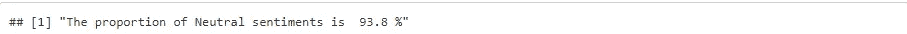

# R 中可视化 Twitter 情感分析的不同方式

> 原文：<https://medium.com/analytics-vidhya/different-ways-of-visualizing-twitter-sentiments-analysis-in-r-270d5d459603?source=collection_archive---------8----------------------->

在我之前关于 WhatsApp 聊天的[情感分析](/@freemangoja/sentiment-analysis-of-whatsapp-chat-a906105917f4)的文章中，我已经介绍了如何使用 r 进行情感分析。与 WhatsApp 数据不同，提取 twitter 数据有点棘手。您必须成功设置 Twitter API 以获得授权。关于如何设置 twitter API，有很多有用的在线资源，所以本文将主要关注分析和可视化。

Twitter 数据非常适合情感分析。有了这么多的灵活性，你可以轻松地将你的推文选择限制在特定的日期范围、语言、地区、推文数量等等。在这篇文章中，我们将评估 twitter 对特朗普的情绪，并以不同的方式可视化结果。这些推文是在 2019 年 11 月 22 日提取的，当时国会主导的弹劾听证会正在进行。

设置好 API 后，您将拥有 consumerKey、consumerSecret、accessToken 和 accessTokenSecret，您需要将它们复制并粘贴到 RStudio 中，如下所示:

然后，您可以像这样设置您的授权:

一旦设置成功，您就可以开始提取推文进行分析了。您需要的基本 R 包是:

ROAuth:这个 R 包为用户认证提供了到 OAuth 1.0 的接口

twitteR:这是访问 twitter API 的 R 包。与日常交互相比，它更倾向于提取分析数据。

你可以在这里找到分析中使用的所有软件包和完整的分析代码[。](https://frex1.github.io/twitter-sentiments/tweets)

Twitter 包中的 searchTwitter 函数为废弃推文提供了不同的选项。这些默认为空的参数(除了 *n* )可以单独使用，也可以与多个由“+”连接的参数组合使用。

指定你希望提取的 tweets 的最大数量。

lang-同一主题的推文可能会有不同的语言版本。默认情况下为空，但指定时，会根据 ISO 639-1 代码将搜索限制到给定的语言。

*自*起——用于限制搜索自给定日期以来的推文。请注意，日期必须采用 YYYY-MM-DD 格式。

*直到*——指定你感兴趣的推文的最新日期。请注意，日期必须采用 YYYY-MM-DD 格式。

*区域设置*-相对来说是最有限的选项，因为目前只有 *ja* 有效，但是当指定时，它会设置搜索的区域设置。

*地理编码*-允许您定义感兴趣的地理半径，以纬度/经度给出。

*since ID*——用于将推文限制为那些 ID 比指定 ID 新的推文。

maxID-将搜索限制在比指定 ID 更早的推文。

*result type*——用于根据设定值过滤返回的 tweets。

在上面的例子中，从搜索的当天开始向后(默认)检索了 10，000 条关于特朗普的推文。废弃的 tweets 在一个列表中，需要转换成数据帧，如下所示:

为了确保没有特朗普本人对所收集的推文的个人贡献，来自@realDonaldTrump 和@POTUS handles 的所有推文和转发都已通过以下代码从我们的数据中删除:

数据集中有很多转发，如下图所示:

推文是否被转发的分类

为了找到关于 Trump 的热门推文，只需要具有最高转发计数的独特推文，因此创建了一个只包含独特推文的新数据框架，并对其进行预处理以查看热门推文:

正如我们在我的[早期文章](/@freemangoja/sentiment-analysis-of-whatsapp-chat-a906105917f4)中讨论的那样，推特就像其他社交媒体帖子一样，结构松散，挖掘它们需要大量的清理工作。上一次我们还使用 R 比较了两种不同的情感分析方法。本文将考虑单词袋和其他相关模型。

在找到热门推文后，对整个数据集进行了进一步的分析。这里的逻辑是，转发另一个人的推文的人很可能这样做，因为原始推文代表了他/她的想法，所以两者都同样计入情感。数据经过预处理，准备用于分析，如本[完整代码](https://frex1.github.io/twitter-sentiments/tweets)所示。

可以使用 kableExtra 包中的 kable 函数可视化标记化的前十个阳性单词，如下所示:

积极的话

类似地，我们可以如下所示表示否定词:

否定词

在上面的两个图中，选择了前 10 个单词，但是你可以选择尽可能多的单词。如果需要，您还可以根据单词的频率对其进行排序。你可以看到使用最多的肯定词是“喜欢”，而使用最多的否定词是“弹劾”。

我们也可以用如下图所示的条形图来表示情感词。

前 10 项积极情绪的条形图

前 10 大负面情绪条形图

同样，您可以选择从最高到最短的条块对图进行排序，但这不是必须的，所以我选择保持这种顺序，以便与前面的 kableExtra html 输出的顺序保持一致。

DT 包允许一个人创建一个交互式输出，很容易浏览并找到所有的情感词汇，如这个 [html 文件](https://frex1.github.io/twitter-sentiments/tweets)所示。它看起来是这样的:

积极情绪词汇的完整列表

当您有兴趣在情感分析中寻找感兴趣的特定关键词时，这可能是有用的。搜索选项使您能够查找特定单词是否存在。

wordcloud 功能用于创建单词包，这些单词包的最小计数为 10，分别代表积极情绪和消极情绪。选择将单词输入限制在最小 10 个是为了保持单词包的简单和可读性。

一袋积极的情绪

一袋负面情绪

你可以很容易地在两个单词袋中挑出前 10 个单词，因为它们在每种情况下都显得更粗。显然，你可以看到“喜欢”和“弹劾”分别是正面和负面情绪中最受欢迎的词。

此外，你会注意到我们以不同方式可视化的结果是一致的，这给了我们信心，根据情况，我们可以使用其中的任何一个或多个方法，仍然可以得出有信心的结论。单词包模型非常受欢迎，但有时当数据表可以返回更具交互性的结果时，您不一定需要它，kableExtra 可以给你一个复杂但更容易解释的 html 输出，当然，条形图可以以自我解释的方式很好地可视化它。

让我们看看情绪的分布。

以下是比例:

积极情绪的比例

负面情绪的比例

中性情绪的比例

上面的图表显示，消极情绪比积极情绪多得多。然而，压倒性的中性情绪带来了巨大的机会。根据政治或商业背景，双方(正面和负面)都可以设计策略来影响中立者。最终的赢家将会是那些设法获得更多支持的人。

比例分析的主要收获是中性情绪的价值。通常，情绪分析侧重于消极和积极的方面，当你在这些方面占很大比例时，这没什么，但当很大比例是中性的时，这是一个不容忽视的风险太大的机会。

我希望你喜欢并从这篇文章中学到一些东西。保持联系，在我的下一篇文章《预测建模者选择最佳回归模型指南》中再见。