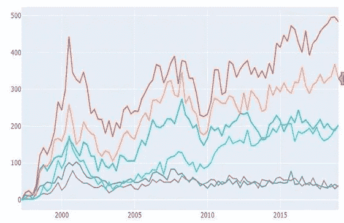

# 处理时间序列数据的不同方法

> 原文：<https://medium.com/analytics-vidhya/different-ways-to-deal-with-time-series-data-a04b3c63c413?source=collection_archive---------18----------------------->

时间序列建模有不同的机器学习算法

不同细分市场的数据趋势

因此，选择哪种算法取决于数据的类型(单变量或多变量)

1.  您可以使用线性回归技术——根据需求使用不同的滞后(Lag1、Lag2 等)(您可以检查不同滞后的相关矩阵，然后比较模型。这是一种解决多元时间序列问题的好方法。
2.  你可以使用 ARIMA 模型 SARIMA 有不同的变化——AR、MA、ARMA 或 SARIMA、SARIMAX(它处理季节性)等。
3.  也可以用 fbprophet(我一直以来的最爱)。你也可以对多元数据这样做(使用 add_regressor()，我将在下一篇博客中分享更多细节)。它使用傅立叶级数，很好地处理了季节性。您可以调整傅立叶的阶数，使其更加灵活
4.  你也可以使用蒙特卡罗模拟。因此，基本上找到一个漂移值，即驱动值，并将其乘以上一年的值，以估计未来的值。运行多次迭代后，您可以找到平均值并开始计算。
5.  还有其他方法，如 VAR、VARMA、VARMAX、LSTM(神经网络)、指数平滑

请分享你的想法，如果你已经使用这些或任何其他技术来预测时间序列数据。

我的 github 链接:——[https://github.com/DeeptiAgl?tab=repositories](https://github.com/DeeptiAgl?tab=repositories)

谢谢

迪普蒂