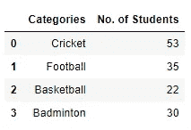

# 深入挖掘情节-提高标准

> 原文：<https://medium.com/analytics-vidhya/digging-deep-into-plotsraising-the-bar-f24ca6cae9da?source=collection_archive---------13----------------------->

## 让你的条形图更吸引人的指导方针，以及如何使用 Python 做到这一点

作为一种开源语言，ython 有各种各样的库，使我们能够在几秒钟内完成原本需要几天才能完成的任务。

使用 Python 作为数据科学工具的人都很了解 Matplotlib 和 Seaborn。使用单行代码绘制图形是这些库的特色之一。

如果您想通过绘图来理解您的数据，那么这些一行程序将会派上用场。但是，如果你想你的情节是像样的，简约的，没有任何视觉混乱，你可能要多努力一点。

欢迎收看《深挖剧情》第一集(注意双关语！).我将把这一集命名为**提高门槛**(再次，一语双关)。

**首先，让我们来讨论一下让你的酒吧图像样应该牢记的要点——**
1。当数据是按时间顺序排列的或有负值时，请使用竖线。当您的数据有许多不同的类别时，水平条效果最好
3。在零点
4 启动 Y 轴。所有杆
5 使用相同的颜色。保持标签和标题简短
6。避免在背景中放置网格
7。如果条形的数量较少(2-6)，请标注条形并避开数值轴

现在，让我们深入了解 Python。我将使用一个简单的预定义表格，而不是数据框架，这样我们就可以专注于我们的目标。

数据表

**通过编写简单的一行代码，我们得到下面的条形图-**

**首先，这些条不应该是上面讨论的不同颜色，让我们改变一下-**

你知道吗，如果我们把它们按升序或降序排列会更好看

**同样，让我们切换坐标轴。当我们使用分类数据时，最好将条形水平放置-**

**让我们去掉边框，这是不必要的(sns.despine()函数将在这里帮助我们)-**

**我们不使用 x 轴来表示刻度，而是进行注释，这样我们就不必寻找数值了-**

这看起来很整洁，对吗？

**最终代码-**

**和最终图表——**

如果您想查看上述过程的视频指南，请单击下面的链接(不要忘记发送连接请求)

 [## Sarthak Arora 在 LinkedIn 上发帖

### 深入挖掘剧情！第 1 集-提高标准

www.linkedin.com](https://www.linkedin.com/posts/iasarthak_machinelearning-dataanalytics-data-activity-6708336300770041856-7w8g) 

下面我的 GitHub 里上传了循序渐进的笔记本。看看吧。

**LinkedIn-**【https://www.linkedin.com/in/iasarthak/】
**GitHub-**[https://github.com/iasarthak](https://github.com/iasarthak)
还有，这是我的第一篇博文，我希望可以改进。如果你能提供一些评论就太好了！**感谢坚持到最后**。