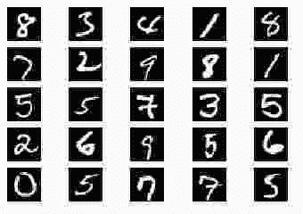
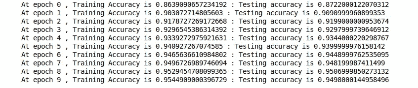
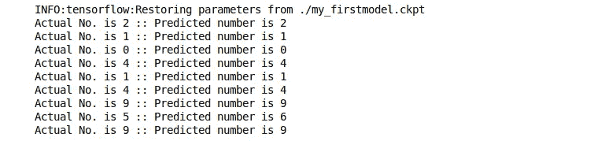

# 张量流中深度神经网络的数字识别

> 原文：<https://medium.com/analytics-vidhya/digit-identification-using-dnn-in-tensorflow-ba569e1c38b8?source=collection_archive---------1----------------------->

我在大学期间开始研究机器学习。最初，我从 Keras 开始做一些初级项目的模型实现。但是，观察机器学习特别是深度学习的趋势，TensorFlow 现在已经成为 ML 任务中使用最多的开源库。我喜欢的 TensorFlow 最有前途的方面是它简洁的设计和定制的灵活性(比如你可以为神经网络、损失函数等实现你的函数，这在 Keras 中并不容易)。

对于使用 TensorFlow 的新手来说，在阅读了一些内容后，最好直接去实现，因为使用 TensorFlow 是学习它的最好方法。在本教程中，我们将使用 TensorFlow 中的 **MNIST 数据**实现**数字分类**。我将使用**深度神经网络(DNN)** 进行模型训练。

第一步是导入必要的库。让我们这样做

## MNIST 数据集

在继续实现之前，让我们对数据集有一些了解。MNIST 是手写数字的大型数据库，经常用于各种图像分类任务的训练和测试。MNIST 数据库包含大约 60000 幅训练图像和 10000 幅测试图像。每幅灰度图像的尺寸为 28*28。任何图像的标签从 0 到 9。

来自 MNIST 的样本图像

TensorFlow 允许我们通过他们的帮助函数直接导入和下载 MNIST 数据集。导入的数据已经过缩放([0，1])和适当的混洗。现在让我们导入它:

为了可视化我们数据的上述数字，让我们研究一下导入的 MNIST 数据。

现在，如果你在上面的代码中注意到了，我写了“图像作为特征向量”。如前所述，我们将使用 DNN 作为我们的培训模型。输入层中的节点数量实际上由图像数据的大小决定。

我们将把每个像素作为一个特征。因此，特征的数量将等于图像中的像素数量，即 MNIST 的 28*28 = 784。因此，每个图像被展平以使我们的特征向量的长度为 784。这就是为什么，(训练或测试或验证)。图像矩阵有形状(num_examples，784)。为了更清楚，我们可以从它的特征向量重建图像。我们开始吧

上述代码的输出如下。

从特征向量重建图像

## 模型构建阶段

我想我们已经基本涵盖了 MNIST 数据集。让我们开始制作我们的培训模型。我们的模型将由一个输入层，两个隐藏层和一个输出层组成。输入层的大小将是特征的数量，即图像像素(如前所述)。输出层将有 10 个节点，因为我们的标签是从 0 到 9。我已经使两个隐藏层的节点数量可变。你可以和他们一起玩。但是最好选择那些使我们的模型成为漏斗形状的值。

在训练期间，我们需要向神经网络输入数据。我们在这里怎么做？

幸运的是，TensorFlow 有称为占位符的特殊节点。这些是特殊的节点，它们只输出运行时给它们的数据。我们将给出张量数据的类型和形状(可选)。我们将在第一个维度中使用 None，这意味着该维度中的“任意大小”。例如，shape=(None，784)表示具有未知行数和固定列数(即 784)的矩阵。它很有用，因为它让我们可以灵活地一次给出任意数量的训练示例。让我们定义占位符:

现在是我最喜欢的张量流部分。我们将定义我们自己的功能实现层的神经网络。

在上面的代码中发生了很多事情。我来适当解释一下。

第 15 行:创建了隐藏层的命名范围；简化图形可视化
第 18–20 行:隐藏层的核心部分，即创建一个权重矩阵并正确初始化。weight_matrix 将包含从前一层节点(X_input)到隐藏层中每个节点的连接权重，因此它的形状将是(input_count，n_neurons)。我们将通过从代码中给定标准偏差的截断正态分布中随机选择来初始化它。以这种方式进行初始化是为了更快地收敛和避免模型中的大权重和对称性。
第 21 行:创建了偏差矩阵。
第 23 行:激活前输出:z = X*W + b
第 24–29 行:应用给定的激活并返回隐藏层响应。

现在，我们可以使用我们的神经功能来为我们的训练模型创建所有的层。我们将对隐藏层使用“Relu”激活功能。我们将使用的成本函数是“交叉熵”。TensorFlow 有一个我们将使用的内部实现。成本函数的输入将是输出图层的预测(逻辑)和实际标注(目标)。我们还将定义准确性作为我们模型的评估标准。

现在，在我们的构建阶段剩下的唯一的事情就是定义我们的训练操作和合适的优化器来最小化损失。由于这是一个基本模型，所以我将使用梯度下降优化。请注意，TensorFlow 有很多内置的优化器，如 Momentum、内斯特罗夫、亚当等。梯度下降优化器的唯一输入是超参数，学习率设置为 0.01。注意，在我们的训练操作中，我们要求我们的优化器最小化我们之前定义的损失。

## 模型执行

我们已经做好了模型的结构。然而，我们所做的所有上述步骤只是为了定义我们的模型，或者我应该说，我们已经在张量流模型图中构建了不同的节点及其操作。现在，让我们不要再等了，通过输入数据来执行它。

我们将使用小批量梯度下降进行训练，这意味着我们将发送小批量数据，并学习或更新它们的模型权重，而不是发送整个数据。相同的操作将进行“n_epochs”次。我们还将保存我们的模型供以后使用。

在上面的 cod 中，我们初始化了一个 TensorFlow 会话来运行我们的操作。tensor flow“Mn ist . train . next _ batch”函数从训练数据中输出小批量数据，并将其输入到训练操作中。在每个时期之后，我们计算我们的评估度量，训练和测试数据的准确性。最后，我们保存模型以备后用。以下是上述代码的输出:

显然，训练和测试的准确性都随着每个时期而增加。说明我们的模型在学习。

## 预言；预测；预告

让我们使用之前保存的模型来做一些预测。是时候看看我们工作的惊人成果了。我们将从测试数据中获取一些图像，并检查我们学习的 DNN 模型的预测。

我们刚刚加载了保存的培训模型。对于每个测试图像，在整形后，我们只是计算每个标签的概率，这只是运行输出层操作，即 logits(参见构造阶段)。换句话说，使用我们的神经网络模型中各层之间的学习权重，我们只是计算最终层的输出，即逻辑值。
上面的输出是:

目前就这些。

## 未来的工作

嗯，因为这只是一个入门教程，所以我没有做太多。但是，这里有很大的改进空间。其中一些可能如下:

*   *由于这不是该任务的最佳模型，您可以调整节点数量或添加层(使其更深)以获得更高的性能。*
*   *您可以尝试不同的优化器，如 Momentum、Adam 等，看看准确性是否有所提高。*
*   *尝试使用 Tensorboard 来更好地显示精度曲线等。我觉得它非常迷人，很有见地。将根据要求提供代码。*

## 仅此而已！

如果您有任何建议或修改或想要更多的解释，请评论。由于这是我的第一个帖子，如果你能给我反馈，这将是一个很大的激励。

我将在不久的将来添加更多的教程。

感谢阅读。