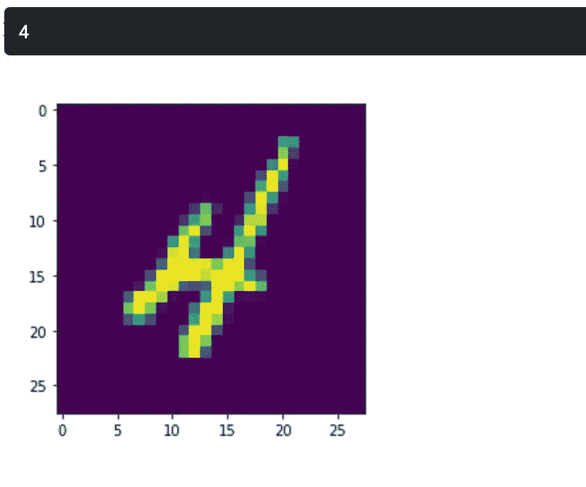

# 机器学习的数字识别器，又名“Hello World”

> 原文：<https://medium.com/analytics-vidhya/digit-recognizer-aka-hello-world-of-machine-learning-d59a4d11d35f?source=collection_archive---------13----------------------->

数字识别是一个崭露头角的机器学习工程师应该尝试的基本和首要问题之一。这是一个简单的问题，挑战在于识别手写数字。

根据 Kaggle，这里是详细的描述…

> MNIST(“改进的国家标准和技术研究所”)是计算机视觉事实上的“hello world”数据集。自 1999 年发布以来，这个经典的手写图像数据集一直是基准分类算法的基础。随着新的机器学习技术的出现，MNIST 仍然是研究人员和学习者的可靠资源。
> 
> 在这场比赛中，你的目标是从成千上万的手写图像数据集中正确识别数字。我们策划了一套教程风格的内核，涵盖了从回归到神经网络的所有内容。我们鼓励您尝试不同的算法，以直接了解哪些算法运行良好以及技术之间的比较。
> 
> [https://www.kaggle.com/c/digit-recognizer/overview](https://www.kaggle.com/c/digit-recognizer/overview)

**第一步:导入库**

> 导入熊猫作为 pd
> 导入 numpy 作为 np
> 导入 matplotlib.pyplot 作为 plt
> 导入 seaborn 作为 sns

**第二步:将数据文件加载到 Pandas DataFrame**

> train _ data = PD . read _ CSV(r '/ka ggle/input/digit-recognizer/train . CSV ')
> test _ data = PD . read _ CSV(r '/ka ggle/input/digit-recognizer/test . CSV ')

**第三步:预览数据文件**

> print(' Train Data sample ')
> print(Train _ Data . head())
> print(' Train Data file { } '的形状)。format(train_data.shape))
> 打印('列车数据文件的形状{} '。测试 _ 数据.形状))

**步骤 4:让我们将熊猫数据帧数据转换成一个 Numpy 数组**

> train_data = np.array(train_data，dtype = ' float 32 ')
> test _ data = NP . array(test _ data，dtype='float32')
> print('列车数据的形状{})。format(train_data.shape))
> 打印('列车数据的形状{} '。测试 _ 数据.形状))

**第五步:让我们从数据集中想象一个随机样本**

> 导入 random
> i = random.randint(1，42000)
> PLT . im show(train _ data[I，1:】。reshape(28，28))
> 标签= train_data[i，0]
> 标签

**第六步:从数据中可视化更多的样本**

> w _ grid = 15
> l_grid = 15
> fig，axes = plt.subplots(w_grid，l _ grid，figsize=(16，16))
> axes = axes . ravel()
> n _ training = len(train _ data)
> for I in NP . arange(0，w _ grid * l _ grid):
> index = NP . random . randint(0，n_training)
> axes[i]。imshow(train_data[index，1:]。整形(28，28))
> 坐标轴[i]。set_title(train_data[index，0]，fontsize=8)
> 轴[i]。axis(' off ')
> PLT . subplots _ adjust(hspace = 0.4)

**第七步:将数据拆分成训练并验证数据**

> x_train = train_data[:，1:]
> x_train = x_train/255。#归一化数据
> y_train = train_data[:，0]
> 
> 从 sklearn.model_selection 导入 train_test_split
> x_train，x_validate，y_train，y _ validate = train _ test _ split(x _ train，y_train，test_size=0.2，random_state=5)
> 
> #检查列车的形状并验证数据
> 
> 打印(' x 列数据的形状是{} '。format(x_train.shape))
> 打印(' y 列车数据的形状为{} '。格式(y_train.shape))
> 打印(' x 验证数据的形状是{} '。format(x_validate.shape))
> 打印(' y 验证数据的形状是{} '。格式(y_validate.shape))
> 
> #大部分 python 模型只能处理一维数组的数据，所以我们将数据转换成一维数组
> x _ train = x _ train . shape(x _ train . shape[0]，*(28，28，1))
> x _ validate = x _ validate . shape(x _ validate . shape[0]，*(28，28，1))

**第八步:导入模型包并训练**

> #从 keras 导入包
> 从 keras.models 导入顺序
> 从 keras.layers 导入 Conv2D、MaxPooling2D、Dense、Flatten、Dropout
> 从 keras.optimizers 导入 Adam
> 从 keras.callbacks 导入 TensorBoard
> 
> #定义并拟合模型
> cnn_model = Sequential()
> 
> cnn_model.add(Conv2D(32，3，3，input_shape=(28，28，1)，activation = ' relu ')
> CNN _ model . add(MaxPooling2D(pool _ size =(2，2)))
> CNN _ model . add(Flatten())
> CNN _ model . add(Dense(32，activation = ' relu ')
> CNN _ model . add(Dense(10，activation='sigmoid '))
> 
> CNN _ model . compile(loss = ' sparse _ category _ cross entropy '，optimizer=Adam(lr=0.001)，metrics =[' accuracy '])
> epochs = 80
> CNN _ model . fit(x _ train，y_train，batch_size = 512，epochs = epochs，verbose = 1，validation_data = (x_validate，y_validate))
> 
> #查看型号
> cnn_model.summary()

**步骤 9:标准化和整形测试数据**

> x_test =测试数据/255。
> x _ test = x _ test . shape(x _ test . shape[0]，*(28，28，1))

**第十步:做一个预测并验证它**

> import random
> I = random . randint(1，28000)
> PLT . im show(test _ data[I，]。reshape(28，28))
> 预测= CNN _ model . predict _ classes(x _ test)
> 预测[i]

