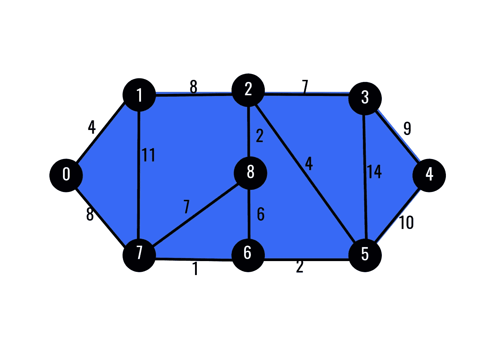
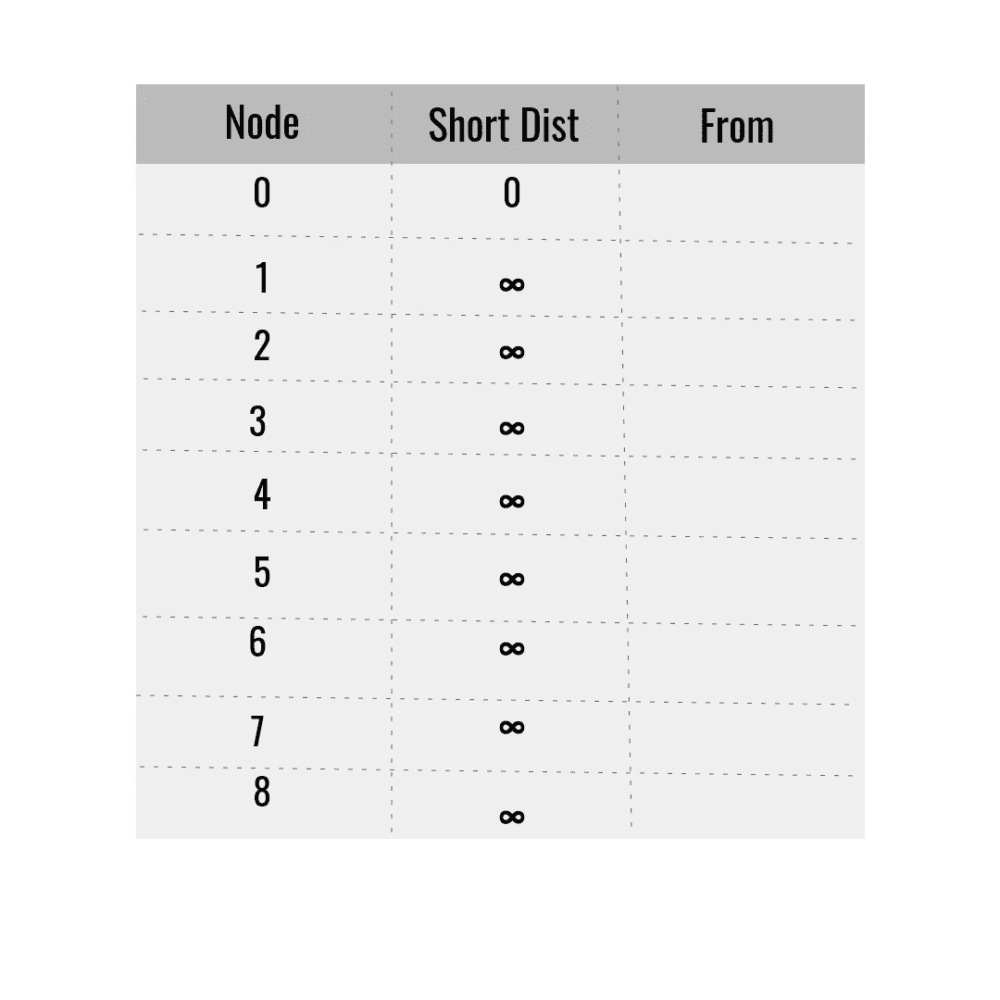
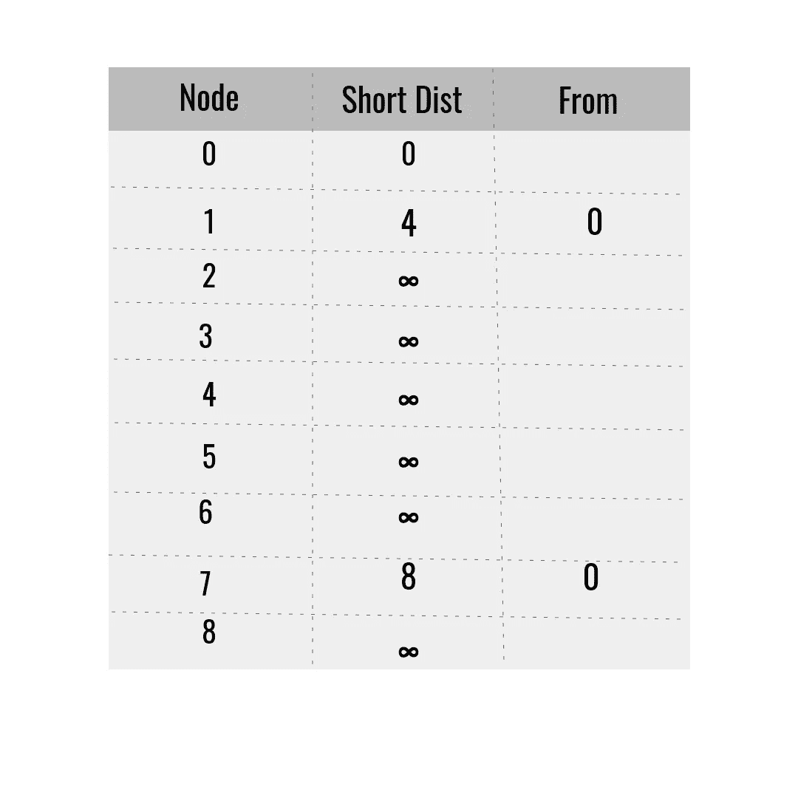
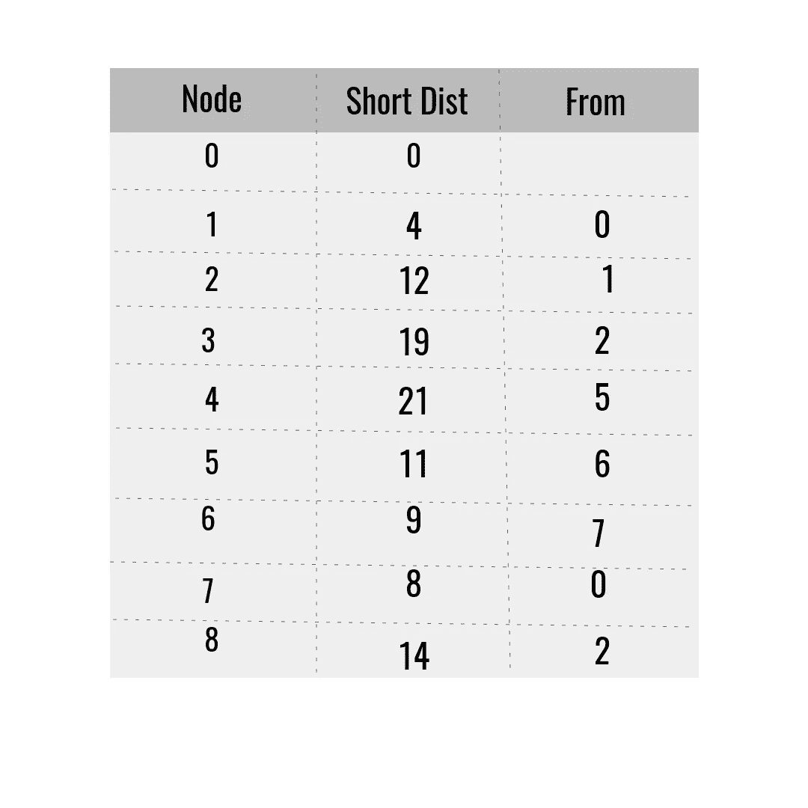

# Dijkstra 算法可视化器

> 原文：<https://medium.com/analytics-vidhya/dijkstras-algorithm-visualizer-fe5332a1980a?source=collection_archive---------6----------------------->

—所有路径查找算法之母

# Dijkstra 的算法是什么？

首先让我们弄清楚什么是 Dijkstra 算法。是的，这个名字听起来很奇怪。这是一种图形数据结构中的路径查找算法。对图到底是什么感到困惑？图是存储两个节点之间关系的数据结构(节点可以是保存数据的任何东西),例如:考虑脸书——你可以有多个朋友，你的朋友也可以有相同的朋友。有没有想过脸书是如何存储用户之间的联系的——是的，他们使用图形数据结构


# 它是如何工作的？

现在让我们讨论算法是如何工作的。考虑一个带有加权边(连接两个节点的线是边)的图，如下所示



图表示例

假设你在位置 0，你想去位置 4。您可以很容易地找到从位置 0 到位置 4 的最短路径。但是电脑就像孩子一样，我们需要给他们提供一切。让我们绘制一个表格来理解算法中涉及的步骤。



表 1

将第 0 个位置视为起始节点，我们将距离设为 0(当然，从 x 到 x 的距离总是为零)。对于算法的情况，我们使所有其他距离为无穷大。

现在我们要选择当前节点的一个相邻节点(节点 0)。顺序不是问题。

当前节点= 0，考虑节点= 1

> 距离(考虑节点)=距离(当前节点)+重量

这里权重是当前节点和考虑节点之间的边上的数。在计算了所考虑的节点的距离之后，如果该距离小于表中该特定节点的现有距离，则我们替换该值(这就是为什么我们使用无穷大作为默认距离的原因，这样任何距离在开始时都将小于无穷大)。现在考虑当前节点的第二个邻居，并做同样的事情。

(注意:我们需要将访问过的节点存储在某个地方，这样我们就不会迭代已经访问过的同一个节点)

更新当前节点的每个相邻节点的距离值后，将当前节点添加为所有相邻节点的 from 列。遍历第一个节点后，该表应该如下所示:



表 2

考虑尚未访问的节点，并在表中选择距离最短的节点。在这个例子中，节点 1 在所有未被访问的节点中具有最低的距离(注意，节点 0 被访问)。所以拿起那个，做同样的过程，直到图中没有未访问的节点。现在桌子会像这样:



表 3

这就是算法，是的，你没看错。算法到此为止。您可以使用此表来查找从节点 0 到任何其他节点的最短距离。例如:假设我们需要从节点 0 访问节点 4，为了找到最短路径，我们需要从节点 4 回溯。参考节点 4 所在的行。它来自 5，现在看看 5，它来自 6，重复这个过程，直到到达节点 0(源)。因此，路径将是:

> 4 -> 5 -> 6 -> 7 -> 0

# 可视化:

我们将使用 python 游戏模块 pygame 来可视化算法。我的实现只是一个实践，包含一些错误，但只是为了可视化，这没什么。我不打算介绍 python 的基础知识。如果你不知道 python，请从这里停止阅读。

创建一个目录(可以随意命名)，在该目录中创建一个名为 main.py 的文件，并在其中插入以下代码:

```
import pygame
from constants import *
from components import *
from helper import *
from algorithm import find_shortest_pathpygame.init()
pygame.display.set_caption("Dijkstra's Algorithm")
screen = pygame.display.set_mode([ WIDTH, WIDTH ])
screen.fill(BLACK)def main():
 running = True
 dragging = False
 disabled = Falseboard = Board(screen)
 grid = board.gridwhile running:
  board.draw()for event in pygame.event.get():
   if event.type == pygame.QUIT:
    running = Falseif disabled and (event.type == pygame.KEYDOWN or event.type == pygame.MOUSEBUTTONDOWN):
    disabled = False
    board = Board(screen)
    grid = board.gridelif event.type == pygame.MOUSEBUTTONDOWN:
    if event.button == 1:
     dragging = True
     handle_mouse_event(board)elif event.type == pygame.MOUSEMOTION and dragging:
    handle_mouse_event(board)elif event.type == pygame.MOUSEBUTTONUP:
    dragging = Falseelif event.type == pygame.KEYDOWN:
    if event.key == pygame.K_SPACE:
     find_shortest_path(board)
     board.start.set_start()
     board.end.set_end()
     disabled = Truepygame.quit()if __name__ == '__main__':
 main()
```

现在创建另一个名为 components.py 的文件，并粘贴以下内容:

```
import pygame
from constants import *
from helper import *class Item():
 ITEM_WIDTH = WIDTH // ROWSdef __init__(self, screen, row, col):
  self.screen = screen
  self.row = row
  self.col = col
  self.color = WHITE
  self.neighbours = []self.x = self.row * self.ITEM_WIDTH
  self.y = self.col * self.ITEM_WIDTHdef set_start(self):
  self.color = GREENdef set_end(self):
  self.color = REDdef set_wall(self):
  self.color = BLACKdef set_visited(self):
  self.color = BLUEdef set_path(self):
  self.color = GREYdef get_neighbours(self, grid):
  neighbours = []if self.row > 0 and grid[self.row - 1][self.col].color != BLACK:
   neighbours.append(grid[self.row - 1][self.col])if self.row < ROWS - 1 and grid[self.row + 1][self.col].color != BLACK:
   neighbours.append(grid[self.row + 1][self.col])if self.col > 0 and grid[self.row][self.col - 1].color != BLACK:
   neighbours.append(grid[self.row][self.col - 1])if self.col < ROWS - 1 and grid[self.row][self.col + 1].color != BLACK:
   neighbours.append(grid[self.row][self.col + 1])return neighboursdef draw(self):
  pygame.draw.rect(
   self.screen, 
   self.color, 
   (self.x, self.y, self.ITEM_WIDTH, self.ITEM_WIDTH)
  )def get_pos(self):
  return self.x, self.ydef __str__(self):
  return f"{self.row}, {self.col}"class Board():
 def __init__(self, screen):
  self.screen = screen
  self.grid = generate_grid(screen, ROWS, ROWS, Item)
  self.start = None
  self.end = Nonedef _draw_lines(self):
  for row in self.grid:
   for col in row:
    x, y = col.get_pos()
    pygame.draw.rect(
     self.screen, 
     BLACK, 
     pygame.Rect(x, y, col.ITEM_WIDTH, col.ITEM_WIDTH),
     1
    )
  pygame.display.flip()def draw(self):
  for row in self.grid:
   for col in row:
    col.draw()

  self._draw_lines()
  pygame.display.update()
```

现在常量文件:

```
WIDTH = 800
ROWS = 40BLACK = (0, 0, 0)
WHITE = (255, 255, 255)
GREEN = (0, 255, 0)
RED = (255, 0, 0)
BLUE = (0, 0, 255)
GREY = (66, 66, 66)
```

你可以调整宽度和行数来改变游戏的用户界面。确保行是宽度的一个因素。

如下所示创建 helper.py 文件

```
import pygame
from constants import *def generate_grid(screen, rows, cols, Item):
 grid = []
 for row in range(rows):
  grid.append([])
  for col in range(cols):
   grid[row].append(Item(screen, row, col))return griddef get_pos(x, y):
 return x // (WIDTH // ROWS), y // (WIDTH // ROWS)def handle_mouse_event(board):
 grid = board.grid
 start = board.start
 end = board.endx, y = pygame.mouse.get_pos()
 row, col = get_pos(x, y)if not start:
  grid[row][col].set_start()
  board.start = grid[row][col]elif not end and grid[row][col] != start:
  grid[row][col].set_end()
  board.end = grid[row][col]elif grid[row][col] != start and grid[row][col] != end:
  grid[row][col].set_wall()
```

所有这些文件都是为了游戏。现在到了重要的部分，是的，算法实现，如下所示:

```
def get_min_distance(distance, unvisited):
 minimum = next(iter(distance))for item in distance:
  if distance[item] < distance[minimum] and not unvisited[item]:
   minimum = itemreturn minimumdef draw_path(from_list, start, end):
 if end == start:
  return
 end.set_path()
 draw_path(from_list, start, from_list[end])def find_shortest_path(board):
 grid = board.grid
 start = board.start
 end = board.endunvisited = {col: False for row in grid for col in row}distance = {col: float("inf") for row in grid for col in row}
 distance[start] = 0from_list = {}while any(unvisited):
  current = get_min_distance(distance, unvisited)if current == end:
   draw_path(from_list, start, end)
   return Truefor neighbour in current.get_neighbours(grid):
   temp_dist = distance[current] + 1
   if temp_dist < distance[neighbour]:
    distance[neighbour] = temp_dist

    from_list[neighbour] = currentcurrent.set_visited()
  unvisited[current] = Truereturn False
```

推荐大家自己编算法，请不要只是复制粘贴我做的代码(里面有几个 bug，我只是做着玩的)。

以下是[回购](https://github.com/GanapathyPT/Short-Path-Finder)链接，以供参考

> 感谢阅读