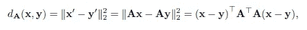
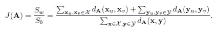
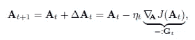
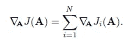
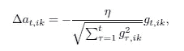

# 随机梯度下降降维

> 原文：<https://medium.com/analytics-vidhya/dimensionality-reduction-by-stochastic-gradient-descent-f617ebde3c1b?source=collection_archive---------8----------------------->

在 [Unsplash](https://unsplash.com?utm_source=medium&utm_medium=referral) 上拍摄的 [ThisisEngineering RAEng](https://unsplash.com/@thisisengineering?utm_source=medium&utm_medium=referral)

这篇文章展示了使用随机梯度下降进行降维。

***什么是降维？***

*降维是将一个潜在的大特征集 F 缩减为一个较小的特征集 F’的过程，以便在给定的机器学习或统计问题中加以考虑。*

在无监督的设置中，降维通常用于探索性数据分析，例如，可视化高维数据在人类可消化的二维或三维中的分布。在监督设置中，主要用途是减少学习机必须确定的参数数量。换句话说:降维的目标是克服维数灾难。

一种直接的方法，即特征选择，是根据一些优化标准，例如，与 F’中关于数据的特征的信息内容相关，仅选择某些特征，即选择 F 的选择 F’子集。更一般的方法是通过将由 F 定义的特征空间 Fs 映射到对应于 F’的低维空间 Fs’来找到 F’。

在这里，我们将重点放在后一类监督设置。特别地，我们提出了一种学习线性映射的方法，该方法近似地最大化了类之间的距离。

***对数据集应用降维有什么好处？***

1.  维数越小意味着计算时间越少。
2.  有助于删除多余的功能。移除冗余要素有助于处理多重共线性。
3.  更高的维度可能会导致“维数灾难”的问题。
4.  很难将高维数据可视化。
5.  较小的维度意味着用于存储数据的存储空间较小。
6.  过多的维度可能会从训练数据中发现不必要的信息，并且可能无法很好地概括测试数据。也就是说，它可能会导致过度拟合。

***相关工作***

可以说，两种最著名的降维技术是无监督主成分分析(PCA)和 Fisher 的监督线性判别分析(LDA)。

简而言之，PCA 找到线性映射，从而最小化平方投影误差。效果是原始特征空间中的大部分数据方差也在缩减空间 Fs’中表示。虽然 PCA 确实保持了方差，但是它不一定保持投影空间中的类别可分性。

另一方面，LDA 找到一种投影，使得不同类别的样本之间的分散最大化，而相同类别的样本之间的分散最小化。投影不一定能很好地表示数据的高维变化，但它确实保留了区分类别所需的信息。然而，LDA 隐含地假设给定类的数据是正态分布的。再加上 Fs '的维数比类 C 的数目少 1，dim(Fs ')= C1 的限制，这意味着可能会丢弃太多的信息，并且这些类在 Fs '中是不可分的。

还有将数据投影到嵌入在 f 中的低维流形上的非线性方法。这种方法的例子包括多维标度、Isomap、局部 Fisher 判别分析和 t 分布随机邻居嵌入。

降维也与度量学习密切相关，度量学习的目标是学习一个实现与给定数据集的距离的函数。然后，该度量将用于后续的基于距离的分类器，如最近质心或 k-最近邻居。度量学习方法的例子包括大间隔最近邻和信息论度量学习。

***其他一些流行的降维技术***

t 分布随机邻域嵌入

神经自动编码器

正向特征选择

反向特征消除

缺失值比率

列值中的低方差

两列之间的高度相关性

***战法***

我们的方法可以被形式化如下:给定 R^n 的一组 n 维训练数据 d 子集以及该组到两个不相交的类 x 和 y 的划分，目标是找到到 m 维空间的线性投影 x’= ax，其中 m << n，使得类分离在较低维空间中被最好地保留。该方法还可以很容易地扩展到两个以上的类。

换句话说，目标是找到一个属于 R^(m×n 的矩阵 a)使得两个缩减的特征向量的平方欧几里德距离，

如果 x 和 y 属于不同的类，则为大，否则为小。请注意，这个目标与度量学习的目标非常相似。然而，这里我们明确地对维数减少感兴趣，以便随后的学习算法不必是基于距离的。可以使用大间隔最近邻或信息论度量学习的方法并分解矩阵 M，但是不能保证所得到的维数减少在我们的目标意义上是最优的。

取而代之，我们从 LDA 中获得灵感，并且找到投影矩阵 A = argmin(A) J(A ),其最小化相同类别的特征向量之间的距离，同时最大化不同类别的样本之间的距离，通过类内和类间距离的未加权比率来测量(像 LDA)，

等式 1

不幸的是，上述最小化问题的封闭形式的解决方案并不容易获得。因此，我们选择迭代优化它。特别地，我们使用众所周知的梯度下降法来寻找(局部)最小值，

其中 At 和 At 表示候选解并在时间步 t 更新，Gt := del(A)J(At)表示目标函数相对于 A 的梯度，超参数 nt 是在时间步 t 的学习率

***随机梯度下降***

随机梯度下降(SGD)已经成为加速深度神经网络学习过程的流行工具。SGD 的主要观点是，由于微分算子 del(A)的线性，对几个子目标求和的目标函数的梯度 J(A)=summation(i=1 到 N)Ji(A)可以写成

在经验风险最小化(机器学习的主要支柱之一)中，目标函数通常采用这种形式，其中每个子目标对应于最小化单个训练样本的损失。

SGD 通过在梯度下降的每一步用训练数据的随机子样本近似梯度来利用这种结构，

其中 K<< N is the number of samples to consider each step and sigma-t is a random permutation of the set {1, . . . ,N}. The intuition is that, while the individual approximations of the gradient do not point in the same direction as the true gradient, the approximation error averages out when a large number of iterations are performed. SGD requires more iterations to converge than gradient descent, but each iteration is much less computationally expensive. Thus, the overall convergence speed is generally faster, especially with large datasets or when the Ji are expensive to compute.

Unfortunately, the objective function in equation 1 does not have the required structure. Both the nominator and denominator, however, do. This suggests that the general idea is applicable regardless: At each step of the gradient descent, we sample a small subset of the data, so that an equal number of samples is drawn from both X and Y. The gradient Gt is approximated using only these samples.

**T5【阿达格拉德】T6**

随机梯度下降和规则梯度下降一样，非常容易受到学习率选择的影响。如果学习率过大，那么可能会错过好的解；如果太小，算法会收敛得很慢。理想情况下，学习速率在开始时应该很大，但是当中间解接近最优值时应该很小，以便不会在最优值附近振荡。

AdaGrad 定义了一个学习率计划，其中考虑了之前的参数更新。梯度的第(ik)个分量的学习速率被选择为

其中 n 是全局学习率，r(tau)表示 t 之前的时间步长，g，ik 表示历史梯度 g 的第(ik)个分量。直觉是，较大的更新将导致将来较小的学习率，这有效地消除了由于局部陡峭梯度而导致的极端参数更新。与动量方法或牛顿-拉夫森方法非常相似，每个参数 aik 都与不同的学习速率时间表相关联，这意味着沿着参数空间的每个维度的进展随着时间而变得均匀。缺点是，根据全局学习率，学习率最终接近零，并且优化可能在达到最小值之前停止。

***结论***

我们提出了一种线性降维的方法。该方法从 PCA 和 Fisher LDA 中获得灵感，并试图最小化同一类样本之间的成对距离，同时最大化不同类样本之间的距离。我们没有提供封闭形式的解决方案，而是选择使用众所周知的梯度下降优化算法。为了加速计算，我们使用了随机梯度下降和 AdaGrad 学习速率表。

我们方法的最大问题是偏向于有效地将特征减少到一维特征空间。我们可以计划通过重新加权目标函数的各项并在投影中引入非线性来解决这个问题。由于这将导致更加复杂的梯度，我们将重新评估自动微分工具的使用。

另一个有趣的研究问题是关于*逐步降维*的使用:该算法不是直接从 n 维降维到 m 维，而是首先将 n 个特征降维到 n-1 个特征，然后将中间的 n-1 个特征降维到 n-2 个特征，等等。，直到达到所需的特征数量。希望每个中间降维比完全降维更容易解决——特别是如果非线性也被引入的话。

*谢谢！*

***参考文献***

J.b .克鲁斯卡尔。通过优化非度量假设的拟合优度进行多维标度。心理计量学，29(1):1–27，1964 年。

Yann LeCun，Yoshua Bengio 和 Geoffrey Hinton。深度学习。自然，521(7553):436–444，2015。

基利安·Q·温伯格、约翰·布利泽和劳伦斯·K·索尔。用于大间隔最近邻分类的距离度量学习。神经信息处理系统进展，1473-1480 页，2005。

由随机梯度下降引导的线性降维。

约书亚·特南鲍姆、文·德·席尔瓦和约翰·C·兰福德。非线性降维的全局几何框架。科学，290(5500):2319–2323，2000。

***如果你喜欢这篇文章，别忘了留个“拍手”！***

*感谢您的宝贵时间。*

 [## Subodh Lonkar -质量保证自动化工程师- Aptify | LinkedIn

### 查看 Subodh Lonkar 在全球最大的职业社区 LinkedIn 上的个人资料。Subodh 有一个工作列在他们的…

www.linkedin.com](https://www.linkedin.com/in/subodh-lonkar-47662819b/)  [## 学员-子科目-概述

### 在 Python 项目中使用基本数据结构的基本计算机科学算法集 Euler 是一系列…

github.com](https://github.com/learner-subodh)