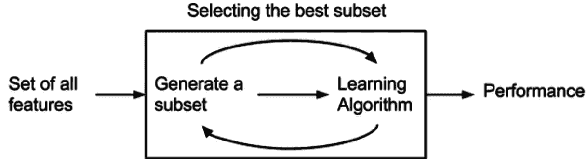
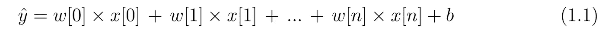

# 降维——如何处理数据集中的特征(第 1 部分)。

> 原文：<https://medium.com/analytics-vidhya/dimensionality-reduction-how-to-deal-with-the-features-in-your-dataset-part-1-fbd174d6dc2a?source=collection_archive---------5----------------------->

真实世界的数据是杂乱的，大多包含不想要的和多余的特征。这些冗余的特征通常会使我们的预测模型很难达到预期的效果。因此**降维**，消除、包含和转换现有特征的过程成为数据预处理的关键步骤。

一旦我们有了简明和相关的数据，它会帮助我们

*   更好地可视化和探索数据集
*   占用更少的内存空间
*   降低预测模型的复杂性，使其更易于解释
*   减少过度拟合
*   通过选择正确的特征来提高模型的性能

该过程可以大致分为两种方式:

1.  **特征选择**-排除或包含数据中存在的属性而不改变它们的过程。
2.  **特征提取-** 通过对现有属性进行一些转换来创建新的属性组合的过程

在这个故事中，我们将看看**特征选择**部分。**特征提取**将在本文的第 2 部分讨论。

**特征选择**分为 3 个主要类别。

1.  **过滤方法**
2.  **2。包装方法**
3.  **3。嵌入式方法。**

我们将详细讨论每个问题:

# 1.过滤方法

这里，最相关的特征是基于它们与目标的**相关性**、特征的**唯一性**以及它们的**统计显著性**来选择的。用于训练数据集的 **ML 算法**在选择特征时**不涉及**。

一些常用的过滤方法:

**a .缺失值比率:**我们经常会遇到某些列有很多缺失值的数据。如果列*大部分为空*，则*没有提供足够的相关信息*。因此，我们可以找到每一列的缺失值比率，并删除不符合约定阈值比率的列。

**b .低方差滤波器:**如果一列中数据的分布是*最均匀*那么它的*方差趋于零*。这样的列*对预测目标变量*没有太大贡献。因此，在决定了阈值方差值之后，我们可以删除方差低于该值的列。但是方差取决于数据的分布/范围。因此，在应用该方法之前， [*标准化*](https://stats.stackexchange.com/questions/10289/whats-the-difference-between-normalization-and-standardization?source=post_page-----e3f174b65dfc----------------------) 数据非常重要。

**c .信息增益:**这有助于测量两个变量之间的相关性。主要用于*分类*问题。IG 着眼于每个特征，并衡量该特征在目标变量分类中的重要性。它涉及到熵的度量。(信息增益= 1-熵)。*信息增益越高，分类越好。*

让我们考虑一个数据集，它有两个特征 **x1** 和 **x2** 以及一个值为 0 和 1 的目标变量 **y** 。让我们对 **y** 进行两次分类，一次基于 **x1** 一次基于 **x2。**

设特定分裂的 1 和 0 的百分比为 p1 和 p2，因此该分裂的熵为

让我们找出 **y** 每次分裂的熵和信息增益

这里我们可以看到， **x2** 上的分割 IG 更大，分类也更好。因此，x2 是一个更好的特征，应该被选择。

**d. Pearson 相关性:**此度量具有**连续**值的目标列对另一个也包含**连续**值的列的依赖性。它测量两个变量之间的线性关联。

如果这个值接近 1，那么它就是一个完美的相关性:当一个变量增加时，另一个变量也会增加(如果为正)或减少(如果为负)。

当值接近零时，变量被称为没有相关性。更多关于这个[在这里。](https://www.khanacademy.org/math/ap-statistics/bivariate-data-ap/correlation-coefficient-r/v/calculating-correlation-coefficient-r)

**e. ANOVA :** 此测量具有**连续**值的目标列对包含**分类**值的另一列的依赖性。在我们首先讨论之前，我将敦促读者从[这里](https://www.khanacademy.org/math/statistics-probability/analysis-of-variance-anova-library#analysis-of-variance-anova)理解方差分析的概念。

让我们考虑一个分类特征 **x** 和一个目标列 **y** ，前者具有可能的值 A、B 和 C，后者具有不同的连续值。现在，我们将根据特征 x 的类别对这些连续目标值 **y** 进行分组

将 **y** 的值按 **x** 的类别分组后，我们发现表格如下

现在 ANOVA 将确定 Y 值的这些组(A，B，C)中的每一组的平均值是否基本相等(**零假设**)或者它们之间是否有显著性差异(**零假设**)。

**如果我们的零假设为真，那么我们将得出结论，分类特征 X 对 Y 没有任何影响**。

否则，如果无效假设被拒绝，那么我们将得出结论，X 特征的不同类别确实影响 Y，因此应该在我们的特征选择技术中进行选择。

*   **如果统计量<临界值**:无显著结果，不拒绝零假设(Ho)，**独立。**
*   **如果统计> =临界值**:显著结果，拒绝零假设(Ho)，依赖**。**

****卡方检验:**卡方检验确定两个分类变量之间是否存在显著关系。你可以通过[这些](https://www.khanacademy.org/math/statistics-probability/inference-categorical-data-chi-square-tests/chi-square-goodness-of-fit-tests/v/goodness-of-fit-example)来了解卡方分布，以及如何计算卡方统计量。现在我们如何在机器学习中使用这个来进行特征选择呢？**

**它基本上确定了特定分类变量 X(**男性，女性**)的不同组(**性别**)在另一变量 Y ( **兴趣**)的不同类别(**科学、艺术、数学**)中的频率分布是否相同。**

****

**这里我们有 2 个频率分布(男性和女性),按艺术、科学和数学分组。所以我们将确定这两组频率是**相等**(零假设)还是它们之间存在**显著差异**(替代假设)**

*   ****如果统计量<临界值**:无显著结果，不拒绝零假设(Ho)，**独立。****
*   ****如果统计量> =临界值**:显著结果，拒绝零假设(Ho)，依赖**。****

****更多关于这个[这里](https://machinelearningmastery.com/chi-squared-test-for-machine-learning/)。****

# ****2.包装方法****

********

****包装器方法基于贪婪搜索算法，因为它们评估所有可能的特征组合，并为特定的机器学习算法选择产生最佳结果的组合。它基于算法的性能从子集迭代地选择或丢弃特征。它测试所有可能的组合，因此计算量很大。****

****一些最常见的包装方法:****

******a .正向特征选择******

****这里，从 1 个特征开始逐个选择特征。****

****在第一阶段，用每个特征训练算法。从中选出最好的。****

****在第二阶段，将该特征与其他特征相结合，并选择 2 的最佳组合。****

****这一直持续到选择了所需特征数量的最佳组合。****

******b .递归特征消除******

****递归要素消除过程从数据集中的所有要素开始。它以循环的方式消除每个特性一次，并评估剩余子集的性能。选择性能最佳的子集。****

****对于这个选定的(功能数-1)子集，剩余的每个功能都被删除一次，并对性能进行评估。选择性能最佳的特征子集(特征数量-2)。****

****这个过程一直持续到我们得到满足所需标准的最佳性能特征子集****

# ****3.嵌入式方法****

********

****拥有更多的功能有时会增加噪音。模型可能最终会记住噪音，而不是学习数据的趋势。如果没有仔细训练，这些不准确性会导致低质量的模型。这被称为**过拟合******

********

****避免过度拟合背后的主要概念是尽可能简化模型。简单模型(通常)不会过度拟合。另一方面，我们需要注意模型过拟合和欠拟合之间的平衡。这是通过**正则化实现的。******

****正则化背后的基本思想可以理解为**对学习权重(w)** 的**较高值的损失函数**进行惩罚。这防止了一些**特征呈指数增长并导致过度拟合**。****

****让我们详细理解这一点****

****让我们考虑一下训练空间中的一个记录****

******n 个**特征由 **x[0]，x[1]，x[2]表示..x[n]。******

****学习到的参数或权重为 **w[0]，w[1]，w[2]…w[n]** 。****

******目标值为 y******

****让预测值为****

********

****现在损失函数可以定义为:****

********

****我们的全部动机是最小化 1.2 中定义的损失函数。****

****因此，如果由于某些特征 x[j]相应的权重 w[j]爆炸，这可能导致过度拟合。为了避免这种情况，我们必须惩罚那些爆炸重量的损失函数。这可以通过以下方式实现:****

********

****这里，我们将正则化参数 **λ** 与权重一起添加，以便在最小化成本函数的同时，收缩一些权重，使模型不那么复杂。****

******a .岭回归******

****在岭回归中，权重 w[j]的**平方与 **λ一起取值。********

****

**因此，通过改变 **λ** ，权重被调整和收缩，但永远不会达到 0。**

****

**更多关于岭回归[这里](https://www.youtube.com/watch?v=Q81RR3yKn30&t=894s)**

****b .拉索回归****

**在套索中，重量 w[j]的**绝对值与 **λ一起被采用。******

****

**这可能导致权重为零，即某些特征在评估输出时被完全忽略，从而完全消除了某些特征。**

****

**更多关于套索回归[这里](https://www.youtube.com/watch?v=NGf0voTMlcs&t=2s)。**

**因此，我们几乎涵盖了主要的降维技术，即去掉或缩小不太重要的特征来创建一个更简单的模型。提取新特征主题将在后面讨论。**