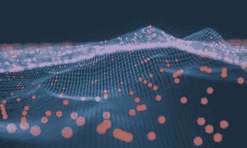
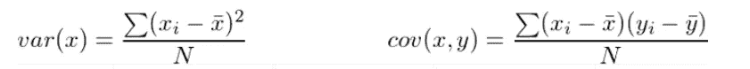
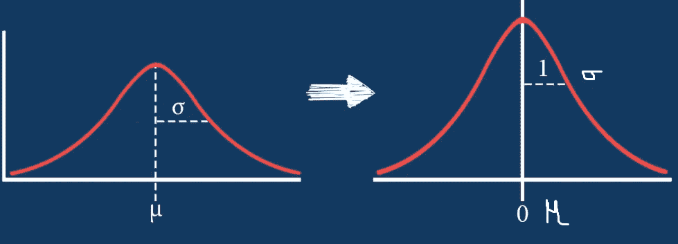
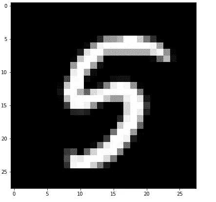
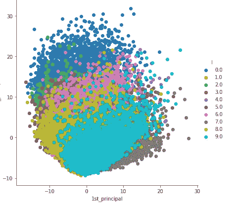
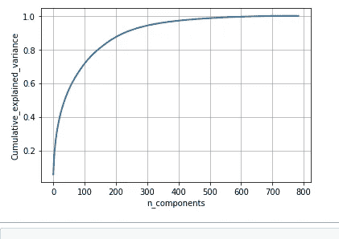
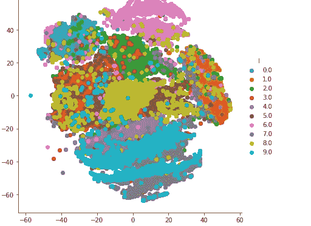

# 机器学习中的降维

> 原文：<https://medium.com/analytics-vidhya/dimensionality-reduction-in-machine-learning-179ba0c83066?source=collection_archive---------20----------------------->

*降维，或称降维，是将数据从高维空间转换到低维空间，使低维表示保留原始数据的一些有意义的属性。*

***我们为什么要使用降维技术？***

人类无法将高维数据可视化，所以我们希望将其降维。在现实世界的数据分析任务中，我们分析复杂的数据，即多维数据。我们绘制数据，并在其中找到各种模式，或者用它来训练一些机器学习模型。考虑维度的一种方式是，假设您有一个数据点 ***x*** *，如果我们将该数据点视为一个物理对象，那么维度只是视图的基础，就像从水平轴或垂直轴观察时数据位于何处一样。*

*随着数据维度的增加，可视化和计算的难度也在增加。那么，如何降低一个数据的维度——
*去掉冗余维度
*只保留最重要的维度*

***机器学习中的降维技术有哪些？***

在这篇文章中，我们使用了像主成分分析和 t-SNE 这样的基本技术。

***主成分分析(PCA):机器学习中的****PCA 是无监督学习技术。*

> *先试着理解一些术语*
> 
> ***方差:*** *它是可变性的度量，或者它只是度量数据集的分布程度。从数学上讲，它是平均分数的均方差。我们使用下面的公式来计算方差 var(x)。*

> ***协方差:****It***是对两组有序数据中对应元素向同一方向移动程度的度量。公式如上所示，表示为 cov(x，y)作为 x 和 y 的协方差。**
> 
> ****列标准化:*** *这是一种压缩数据点的方法，使得均值向量位于原点，并且在变换后的空间中任何轴上的方差(通过压缩或扩展)都为 1。这种技术通常被称为均值居中和方差缩放。**

**

****列标准化公式****

**

****PCA 是如何工作的:*** *我们要保留数据中最大散度/方差的方向。**

1.  *首先，我们要把给定的数据标准化。*

**2。计算数据点的协方差矩阵 X。**

**3。计算特征向量和相应的特征值。**

**4。按照特征值降序排列特征向量。**

**5。选择前 k 个特征向量，这将是新的 k 维。**

**6。把原来的 n 维数据点转换成 k 维。**

****特征向量*** *:这些向量给出了数据中出现最大扩散的方向。**

****特征值*** *:这些值给出了在什么方向上传播的百分比。**

*在下面的例子中，我们使用 Python 和一些库实现了 PCA。*

**在这些例子中，我们使用真实世界的 Kaggle 数据集来执行 PCA。* [*访问下载 MNIST 数据集从 Kaggle 下载。*](https://www.kaggle.com/c/digit-recognizer/data)*

****什么是 MNIST 数据集？****

**在包含成千上万个手写数字图像的 MNIST 数据集中，我们的任务是将手写字符分类为 10 个数字字符中的一个。**

**每张图片高 28 像素，宽 28 像素，总共 784 像素。每个像素都有一个与之关联的像素值，表示该像素的亮度或暗度，数字越大表示越暗。该像素值是 0 到 255 之间的整数，包括 0 和 255。**

**

****手写图像****

> **首先，我们想把图像转换成一个列向量。将图像表示成矩阵。如果图像由全黑表面组成，则赋值“0”，如果图像的表面是全白的，则赋值“1”，如果图像是灰色的，则赋值“0”和“1”之间的值。**
> 
> **矩阵表示后通过使用展平将矩阵转换成单列向量，如图像的维数为(784×1)。**
> 
> *让我们从 Python 开始*
> 
> **#加载数据集
> Data = PD . read _ CSV(' train . CSV ')**
> 
> *在进行主成分分析之前，请始终将您的数据标准化，因为如果我们使用不同尺度的数据(此处为特征)，我们会得到误导成分。*
> 
> **#数据-预处理:对来自 sklearn .预处理导入 standard scaler
> standard _ Data = standard scaler()的数据进行标准化。fit_transform(数据)
> print(标准化 _ 数据.形状)**
> 
> ****求协方差矩阵即:A^T * A****
> 
> **#矩阵乘法使用 numpy
> covar _ matrix = NP . mat mul(标准化 _ 数据。t，标准化 _ 数据)**
> 
> **#找到前两个特征值和相应的特征向量
> #用于投影到二维空间。**
> 
> ****计算特征向量和对应的特征值。****
> 
> **值，向量= eigh(covar_matrix，eigvals=(782，783))**
> 
> ****将原始数据样本投影到平面上。*** *new _ coordinates = NP . mat mul(vectors，sample_data。T)**
> 
> **完成所有这些工作后，绘制出数据的样子**

**

****应用 PCA 后****

> **我们还可以通过做 explained _ variance/components 总数来找出方向解释了多少方差。在下图中，如果我们使用 300 个维度，大约 97 %的数据保存在 thaa 维度中。**

**

****解释方差的百分比****

*[*查看详细代码请访问。*](https://github.com/Sachin-D-N/Machine_Learning/blob/master/PCA_Tsne/PCA.ipynb)*

****PCA 的局限性:****

1.  **PCA 试图只保留数据的全局形状。**

**2。当给定的数据是圆形或超球形时，我们在应用 PCA 时会丢失数据。**

****t-SNE(t-分布式随机邻域嵌入):****

**PCA 仅保留数据的全局形状，但是 t-SNE 保留数据的全局和局部形状。这也是最好的可视化技术。**

****邻域:*** *当两点之间的距离很小时我们可以定义为这些点都在邻域内。**

****嵌入:*** *嵌入是将数据点从高维度逐个放入低维度的技术。**

****如何应用 t-SNE？****

1.  **t-SNE 是一种迭代算法。**
2.  **t-SNE 用于邻域保持嵌入技术。**
3.  *每次当我们运行一个算法时，我们得到不同的值，所以 t-SNE 被称为随机的。*
4.  *当我们增加更多的迭代次数时，我们会得到更好的形状。*
5.  **t-SNE 基本上是扩大密集的点群，收缩稀疏的簇群。下图显示了对 MNIST 数据集应用 t-SNE 后 t-SNE 的可视化效果。**

**

****MNIST t-SNE 数据集****

*[*在没有编码的 web 中玩 t-SNE 访问*](https://distill.pub/2016/misread-tsne/) *。**

*[*查看 t-SNE 访问的详细代码。*](https://github.com/Sachin-D-N/Machine_Learning/blob/master/PCA_Tsne/T-SNE.ipynb)*

**t-SNE 如此受欢迎是有原因的:它非常灵活，经常能找到其他降维算法找不到的结构。不幸的是，正是这种灵活性使得解读*变得棘手*

*如果你发现帖子中有什么错误，或者你有什么要补充的，让我们在评论中讨论。*

**感谢阅读……**