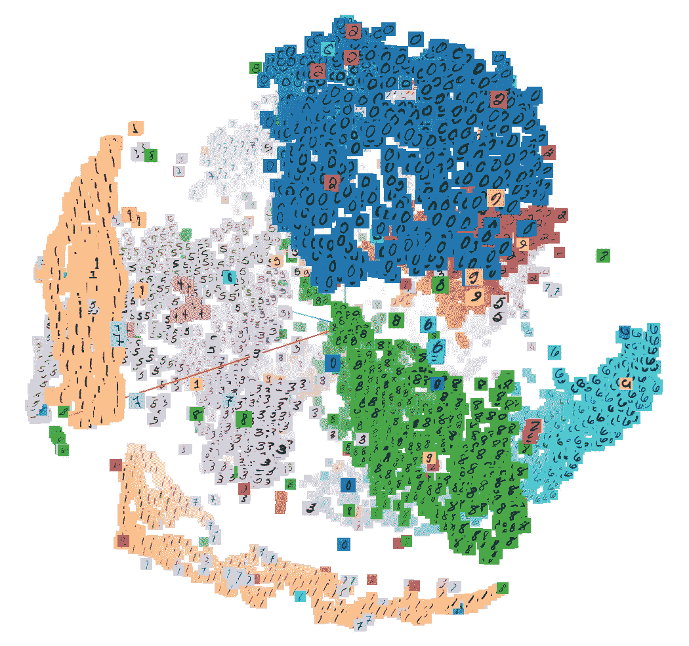

# 监督框架下的降维与偏最小二乘回归

> 原文：<https://medium.com/analytics-vidhya/dimensionality-reduction-in-supervised-framework-and-partial-least-square-regression-b557a4c6c049?source=collection_archive---------6----------------------->

**作者— Souradip Chakraborty**

**图 1:高维空间和维度的诅咒**

## **高维空间和该空间中大多数距离度量的惊人行为**

我一直非常着迷于高维空间的概念和它在…