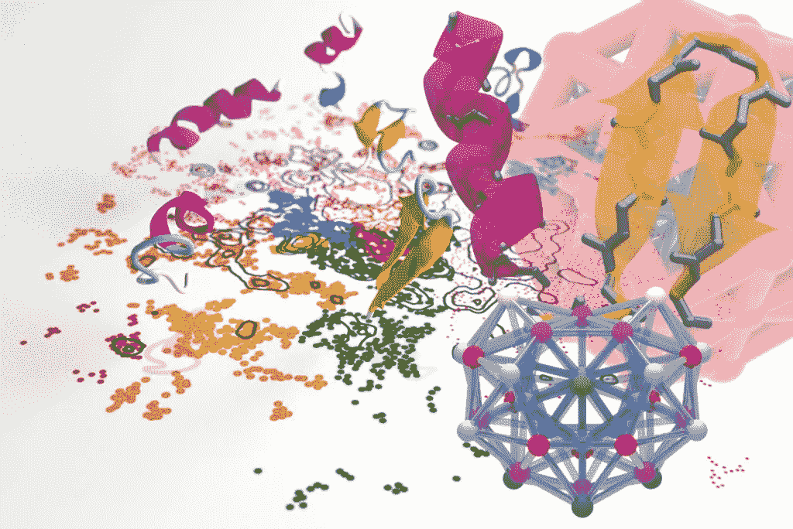
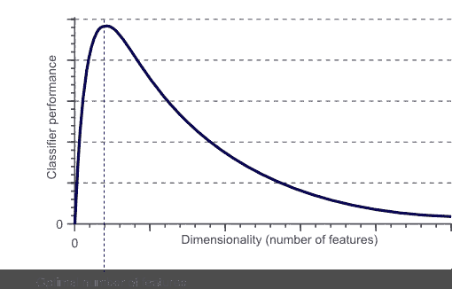
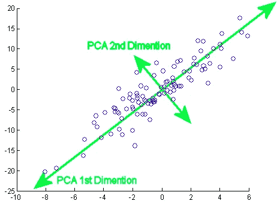
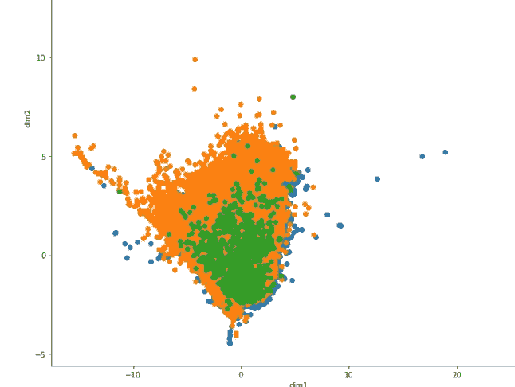
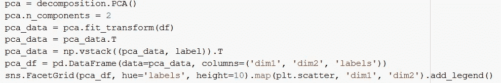
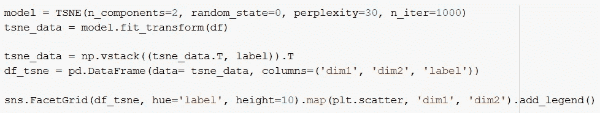
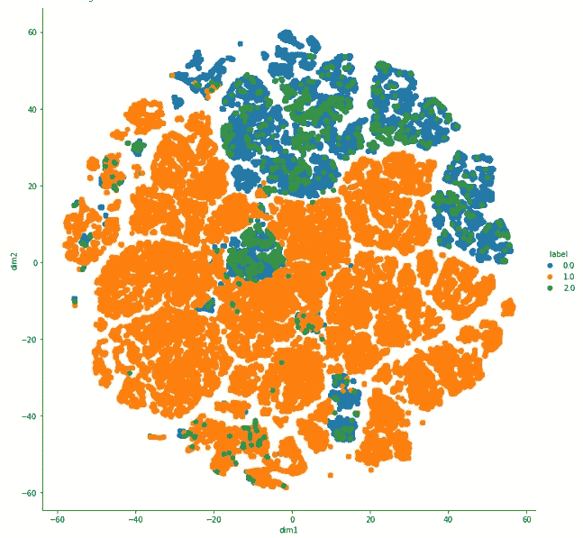
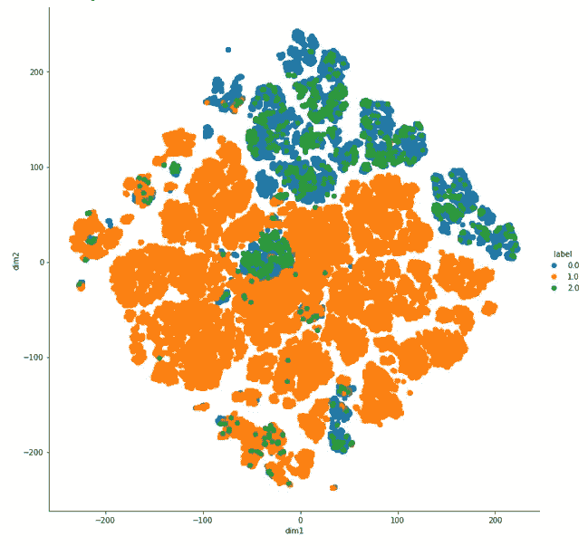

# 降维——主成分分析与线性判别分析和 t-SNE

> 原文：<https://medium.com/analytics-vidhya/dimensionality-reduction-pca-vs-lda-vs-t-sne-681636bc686?source=collection_archive---------10----------------------->

在本文中，我们将了解三种最流行的降维技术背后的直觉。

## 议程

在本文中，我们旨在提供降维技术背后的直觉。我们将主要关注三种最流行的技术——PCA、t -SNE 和 LDA。我们将讨论它们的优点、何时使用以及它们的实现。我们还将在数据集上实现所有三种算法。

资料来源:epfl.ch

## 介绍

在机器学习中，我们将特征或输入变量的数量称为维度。

降维是指将数据从高维空间转换到低维空间，同时保持原始数据中大部分有意义的洞察力的过程。

例如，一个数据集包含 100 列(即特征)，或者它可以是组成三维空间中一个大球体的点的阵列。降维是将列的数量减少到一个较低的数量，比如说两个维度。

那么，为什么我们不能将所有的数据输入到一个机器学习模型中，而不进行任何降维呢？

## 维度的诅咒

维度的诅咒指的是处理高维数据时遇到的问题。具有大量特征的数据集(通常有数百个或更多)被称为高维数据。高维数据带来的一些困难出现在分析或可视化数据以识别模式的过程中，一些困难出现在训练机器学习模型的过程中。

由于高维数据导致的与训练机器学习模型相关的困难被称为维数灾难。

随着维数的增加，分类器的性能会提高，直到达到最佳特征数。在不增加训练样本数量的情况下进一步增加维度会导致分类器性能下降。

**休斯现象**

## 降维

降维可以通过特征选择和特征工程来实现。

要素选择是从数据中的所有可用要素中选择所需要素的过程。要素选择的主要目的是选择能够完美代表数据集的要素。

要素工程是将原始数据转换为要素的过程，这些要素可以很好地表示数据集。

## **PCA —主成分分析**

主成分分析是一种非监督学习类的统计技术，用于使用数量较少的变量(称为主成分)来解释高维数据。

主成分是数据集中原始变量的线性组合。

资料来源:weigend.com

# 步骤:

1.  以 d 维数据集为例
2.  计算每个维度的平均向量。
3.  计算协方差矩阵。
4.  计算每个维度的特征向量和相应的特征值。
5.  接下来，通过减少特征值对特征向量进行排序，并选择具有最大特征值的 k 个特征向量，以形成 d×k 维矩阵
6.  使用这个 d×k 特征向量矩阵将样本变换到新的子空间上。

酒店预订数据集的主成分分析。

使用 sklearn 实现 PCA

## PCA 的弱点

它很容易受到数据中异常值的影响。

为了克服这个问题，已经开发了许多健壮版本的 PCA，包括随机化 PCA、稀疏 PCA 等。

PCA 仅在处理连续数据时效果最佳。

## 线性鉴别分析

线性判别分析寻求通过样本的类值来最好地分离(或区分)训练数据集中的样本。具体来说，该模型寻求找到输入变量的线性组合，该组合实现类之间样本的最大分离(类质心或均值)和每个类内样本的最小分离。

## LDA 的弱点

LDA 有一些严重的局限性:

I)如果设计不平衡(即，不同类别中的对象数量(高度)不同)，LDA 不能很好地工作。

ii)LDA 对过度拟合敏感，并且 LDA 模型的验证至少是有问题的。

iii) LDA 对于非线性问题(橙-香蕉形状点云的分离，类中类情况)不适用(较差)

## t-SNE——t-分布随机邻居嵌入

t-SNE 是一种非线性降维技术，最常用于可视化高维数据集。

有兴趣了解算法详细工作原理的可以参考这篇[研究论文](http://www.jmlr.org/papers/volume9/vandermaaten08a/vandermaaten08a.pdf)。

这是一个使用 sklearn 库实现的 t-SNE 算法

参数—

*   **n_components** (默认:2):嵌入空间的尺寸。
*   **困惑度**(默认:30):困惑度与其他流形学习算法中使用的最近邻个数有关。考虑选择一个介于 5 和 50 之间的值。
*   **early _ 夸张**(默认:12.0):控制原始空间中的自然簇在嵌入空间中的紧密程度，以及它们之间将有多大的空间。
*   **learning_rate** (默认值:200.0):t-SNE 的学习率通常在(10.0，1000.0)范围内。
*   **n_iter** (默认值:1000):优化的最大迭代次数。应该至少 250。

酒店预订数据集上的 t-SNE(困惑度= 30，itr = 1000)。

酒店预订数据集上的 t-SNE(困惑度= 30，itr = 5000)。

SNE 霸王龙的弱点—

1.  t-SNE 在数据点数量上具有二次时空复杂度。这使得它在应用于包含超过 10，000 个观察值的数据集时特别慢、计算量相当大并且消耗资源。
2.  也可以在随机噪声中发现模式，因此在决定数据中是否存在模式之前，必须检查具有不同超参数集的算法的多次运行。

这个项目的所有代码都可以在我的 GitHub 配置文件中找到。

 [## vipinkatara/酒店-预订-需求-ml

### 通过在 GitHub 上创建一个帐户，为 vipinkatara/酒店预订需求 ml 开发做出贡献。

github.com](https://github.com/vipinkatara/Hotel-booking-demand-ml)  [## Vipin katara - Amity 工程学院&技术学院-新德里，德里，印度| LinkedIn

### 查看 Vipin katara 在全球最大的职业社区 LinkedIn 上的个人资料。唯品教育上市于…

www.linkedin.com](https://www.linkedin.com/in/vipin-katara-951a5750/)