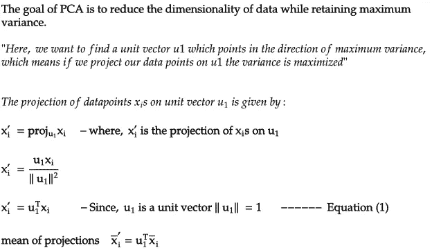
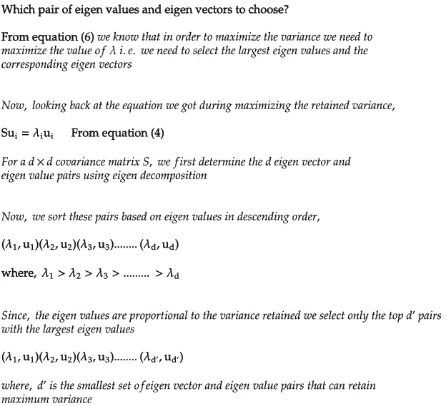
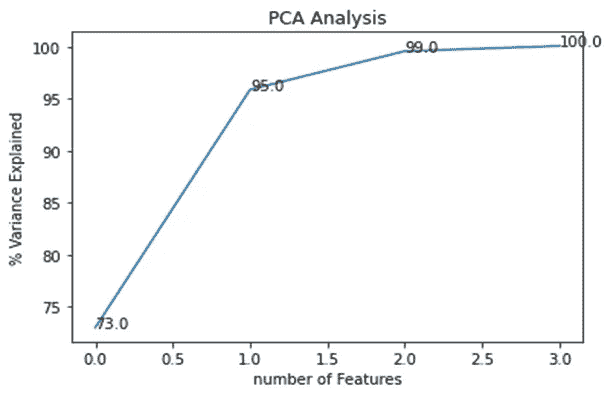

# 降维:主成分分析

> 原文：<https://medium.com/analytics-vidhya/dimensionality-reduction-principal-component-analysis-d1402b58feb1?source=collection_archive---------2----------------------->

图像来源:[数据集](https://i.stack.imgur.com/jPw90.png)和 [PCA 在作用](https://i.stack.imgur.com/lNHqt.gif)

## 零零碎碎地理解 PCA 算法的整体。

在机器学习中，人们认为特征的数量越多，我们的预测就越好，但这并不总是正确的。如果我们继续增加特征的数量，在某个点之后，我们的机器学习算法的性能往往会下降。

> **根据休斯现象**，如果训练样本的数量是固定的，我们继续增加维度的数量，那么我们的机器学习模型的预测能力首先会增加，但在某个点之后，它会趋于减少。

图像来源:[维度与分类器性能](https://builtin.com/sites/default/files/styles/ckeditor_optimize/public/inline-images/classifier%20performance%20dimensionality.png)

如果我们不断增加维度的数量，每个特征可以取一系列可能的值，因此随着维度的增加，我们需要不断增加数据样本，以确保每个值的组合都有几个样本。通常，随着维度的增加，良好预测所需的样本数量以对数方式增加。在现实世界中，数据集有 1000 个特征，因此我们需要跟上不断增加的维度的数据量变得巨大(2 ⁰⁰⁰)，这大大增加了训练时间，另一方面，如果我们继续增加维度而不增加样本数量，那么我们的机器学习算法往往会过度拟合，其性能会下降。

描述高维空间中的数据行为以及在分析高维数据时出现的问题的一个这样的想法被称为维数灾难。让我们把我们的高维空间看作一个超立方体，现在根据维度的诅咒，随着维度的增加，空间的体积增加得如此之快，以至于可用的数据变得稀疏。在某一点之后，数据变得如此稀疏，以至于分类器参数的精确估计变得更加困难。事实上，原点周围的数据比拐角处的数据要稀疏得多。高维度中的大部分数据集中在超立方体的角上，例如，如果我们有一个 10D 数据集，那么大部分数据集中在超立方体的(2 ⁰=1024) 1024 个角上。

高维数据出现的一个更奇怪的问题是，基于距离的算法往往表现很差。这是因为距离在高维空间中毫无意义。随着尺寸的增加，所有点变得彼此等距，使得两点之间的最小和最大距离之差趋于零。

正如我们所看到的，增加维度的数量并不总是一个好主意。高维空间的几何属性不同于低维空间，因此我们用来分析低维数据的工具在高维空间中并不适用。此外，随着维度的增加，数学变得越来越复杂。理解高维空间中的数据行为并不容易，而且也不可能在更高维空间中可视化数据。

在这种情况下，最好降低数据的维度。如果特征变量是不相关的，我们可以使用某些特征选择技术，例如前向选择，它考虑了类别标签并挑选最有用的特征子集。如果特征变量是相关的，我们可以使用降维技术，如 PCA。

# PCA 直觉。

PCA 是一种线性降维技术，它将高维空间中的一组相关特征转换成低维空间中的一系列不相关特征。这些不相关的特征也称为主成分。PCA 是一种正交线性变换，这意味着所有的主成分都是相互垂直的。它以这样一种方式转换数据，即第一个组件试图解释与原始数据的最大差异。这是一种无监督算法，即不考虑类别标签。

上图显示了在二维空间中绘制的两个特征 F1 和 F2。从上面的图中我们可以看出，特征 F2 的方差比特征 F1 的方差高得多，这意味着

**F2>保存的信息>F1**保存的信息

现在，假设我们想将 2D 数据转换成 1D 数据，我们需要删除一个要素。我们知道功能 F1 保存的信息比 F2 少得多，所以我们可以安全地删除功能 F1，并使用功能 F2 作为我们的最终功能。

## 现在，让我们再看一个情节

这里，特征 F2 的方差等于特征 F1 的方差，这意味着

**F2 保存的信息= F1 保存的信息**

现在，如果我们想要降低从 2D 到 1D 的数据的维度，我们不能丢弃一个特征，因为我们丢失了很多信息。

那么，我们在这里能做什么？

**在这里，PCA 开始发挥作用**

PCA 对数据执行线性正交变换以找到特征 F1’和 F2’，使得 F1’上的方差> F2’上的方差。

> **线性正交变换是什么意思？**
> 
> 为了找到这些新的特征，PCA 所做的就是，以这样一种方式旋转原始轴，即在将数据点投影到新轴上之后，我们在新轴上获得最大的分布(方差)。这些新轴是原始轴的线性组合，它们总是相互垂直。

这些新的特征被称为主成分。这里，F1’是给出最大方差方向的第一主分量，F2’是给出最大方差第二方向的第二主分量。F1 '和 F2 '是单位矢量，它们相互垂直。由于 F1 '和 F2 '是我们的新功能集，我们可以放心地删除 F2 '，因为 F1 '保留了最大的信息。

*PCA 试图找到一个方向 F1’，使得投射到 F1’上的点 Xis 的方差最大化。*

**这里，**

**Xi =数据点**

**u1 =最大方差方向的单位矢量**

**Xi’= Xi 在 u1 上的投影**

在上图中，我们可以看到红色向量给出了最大方差的方向。绿点是原始数据点，红点是这些点在轴上的投影。

到目前为止，我们已经看了 PCA 的基本直觉。现在让我们看看 PCA 背后的数学原理。

# PCA 数学。

## **ƛ.特征值的解释**

让我们通过看不同的情况来理解特征值的几何解释。

**案例 1:**

**案例二:**

**案例三:**

案例 4:

从上面的图中我们可以看到，在第四种情况下，如果我们删除一个特征，我们会丢失 50%的不需要的信息。

所以在这里，我们可以说，如果ƛ1 >> ƛ2(情况 1 和 2)，我们可以有效地从 2D 转换到 1D，因为最大的信息被保留。

**此处，解释的方差百分比= %保留的信息**

Vi =最大方差方向

ƛi =每个轴上的数据分布(方差)如何

# **PCA 的代码。**

现在，让我们看看 PCA 的代码。我们将使用 scikit-learn 库中 python 中的 PCA 模块。要使用该模块，我们需要使用-

**"从 sklearn.decomposition 导入 PCA"**

这里，我们将使用 scikit-learn 中提供的虹膜数据集。

虹膜数据集有 4 个特征:**萼片长度、萼片宽度、花瓣长度、花瓣宽度**

由于这是四维数据，我们无法将其可视化。让我们使用 PCA 转换数据，并将数据降低到二维。这里，在应用 PCA 之后，我们将获得 4 个主成分，我们将选择前 2 个主成分来理解和可视化 PCA 如何转换数据，以及在仅选择两个主成分之后保留了多少方差。

## **那么，我们开始吧！**

首先，让我们将数据加载为熊猫数据框

如我们所见，虹膜数据集有 4 个特征和 150 个数据点

我们知道，如果变量高度相关，PCA 对数据非常有效，因此在应用 PCA 之前，让我们先看看数据集的相关矩阵

如我们所见，除了花瓣长度和萼片宽度，我们的特征变量高度相关，因此我们可以说 PCA 将在数据上出色地工作。

现在，我们的第一步是标准化数据，即均值= 0，为此我们将使用 scikit-learn 库中的 **standardscaler** 模块。

现在，让我们应用 PCA 并转换数据。应用 PCA 的代码只有一行，我们首先拟合我们的数据，然后转换它。

如我们所见，在 PCA 变换后，我们得到 4 个主成分，因为主成分的数量等于特征的数量。这里，第一主分量，即数据帧中的列 0，给出了最大方差的方向。

现在，让我们看看数据协方差矩阵的特征值。特征值可以由 **pca.explained_variance_** 给出。这里，第一个特征值解释了最大方差。

现在，让我们看看每个主成分解释了多少百分比的方差，以及我们需要多少个主成分来保留原始数据的最大方差。对此，我们可以使用**PCA . explained _ variance _ ratio。**

我们可以看到，第一主成分解释的方差百分比最高，即 73%，其次是第二主成分，即 23%，最后一个主成分解释的方差最低，即 1%

我们可以看到，通过使用前两个主成分，我们可以轻松地保留总方差的 95%,因此我们可以安全地放弃后两个成分，因为它们只解释了总方差的 5%

因此最后，我们使用主成分分析将 4D 数据转换为 2D，现在，在我们可视化转换后的 2D 数据之前，让我们尝试解释这些主要成分。主成分是我们对原始数据进行正交线性变换后得到的新形成的特征，但有必要了解原始数据中的哪些特征对这些主成分影响最大，因为可解释性在机器学习中非常重要。为了理解这一点，我们可以使用 **pca.components_** ，它告诉我们每个特征对我们的主成分有多大影响。这里，我们着眼于本征矢量分量的绝对值。这些绝对值越大，特定特征对该主分量的贡献就越大。

现在，让我们绘制这些值，以便更好地可视化和理解

从上面的图中我们可以看出，萼片长度、花瓣宽度和花瓣长度是对主成分 1 影响最大的特征，所以在这里，我们可以说最大方差的方向受这三个特征的影响很大。这里花瓣长度影响最大，萼片宽度影响最小。

主成分 2 主要受萼片宽度和萼片长度的影响，所以在这里，我们可以说方差最大的第二方向受萼片宽度和萼片长度的影响很大。这里，萼片宽度的影响最大。

我们甚至可以将双标图可视化，以了解特征对主成分的影响

我们可以从上面的图中看到，主成分 1 受萼片长度、花瓣宽度和花瓣长度的影响很大，主成分 2 受萼片宽度的影响很大。

这里花瓣长度对 PC1 的影响最大，萼片宽度对 PC2 的影响最大。现在，在我们可视化我们的主成分之前，让我们在应用 PCA 变换和比较这两个图之前，从我们的原始数据集中可视化这两个特征。

从上面的图中我们可以看到，原始数据中数据点的大部分分布都得到了保留，所有三个类别都被很好地分开，因此我们最终可以说，PCA 在将我们的数据从 4D 转换到 2D 方面做得非常好，没有丢失太多信息。

# **五氯苯甲醚的局限性。**

PCA 是最简单也是最基本的降维技术之一。如果特征变量高度相关，它在数据上工作得非常好，但是它有自己的限制。PCA 算法有不同的变体，例如核 PCA，以克服这些限制中的一些。

让我们来看看 PCA 失败的一些情况:

**案例 1:**

这里，ƛ1 = ƛ2，所以如果我们丢弃任何一个特征，信息损失非常大，我们会损失大约 50%的总信息，这是不希望的。

**案例二:**

PCA 不考虑数据中存在的局部结构。在这里，C1 和 C2 这两个聚类将被投影到 V1 的同一区域，因此如果从 2D 转换到 1D，很难分辨出这两个点属于哪一类

**案例三:**

图 1

图 2

PCA 依赖于线性假设，即它假设数据是线性相关的，但是如果数据是非线性相关的，PCA 是不够的。

这里，数据有一个很好的非线性结构。现在，如果我们将所有的点都投影到 V1，以将数据从 2D 转换到 1D，我们将丢失整个数据结构。

# 结论。

PCA 是最简单的降维算法，但是它有自己的局限性。还有 PCA 的其他变体，例如可以用于非线性数据的核 PCA。PCA 不考虑数据中存在的局部结构，因为它试图保留全局结构。还有其他高度先进的降维技术，如 TSNE，它不对数据做任何线性假设，并保留数据中存在的局部结构。总的来说，当变量强相关时，我们可以使用 PCA，但是如果变量之间的关系很弱，PCA 就不起作用。

— — — — — — — -

感谢您阅读这篇文章。对于任何建议或疑问，请留下评论。

# 参考文献。

 [## PCA 清楚地解释了——如何、何时、为什么使用它以及特性的重要性:Python 指南

### 在这篇文章中，我解释了什么是 PCA，何时以及为什么使用它，以及如何使用 scikit-learn 在 Python 中实现它。还有…

towardsdatascience.com](https://towardsdatascience.com/pca-clearly-explained-how-when-why-to-use-it-and-feature-importance-a-guide-in-python-7c274582c37e)  [## 分类中的维数灾难

### 在这篇文章中，我们将讨论所谓的“维数灾难”，并解释为什么它是重要的，当…

www.visiondummy.com](https://www.visiondummy.com/2014/04/curse-dimensionality-affect-classification/)  [## 主成分分析

### 实 p 空间中点集合的主成分是一系列方向向量，其中…

en.wikipedia.org](https://en.wikipedia.org/wiki/Principal_component_analysis)  [## 机器学习的特征值和特征向量简介-机器学习掌握

### 矩阵分解是一个有用的工具，它可以把矩阵分解成它们的组成部分，从而简化一个范围…

machinelearningmastery.com](https://machinelearningmastery.com/introduction-to-eigendecomposition-eigenvalues-and-eigenvectors/)