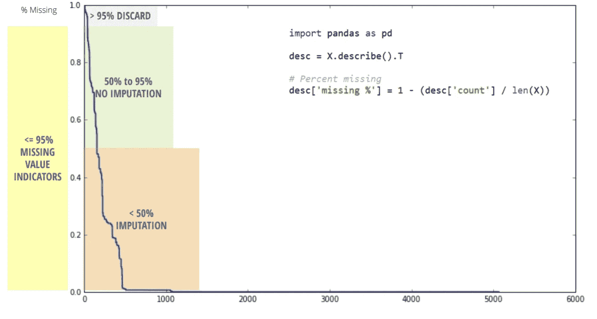
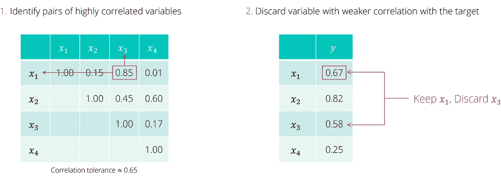

# 机器学习中的降维技术

> 原文：<https://medium.com/analytics-vidhya/dimensionality-reduction-techniques-in-machine-learning-9098037baddc?source=collection_archive---------5----------------------->

# **什么是降维？**

在机器学习问题中，往往有太多的因素是在这些因素的基础上做最后的分类的。这些因素基本上是称为特征的变量。特征的数量越多，可视化训练集并对其进行处理就越困难。**选择用于模型构建的特征子集的过程被称为降维。**

在学习降维技术之前，让我们理解为什么在我们的数据集中降维是重要的。

**原因:
1)** 冗余和无关特征的丰富度
**2)** 在训练样本数量固定的情况下，预测能力随着维度的增加而降低。【*休斯现象*】
**3)**其他条件相同的情况下，简单的解释一般比复杂的好。
**4)** 如果选择了正确的子集，它会提高模型的准确性。
**5)** 减少过拟合。
T22)6)它减少了计算时间。它有助于数据压缩，从而减少存储空间。

# 维度缩减技术

1.  缺失值的百分比
2.  变化量
3.  多重共线性
4.  主成分分析
5.  (与目标的)相关性
6.  预选
7.  反向消除
8.  套索

# 1.缺失值的百分比

*   删除缺失值百分比非常高的变量/要素。
*   查看或可视化缺失值百分比较高的变量

# 2.变化量

*   丢弃变化很小的变量。
*   要么对所有变量进行标准化，要么使用标准差𝜎来解释不同尺度的变量。
*   删除零变异变量。

# **3。多重共线性**

*   许多变量经常是相互关联的，因此是多余的。
*   如果两个或更多的变量高度相关，只保留一个将有助于减少维度，而不会丢失太多信息。
*   要保留哪个变量？与目标具有较高相关系数的那个。

# **4。主成分分析**

*   [PCA](https://en.wikipedia.org/wiki/Principal_component_analysis) 被定义为一种正交线性变换，它将数据变换到一个新的坐标系，使得数据的某个标量投影的最大方差位于第一坐标上(称为第一主分量)，第二大方差位于第二坐标上，依此类推。
*   强调变化的降维技术。

**何时使用:**

*   过度多重共线性
*   对预测因子的解释并不重要。

# 5.(与目标的)相关性

*   丢弃与目标相关性非常低的变量。
*   如果一个变量对目标的修正非常低，那么它对模型(预测)就没有用。

# 6.预选

前向选择是一种迭代方法，我们从模型中没有特征开始。在每一次迭代中，我们不断地添加最能改进我们模型的特性，直到添加一个新变量不能改进模型的性能。

1.  确定最佳变量。(例如，基于模型精度)
2.  将次佳变量添加到模型中。
3.  等等，直到满足一些预定的标准。

# 7.反向消除

在向后消除中，我们从所有特征开始，并在每次迭代中移除最不重要的特征，这提高了模型的性能。我们重复这一过程，直到在删除特征时没有观察到改进。

1.  从模型中包含的所有变量开始。
2.  丢弃最没用的变量(例如，基于模型精度的最小下降)
3.  等等，直到满足一些预定的标准。

# 8.套索

*   使用带有 L1 正则化的线性回归称为 Lasso 正则化。
*   )**套索方法对模型参数的绝对值之和进行约束，该和必须小于一个固定值(上限)。为了做到这一点，该方法应用收缩(正则化)过程，其中它惩罚回归变量的系数，将它们中的一些收缩到零。**