# 使用主成分分析(PCA)的维数减少

> 原文：<https://medium.com/analytics-vidhya/dimensionality-reduction-using-principal-component-analysis-pca-41e364615766?source=collection_archive---------5----------------------->

> 处理具有更多特征/维度的数据集是一项重要任务。

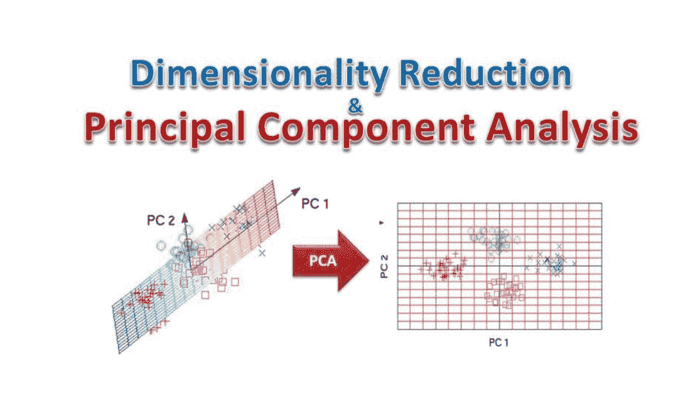

参考:[培养基](https://towardsdatascience.com/a-complete-guide-to-principal-component-analysis-pca-in-machine-learning-664f34fc3e5a)

数据每秒钟都在增加，从这些数据中解读见解以解决问题变得至关重要。而且，随着数据特征的增加，数据集的维度也会增加。最终，机器学习模型需要处理复杂的数据，导致更加复杂。另一方面，有许多特征对于模型是无用的或者与其他特征相关。主成分分析(PCA)是降低维数和从数据集中扣除相关特征的一种方法。

**文章分为以下几节:**

1.  定义- PCA
2.  PCA 的需求和优势
3.  实时使用/应用
4.  执行 PCA 的步骤—

*   数据标准化
*   计算协方差矩阵
*   确定特征值和特征向量
*   计算 PCA 特征

5.使用 Python 实现 MNIST 数据集的主成分分析

6.结论

# **什么是 PCA？**

主成分分析(PCA)是一种降维技术，它使您能够识别数据集中的相关性和模式，以便可以将其转换为维度显著减少的数据集，而不会丢失任何重要信息。

# **对 PCA 的需求**

具有更多要素的数据集需要更多时间来训练模型，并使数据处理和探索性数据分析(EDA)更加复杂。

# **PCA 的优势**

*   减少培训时间。
*   移除相关特征(移除噪声)。
*   易于数据探索(EDA)。
*   易于可视化数据(最大 3D 数据)。

# **实时应用**

主成分分析用于人脸识别、计算机视觉、图像压缩、图像检测、目标检测、图像分类等领域的降维。

# **执行 PCA 的步骤:**

## **数据标准化**

*   标准化就是对数据进行缩放，使所有的值/变量都在一个相似的范围内。标准化意味着重新调整数据，使平均值为 0，标准差为 1(单位方差)。
*   **为什么？**它是关于确保数据内部一致；也就是说，每种数据类型都有相同的内容和格式。

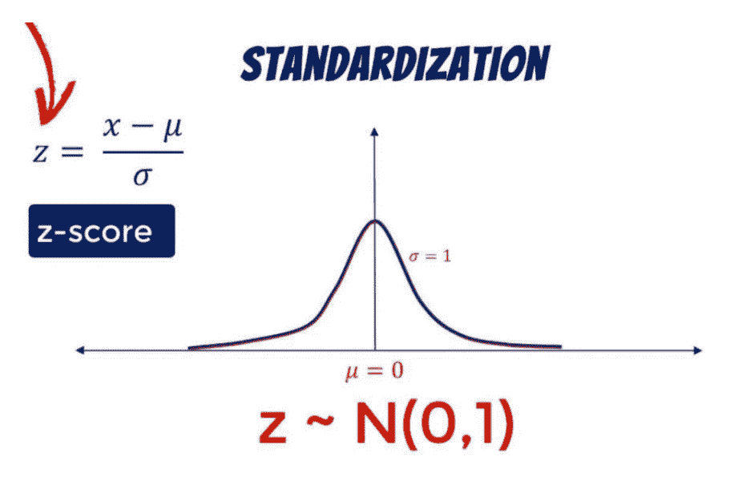

参考:[365 数据科学](https://365datascience.com/standardization/)

## **计算协方差矩阵**

*   协方差矩阵是在数据标准化后计算的，用于查找数据集中的相关要素。协方差矩阵的每个元素代表两个特征之间的关系。
*   **为什么？**用于确定特征之间的相关性。

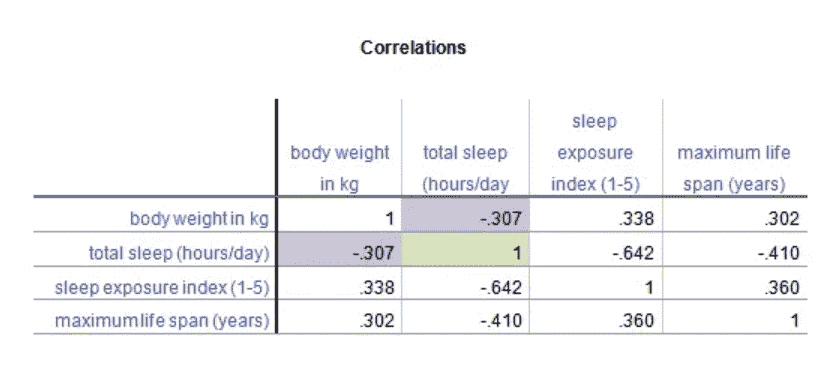

参考- [分析因子](https://www.theanalysisfactor.com/covariance-matrices/)

## **确定特征值和特征向量**

*   特征值和特征向量是为了确定数据集的主成分而必须从协方差矩阵计算的数学构造。
*   主成分是从初始特征集获得的新的变量/特征集。它们压缩并拥有分散在初始特征中的大部分有用信息。
*   特征向量是这样的向量，当对它们进行线性变换时，它们的方向不会改变。
*   特征值简化表示各个特征向量的标量。
*   **为什么？**寻找特征最大扩散的方向。

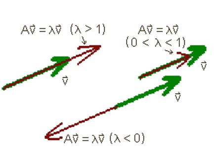

参考- [HMC](https://math.hmc.edu/calculus/hmc-mathematics-calculus-online-tutorials/linear-algebra/eigenvalues-and-eigenvectors/)

## **计算主成分**

*   假设一个数据集中有 5 个特征，那么在计算特征向量和各自的特征值后，将有 5 个主要特征，每个特征将有其特征值和特征向量。
*   与其他特征相比，具有最高特征值的特征具有数据的大部分细节/分布。
*   因此，具有高特征值的特征被认为是主特征，并且这些特征将是 PCA 的输出。
*   现在，这些主要成分将被用作训练模型和数据可视化的输入。

**使用 Python 对 MNIST 数据集实施 PCA**

*   问题陈述——对 MNIST 数据集进行逐步主成分分析，以降低维数。
*   MNIST 数据集包含 0 到 9 个数字的各种图像，它主要用于初学者识别图像/数字。每个图像是 28 * 28 像素，当转换为矢量形式时，它将是 28 * 28 = 784 个特征，并且很难在屏幕上可视化 784 个特征并训练模型。因此，在这里我将降低数据集的维度，并可视化 2D 的数据。
*   数据集已经准备好并转换成矩阵形式(以 CSV 格式存储)，因此很容易将其用于进一步的任务(本文没有解释如何准备数据，因为本文的主题是 PCA)。要下载数据，请访问—[https://www.kaggle.com/c/digit-recognizer/data](https://www.kaggle.com/c/digit-recognizer/data)
*   让我们深入编码。首先，使用 pandas 加载和读取数据；

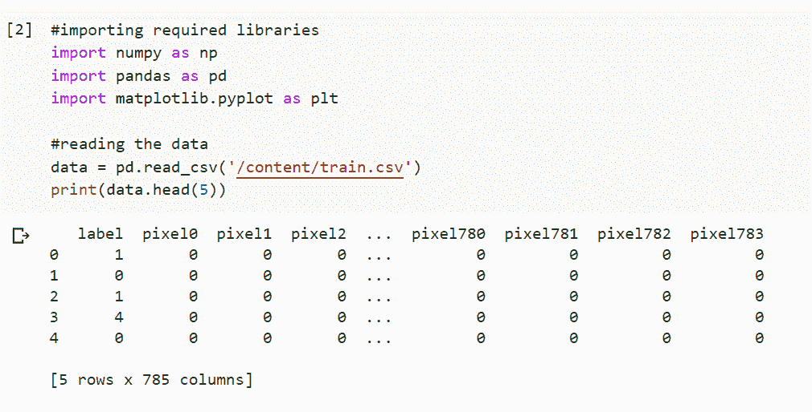

然后分离标签数据和特征数据；

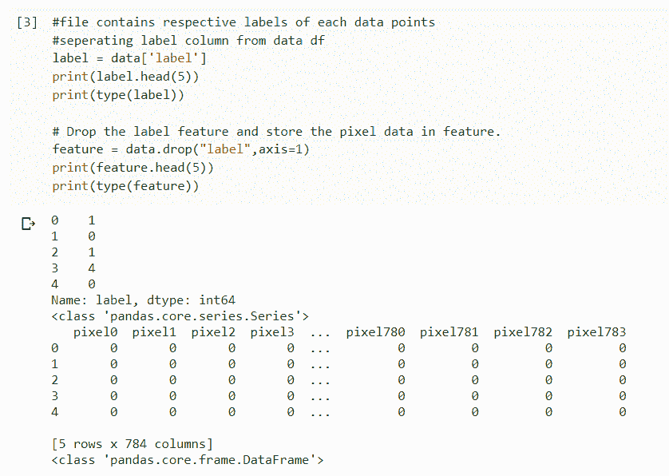

应用栏目标准化 sklearn 图书馆；

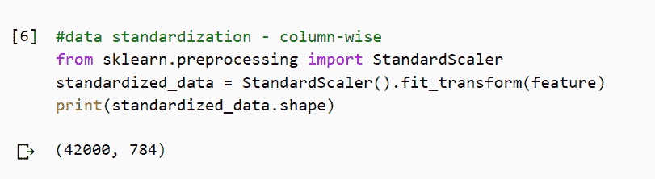

现在，根据标准化数据计算协方差，如下所示:

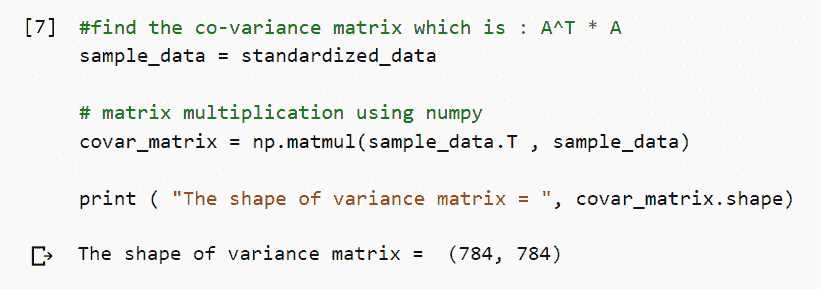

接下来，找到特征向量和特征值，这里我已经计算了前两个特征向量；

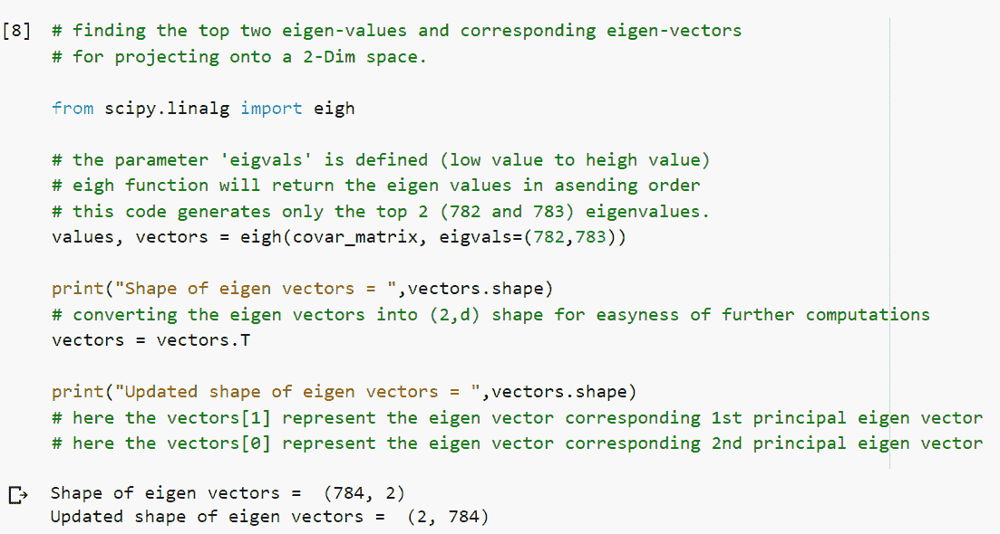

计算主成分；

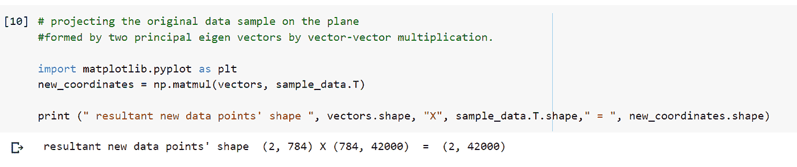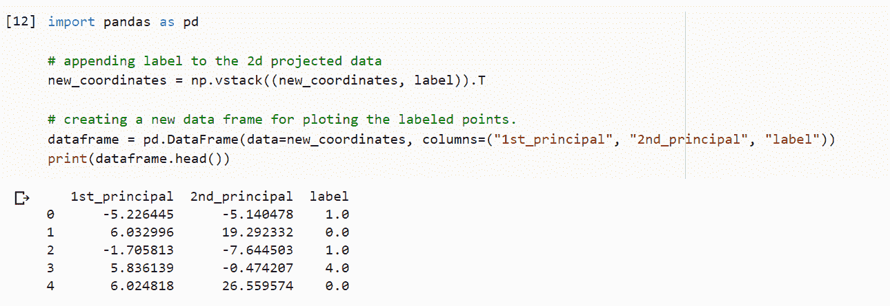

使用 seaborn 绘制具有两个主要特征的数据；

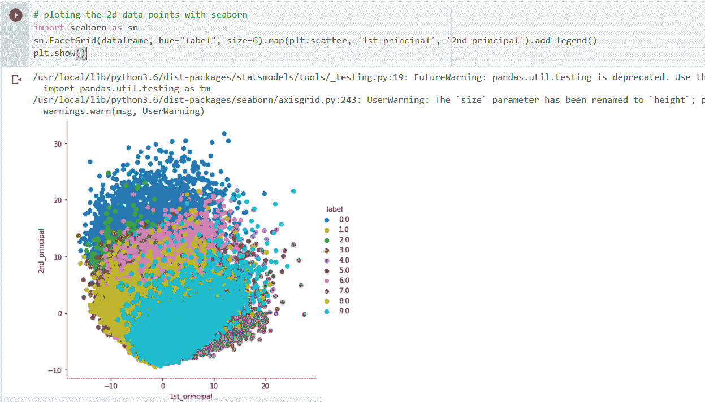

从 sklearn 库中实现 PCA 包；

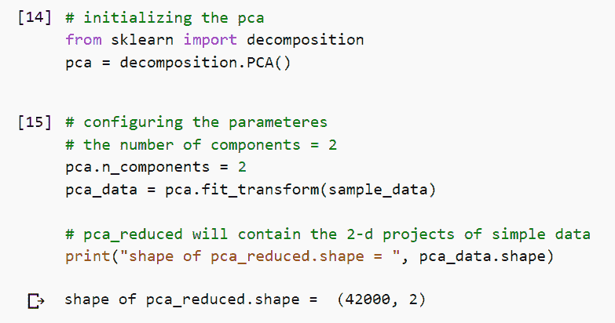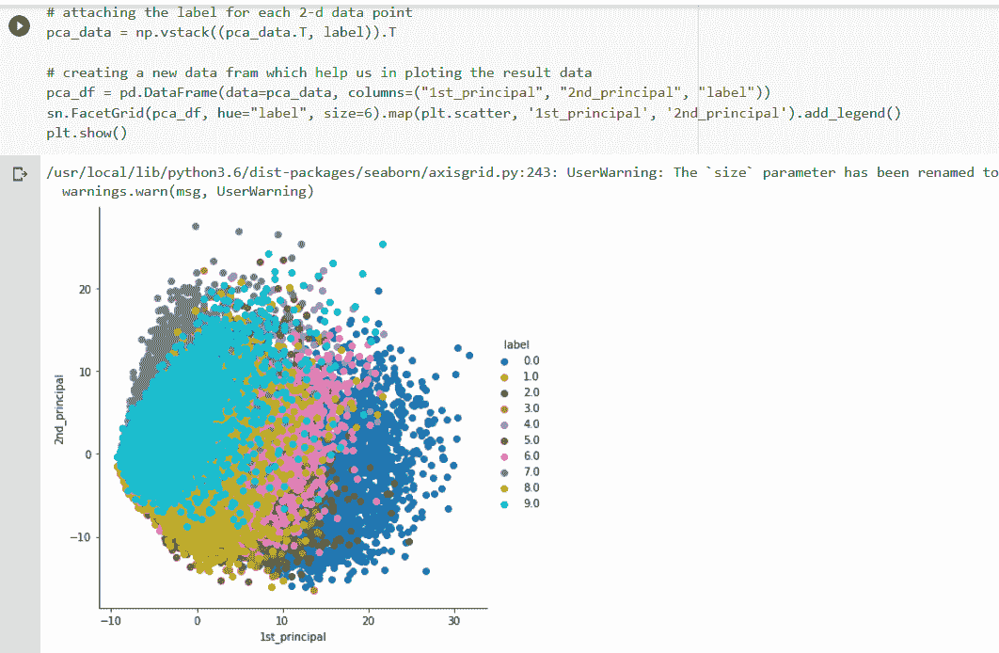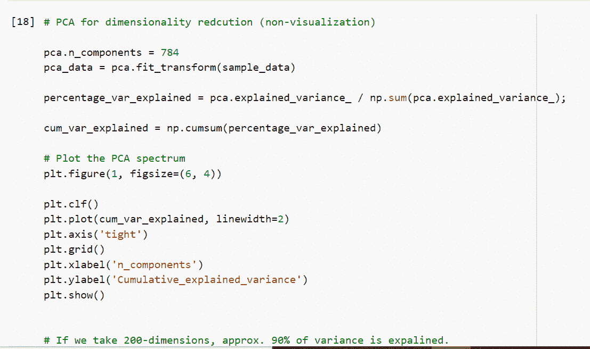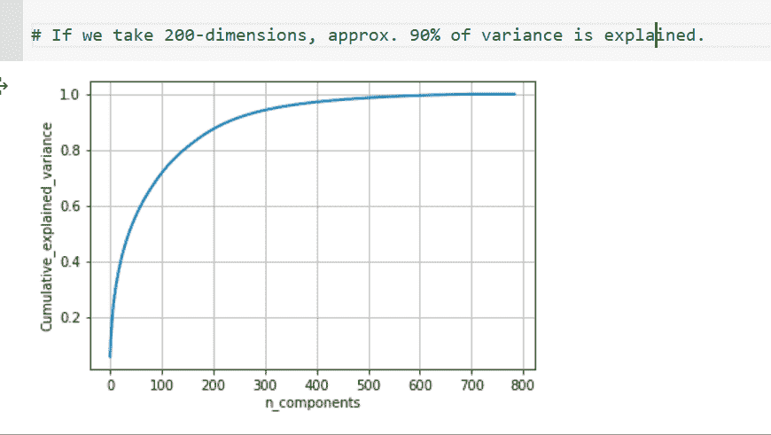

# **结论**

*   维数从 784 减少到 2，主要信息保存在这两个特征中，这两个特征可用于确定数字。

你可以从 [Github](https://github.com/rajviishah/Principal-Component-Analysis) 找到源代码

如果你对这个库的任何函数/类有任何疑惑，那么我请求你查看文档。

如果有任何修正和改进的范围，或者如果您有任何疑问，请通过 rajvishah2309@gmail.com[告诉我](mailto:rajvishah2309@gmail.com)

有关更多信息，请查看以下文章:

*   [http://colah.github.io/posts/2014-10-Visualizing-MNIST/](http://colah.github.io/posts/2014-10-Visualizing-MNIST/)
*   [https://365datascience.com/standardization/](https://365datascience.com/standardization/)
*   [https://sebastianraschka . com/Articles/2015 _ PCA _ in _ 3 _ steps . html #协方差-矩阵](https://sebastianraschka.com/Articles/2015_pca_in_3_steps.html#covariance-matrix)

参考链接:

*   [https://www.youtube.com/watch?v=n7npKX5zIWI&t = 1217s](https://www.youtube.com/watch?v=n7npKX5zIWI&t=1217s)
*   [https://www . applied ai course . com/lecture/11/applied-machine-learning-online-course/2893/visualize-Mn ist-dataset/2/module-2-data-science-explorative-data-analysis-and-data-visualization](https://www.appliedaicourse.com/lecture/11/applied-machine-learning-online-course/2893/visualize-mnist-dataset/2/module-2-data-science-exploratory-data-analysis-and-data-visualization)