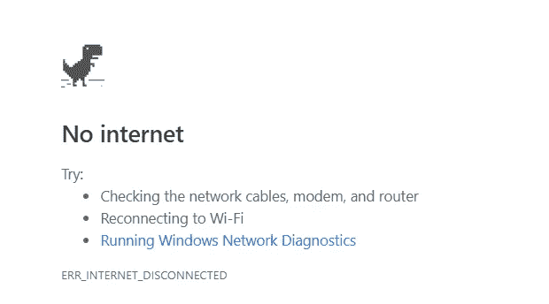
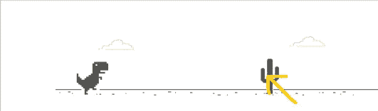

# 恐龙游戏——简单的 Python 自动化

> 原文：<https://medium.com/analytics-vidhya/dinosaur-game-simple-python-automation-e21683e33a3b?source=collection_archive---------11----------------------->

Python。一种全面的语言，虽然有点慢，但非常通用。Python 用于数据科学、ML、DL、Web 开发、构建应用程序、自动化等等。

许多非常琐碎的耗时任务可以使用 Python 实现自动化。有很多用 Python 写的库可以帮助你做到这一点。



大家肯定都在断网的时候玩过谷歌 Chrome 里的恐龙游戏。一个简单的游戏，只需要两个按钮来玩。我们所有人都试图在游戏中获得高分，但在某个时间点，我们人类的反应会放弃，我们无法做出足够快的反应。

那么，有什么比自动化这个游戏更好的方式来开始使用 Python 的自动化之旅呢？

我们需要什么？我们如何接近？每当中间有障碍物时，我们需要霸王龙跳起来。对我们有利的是，游戏中的障碍物只有一种颜色。所以我们需要得到障碍物的 RGB 值。
并且，当屏幕上某一点的像素有障碍物的 RGB 值时，我们需要按下 Jump/Bend down 键。
够简单！！

为了处理屏幕上的像素，我们使用库*pyautogui
使用 pip 安装这个库*

```
pip install PyAutoGUI
```

现在我们需要障碍物的像素 RGB 值，这可以通过

```
pyautogui.displayMousePosition()
```



假设我们的鼠标指针位于黄色，displayMousePosition()方法将返回指针在屏幕上的 X，Y 坐标及其 RGB 值。

X，Y 坐标将有助于检查 RGB 值并决定何时按下跳转键。

在这个游戏中，RGB 元组是(83，83，83)

现在，让我们假设，当 X=801，Y=245，RGB 值为(83，83，83)时，我们希望霸王龙跳跃。我们需要某种方法来自动按键。这可以使用*键盘*库来完成。使用 pip 安装这个库

```
pip install keyboard
```

我们需要按下该键，并在一定时间间隔后释放该键，这可以使用内置的库时间来完成。

keyboard.keyDown(Key required) =按下所需的键
keyboard . keyup(Key required)=释放所按下的键
time.sleep(delay) =以秒为单位添加所需的延迟量

这些都是自动化这个游戏所需要的东西，通过一些控制语句，这个游戏可以自动化如下:

```
import pyautogui   # importing all the 
import time        # required 
import keyboard    # dependencies x=801              # point on the screen which we want to monitor
y=245              # want the dinosaur to jump when obstacle is at
#R=83 G=83 B=83    # that point while 1:           # infinite while loop until someone breaks 
    if pyautogui.pixel(x,y)==(83,83,83):       # if bird comes
        pyautogui.keyDown('down')              # bend down
        time.sleep(0.01)
        pyautogui.keyUp('down')                # stand straight
    if pyautogui.pixel(x,y)!=(255,255,255):    # if cactus comes
        pyautogui.keyDown('space')             # jump up
        time.sleep(0.01)
        pyautogui.keyUp('space')               # land
    if keyboard.is_pressed('esc')==True:       # break the whileloop
        break
```

感谢您的阅读！！

代码上传到我的 github repo:[https://github.com/nike10/Dinosaur_Game_Python](https://github.com/nike10/Dinosaur_Game_Python)

ps。改动不大，当游戏的环境变化到夜晚，更多的条件要加进去。