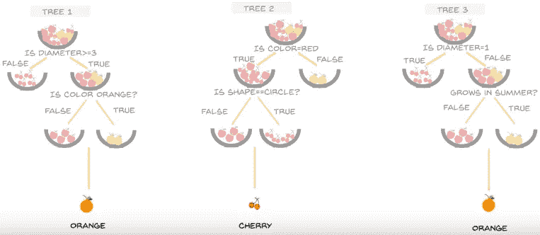

# 揭示随机森林中随机性的秘密

> 原文：<https://medium.com/analytics-vidhya/disclose-the-secret-of-randomness-in-random-forests-705eb751d4d7?source=collection_archive---------8----------------------->

**随机** **森林**是一种机器学习算法的技术，通过在训练过程中构建多个**决策** **树**来运行。

## 随机森林的用例:-

1.  银行欺诈和忠诚客户的检测。
2.  通过分析患者的医疗报告帮助预测疾病。
3.  股价预测。

## 随机森林算法是如何工作的？→

如前所述 ***随机森林是一个决策树*** 的集合，最初当我们得到数据集时我们会 ***将数据集分成 n 等份*** 。这些 ***n 个相等的部分被称为随机森林算法的 n-估计器*** 。

现在，我们将开始为主数据集的每个子数据集构建决策树。因此，在构建决策树时，我们必须知道在第一个标签处，数据集的所有属性或特征将在根标签处。因此，我们可以从数据集的所有属性中选择最佳属性。对于这个，我们有两个具体的算法→一个是信息增益，一个是基尼指数。这里我们将使用 ***基尼指数法*** 从决策树的所有属性中选择最佳属性进行决策。

所以，让我们用这个数据集来理解随机森林。

所以，计算基尼指数的 ***公式为:→***

在哪里，

*   ***p()*** 指的是概率，
*   ***i*** 表示特征栏中出现的不同组
*   ***t*** 表示特征栏中出现的元素总数

***基尼指数→*** 基尼指数是从数据集中出现的其他属性中选择最佳属性的过程，借助于它我们可以生成进一步的子树。它测量整个数据集的列属性的不纯度或不相等性。将选择具有最低杂质的特定组来表示该特征列的基尼指数值。基尼系数为 0 是最坏的情况，理想情况下，我们希望该系数为 1。因此，我们将在用于生成子树的属性中挑选最高的基尼值。

因此，在获得数据集**后，我们应该将数据集分成 n 等份**。对于每个部分，我们将构建一个决策树。由于我们在这里取了一个小数据集，**我们将为数据集**构建 3 种不同类型的决策树。

因此，为了构建我们的第一个决策树，我们将**从计算数据集**中因变量(即“标签”)的基尼指数开始。因此，列标签的基尼指数是 1-(2/6) -(2/6) -(2/6) = 0.66，因为在我们的数据集中，6 个标签中有 2 个柠檬、2 个苹果和 2 个葡萄。现在我们将开始计算每一列的最佳基尼系数。为此，我们必须将每列的元素分成两个一组。因此，对于“颜色”列，可能的子集可以是 2 = 8。因为基尼指数对每个属性和 3 使用二进制分割计算，因为颜色列只有 3 个不同的属性，即红色、紫色、黄色。因此，在所有 8 个可能的子分裂中，可能的**二进制子分裂**是→ {(红色，紫色)，黄色}，{(紫色，黄色)，红色}，{(红色，黄色)，紫色}。现在，我们必须通过公式计算每个二元细分的基尼指数:

其中，如果我们先取 split {(红，紫)，黄}

然后 D1 表示(红色、紫色)，D2 表示黄色，D 表示训练样本的数量

因此，{(红色、紫色)、黄色}的基尼指数为(4/6)*(1-(2/4)-(2/4))+(2/6)*(1-(2/2))= 1/3，计算请查看此视频: [***基尼指数详细计算***](https://www.youtube.com/watch?v=6614umIqeOc)

计算三个等级的基尼指数后({(红、紫)、黄}、{(紫、黄)、红}、{(红、黄)、紫})，取三个等级中基尼指数值最低的等级。同样，通过使用二元分割计算数据集其他要素的最低基尼系数。最后，在特征中，具有最高基尼指数值的特征将被选择作为用于分类目的的根节点。

同时，在接下来的步骤中，我们将继续重复相同的步骤，为下一个最佳特征计算基尼指数以进行分类，并构建决策树的下一个节点，留下先前使用的特征用于分类。

因此，我们将得到第一个决策树:

第一决策树

当我们重复相同的步骤时，将从数据集的子部分形成的决策树的另外两个部分/类型是:

第二决策树

第三决策树

现在，如果我们想要将一个新的水果分类为苹果、柠檬或葡萄**T11(注意:-图片中柠檬用橙色表示，葡萄用樱桃表示)** 类，那么我们将遍历 3 棵不同的树的规格以获得我们的答案，获得**最大** **权重的类**将是新测试对象的答案。

新测试对象

行动中的随机森林算法

因为 Orange 从决策树的预测答案中获得了最多票数。所以，对测试对象的正确预测是柠檬或橙。

这就是随机森林算法处理一堆决策树的方式。我希望你喜欢阅读这篇博客。如果您有任何意见、疑问或问题，请在评论区告诉我。在那之前享受学习。