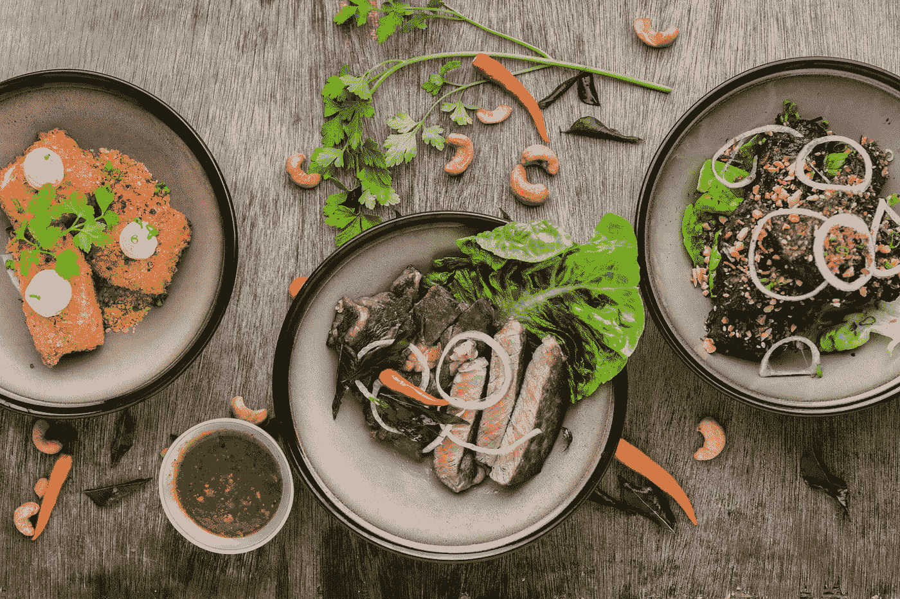
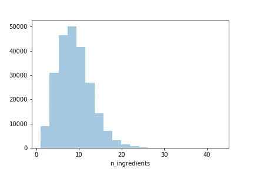
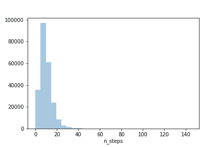
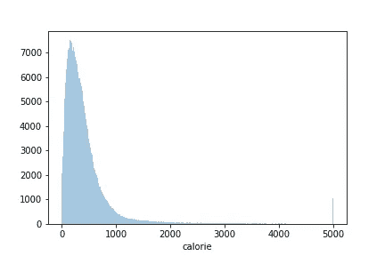
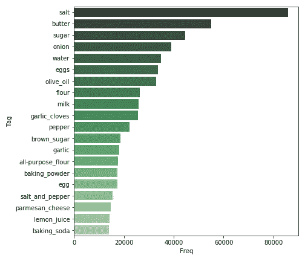
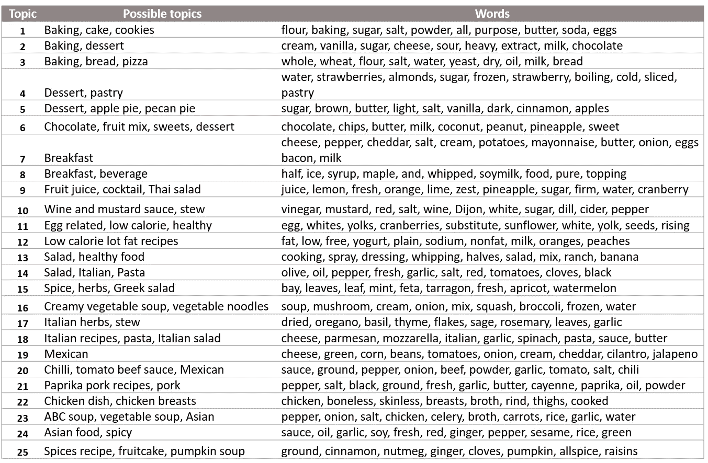

# 使用带有 LDA 的主题建模发现食谱主题

> 原文：<https://medium.com/analytics-vidhya/discover-recipe-topics-using-topic-modeling-with-lda-44ba1f88c668?source=collection_archive---------15----------------------->

多彩的泰国菜

当我们要探索或提取信息文本数据时，首先想到的是什么？由于自然语言处理技术的发展，选择余地很大。主题建模就是能够从大量文本中发现隐藏信息的技术之一。

在这个项目中，我们将检查来自实际网站的食谱数据，并试图揭示食谱数据中的热门话题。下面的文章将带你一步步了解我的项目。

**#数据& EDA**

图 1:食谱中使用的配料数量

数据来源于 [Kaggle](https://www.kaggle.com/shuyangli94/food-com-recipes-and-user-interactions#interactions_validation.csv) 多亏了李，它包含了超过 23 万的食谱数据。对于项目的这一部分，我们不会使用用户交互。

我们跳过了数据清理的大部分时间，因为数据集是非常有组织的。我们绘制了一些图表只是为了更好地理解它。

图 2:配方的步骤数

图 1 显示大多数食谱使用大约 10 种配料，而有些食谱使用很多配料，例如多达 40 种。

图 2 显示大多数配方在 20 步以内，而一些配方可以达到 40 步。

图 3:食谱的卡路里分布

图 3 显示了数据库中卡路里的分布。我们观察到，有许多低热量食谱(~ 0 到 400 卡)，但同时也有非常高热量的食谱(高达 5000 卡)。换句话说，尽管有一些高热量的食谱，数据库中仍有许多低热量的食谱。

图 4:最常用的成分

我们还看了一下成分表。图 4 显示了食谱数据库中最常用的配料。不出所料，我们发现盐、黄油和糖是最常用的配料，其次是洋葱、水和鸡蛋。

**#车型**

我们选择了潜在的狄利克雷分配(LDA)模型进行主题建模。在 LDA 中有三个基本概念:单词、文档和主题。主题是我们需要通过 LDA 模型来推断的潜在或隐藏层，而单词和文档通常是给定的。

我们知道，每个文档都由多个单词组成。当组合成簇时，单词构成一个频率分布，它可以被看作是一个主题。一个文档中可以有多个主题。LDA 帮助我们识别每个文档有多少个主题，以及与主题相关联的单词是什么。主题的数量不能由算法自动推断，通常需要调整。

在这个项目中，我们选择了 Gensim 的 LDA 算法来实现。

**#结果**

LDA 模型使用 topics = 25 找到的主题

我们在食谱数据上应用了 LDA 模型。分析中出现了几个重要的主题。

烘焙和甜点是一大类。主题 1 至 6 是关于不同类型的面包店和甜点食谱。早餐和饮料是另一个受欢迎的类别，由主题 7 至 9 发现。

低热量和健康的食谱也可以通过算法找到。这些是我们之前通过检查食谱的卡路里分析发现的。

另一大类是主题 17 至 19 中的药草和香料。我们有一种感觉，可能会有多种类型的美食，如意大利，希腊或墨西哥。

最后，确定亚洲食谱，按酱油和米饭分类。完整代码可以参考我的 [GitHub repo](https://github.com/ZeeTsing/Recipe_reco) 。

**#讨论和后续步骤**

当给定一个无组织的文本数据时，主题建模帮助我们识别隐藏的主题块。可以进行进一步的可视化，例如每个主题有多相似或不同。

我们项目的第二部分是使用相同的数据集建立个性化推荐。敬请期待！