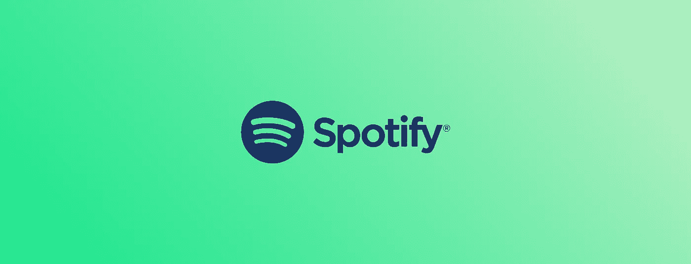
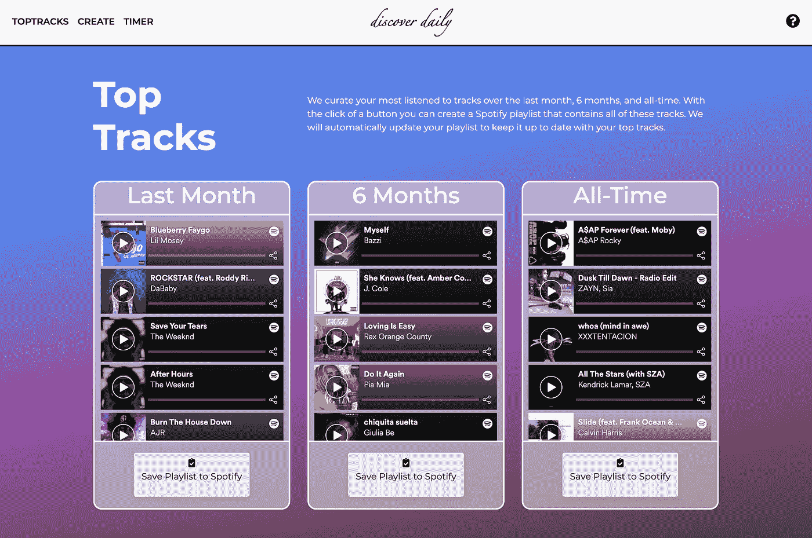
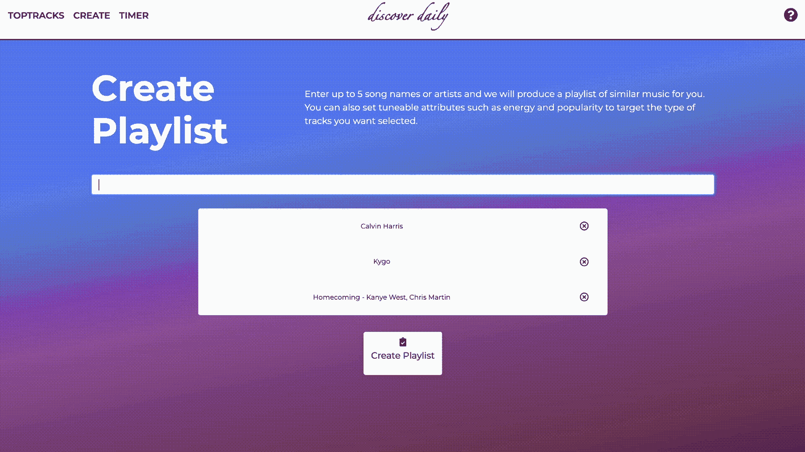
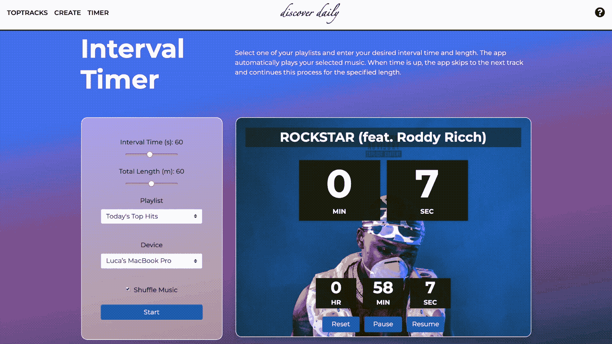

# DiscoverDaily:用 Spotify API 构建的 Flask Web 应用程序，部署在 Google Cloud 上

> 原文：<https://medium.com/analytics-vidhya/discoverdaily-a-flask-web-application-built-with-the-spotify-api-and-deployed-on-google-cloud-6c046e6e731b?source=collection_archive---------3----------------------->



几年前，当我注册了一个 Spotify 试用账户时，我相信我会在计费开始前删除这个账户。然而，我很快就被 Spotify 的时尚布局、易用性和用户定制迷住了。虽然 Spotify 确实值得每月 4.99 美元的学生折扣价，但我错过了 iTunes 中容易获得的小功能:每个曲目的个人播放计数器和最常播放的前 25 个播放列表。

对于没有 iTunes(或现在的 Apple Music)经验的人来说，每个用户都有一个播放列表，按顺序列出了他们最常播放的歌曲。该播放列表会自动更新，并允许用户轻松查看和播放他们最喜爱和最怀旧的音乐。我决定尝试为 Spotify 用户重新创建这个功能，包括自动更新和所有功能。

本文记录了我如何在 Flask 中构建这个特性，以及一个播放列表生成器和间隔计时器，然后将它部署到 Google Cloud，以便其他人可以访问它。我在这里介绍:

*   使用 Spotify API 处理授权
*   使用 Flask 路由和对 Spotify API 的请求构建功能
*   整合 MySQL 数据库，允许自动更新播放列表
*   将应用部署到 Google Cloud

web 应用程序不再运行(由于维护数据库的相关成本)，但是完整的代码可以在 [Github](https://github.com/lucaoh21/Spotify-Discover-2.0) 上查看。

# Spotify API

[Spotify 的 web API](https://developer.spotify.com/) 提供了一组端点，让每个用户都可以访问私人数据，比如他们的播放列表和回放。注册应用程序后，您将获得一个应用程序 ID 和密码(请安全保存)。要开始向 API 发出请求，您需要获得用户授权。这是通过四个步骤完成的。

1.  通过让用户登录并授予访问权限来请求授权
2.  代表用户请求访问和刷新令牌
3.  使用访问令牌向 API 发出请求
4.  在访问令牌到期后，使用刷新令牌请求新令牌

## 批准

```
[@app](http://twitter.com/app).route('/authorize')
def authorize():
  client_id = app.config['CLIENT_ID']
  redirect_uri = app.config['REDIRECT_URI']
  scope = app.config['SCOPE'] state_key = createStateKey(15)
  session['state_key'] = state_key

  authorize_url = '[https://accounts.spotify.com/en/authorize?'](https://accounts.spotify.com/en/authorize?')
  params = {'response_type': 'code', 'client_id': client_id,
            'redirect_uri': redirect_uri, 'scope': scope, 
            'state': state_key} query_params = urlencode(params)
  response = make_response(redirect(authorize_url + query_params))
  return response
```

我创建了一个 *config.py* 文件来存储我的客户端 ID 和密码，以及我的数据库信息(确保将这个文件添加到。gitignore 以避免暴露数据)。在用户尝试访问某个功能后，他们将被重定向到登录 Spotify。重定向包括一个状态密钥，以确保请求和响应都来自同一个浏览器，从而防止攻击。作用域允许应用程序代表用户访问特定的 API 端点，例如 *playlist-modify-public* ，它允许应用程序创建一个播放列表并向其中添加曲目。

## 访问令牌

用户登录后，Spotify 重定向到一个回调 URL，该 URL 是在注册应用程序时设置的。在回调期间，检查返回的状态密钥以确认响应是可信的，然后请求访问令牌。

```
def getToken(code):
  token_url = '[https://accounts.spotify.com/api/token'](https://accounts.spotify.com/api/token')
  authorization = app.config['AUTHORIZATION']
  redirect_uri = app.config['REDIRECT_URI'] headers = {'Authorization': authorization, 
             'Accept': 'application/json', 
             'Content-Type': 'application/x-www-form-urlencoded'}
  body = {'code': code, 'redirect_uri': redirect_uri, 
          'grant_type': 'authorization_code'} post_response = requests.post(token_url,headers=headers,data=body) if post_response.status_code == 200:
    pr = post_response.json()
    return pr['access_token'], pr['refresh_token'], pr['expires_in']
  else:
    logging.error('getToken:' + str(post_response.status_code))
    return None
```

为了第一次接收访问令牌，根据 OAuth 2.0 协议，使用(ID:secret)的编码版本发出 POST 请求。成功的请求具有状态代码`200`，在这种情况下，将返回访问令牌、刷新令牌和到期长度。或者，记录一个错误，并返回`None`以指示故障。刷新访问令牌的工作方式类似，刷新令牌作为附加的主体参数提供。

## 请求 Spotify API

授予访问令牌后，应用程序可以开始向各种 [API 端点](https://developer.spotify.com/documentation/web-api/reference/)发出请求(只要在授权中设置了适当的范围)。因为我的应用程序必须访问数十个不同的端点，所以我编写了标准化的函数来发出 GET、POST、PUT 和 DELETE 请求。

```
def makeGetRequest(session, url, params={}):
  headers = {"Authorization": "Bearer {}".format(session['token'])}
  response = requests.get(url, headers=headers, params=params) if response.status_code == 200:
    return response.json()
  elif response.status_code == 401 
       and checkTokenStatus(session) != None:
    return makeGetRequest(session, url, params)
  else:
    logging.error('makeGetRequest:' + str(response.status_code))
    return None
```

Flask session 对象用于存储用户的访问和刷新令牌，以及各种其他数据。会话对象可以存储特定的用户信息，类似于 cookies。然而，会话会加密地签署 cookie，这样用户在不知道密钥的情况下无法修改 cookie，密钥应该安全地存储在 *config.py* 文件中。

对于 GET 请求，指示成功的唯一状态代码是`200`，在这种情况下，响应以 JSON 格式返回。当访问令牌过期时，出现一个`401`状态代码。出现此错误时，将检查访问令牌的健康状况。否则，返回 null 表示失败。

```
def checkTokenStatus(session):
  if time.time() > session['token_expiration']:
    payload = refreshToken(session['refresh_token']) if payload != None:
    session['token'] = payload[0]
    session['token_expiration'] = time.time() + payload[1]
  else:
    logging.error('checkTokenStatus')
    return None return "Success"
```

如果访问令牌已经过期，则利用刷新令牌请求获得新令牌。响应正文包括访问令牌的生命周期(对于 Spotify API 通常为一小时)，可用于确定新令牌何时到期。

# 构建功能

我希望我的应用程序有三个主要特性:

1.  **TopTracks** :用户可以创建一个播放列表，其中包含过去一个月、六个月或有史以来最常听的音乐，并且可以选择每天更新播放列表以保持最新。
2.  **创建**:用户可以通过输入最多五个艺术家或曲目名称并设置各种可调谐属性来创建播放列表。
3.  **间隔计时器**:用户可以输入他们想要的间隔时间和长度，应用程序将在跳到下一首曲目之前，在指定的时间段内播放指定播放列表中的歌曲。

## 热门曲目

当用户首次访问该网站时，他们会看到过去一个月、六个月以及所有时间内最常听的歌曲，因为 Spotify 播放小部件，所以他们可以了解自己最喜欢的音乐。这是通过从 API 请求顶部曲目、解析曲目 id 的响应以及使用一点前端 Jinja 魔术来显示小部件来实现的。

```

  <div>
    <iframe class="iframe-track" allowtransparency="true"
     src="[https://open.spotify.com/embed/track/{{](https://open.spotify.com/embed/track/{{) track }}"
     allow="encrypted-media" frameborder="0"></iframe>
  </div>

```



TopTracks 网站视图

尝试根据三个时间段之一保存播放列表会提示一个模式，用户可以在该模式中选择他们想要保存的播放列表、这些播放列表的名称以及他们是否想要每天更新它们。在提交时，在后端发出请求以创建新的播放列表，获取指定时间段的热门曲目，并将这些曲目添加到新的播放列表中。创建新播放列表的功能如下所示。播放列表 ID 稍后用于添加曲目，而播放列表 URI 允许重定向到 Spotify 应用程序。

```
def createPlaylist(session, playlist_name):
  url = '[https://api.spotify.com/v1/users/'](https://api.spotify.com/v1/users/') + session['user_id']
        + '/playlists'
  data = {'name': playlist_name, 
          'description': 'Created by Discover Daily'}
  playlist = makePostRequest(session, url, data)   if playlist == None:
    return None return playlist['id'], playlist['uri']
```

## 创造

Spotify [推荐端点](https://developer.spotify.com/documentation/web-api/reference/browse/get-recommendations/)允许最多五个种子生成曲目推荐列表。我允许用户输入曲目和艺术家名字的组合作为种子，然后为他们提供几个可调整的属性，如*能量*和*流行度*。如果选择了一个属性，其值将用作推荐轨迹的目标。填写完所需的信息后，会根据这些建议创建一个播放列表。



创建播放列表网站的视图

为了更容易搜索艺术家和曲目，我加入了 jQuery UI Autocomplete 小部件。当用户输入文本时，将文本作为参数的 GET 请求被发送到后端。然后，基于该输入的对曲目和艺术家姓名的请求被发送到 API。

```
def searchSpotify(session, search, limit=4):
  url = '[https://api.spotify.com/v1/search'](https://api.spotify.com/v1/search')
  params = {'limit': limit, 'q': search + '*', 
            'type': 'artist,track'}
  payload = makeGetRequest(session, url, params) if payload == None:
    return None results = []
  for item in payload['artists']['items']:
    results.append([item['name'], item['id'], item['popularity']]) for item in payload['tracks']['items']:
    results.append(item['name'], item['id'], item['popularity']]) results.sort(key=lambda x: int(x[2]), reverse=True) results_json = []
  for item in results:
    results_json.append({'label': item[0], 'value': item[1]}) return results_json
```

使用`'*'`标识符使得输入不必完全匹配音轨或艺术家的名字。该列表按受欢迎程度(从高到低)排序，以便用户首先看到最有可能的请求。根据 jQuery Autocomplete 小部件协议，结果被放入 JSON，名称和值对为`'label': name`和`'value': ID`。虽然名称会显示给用户，但 id 是隐藏的，仅在创建播放列表时用作种子。

## 限时器

间隔计时器对各种活动都很有用，包括健身，在健身时经常很难不停地看手表。虽然有很多定时器在时间间隔到期时会发出警报，但它们都没有音乐功能。这个定时器的工作方式是在指定的时间内循环播放曲目，并通过 JavaScript*setInterval()*函数提供一个有用的倒计时定时器。



间隔计时器站点视图

最初加载页面时，会向 Spotify API 发出请求，为用户收集所有可用的播放列表和设备。同样，它们通过 Jinja 循环显示给用户。

倒计时定时器在前端处理，当用户单击开始、重置、暂停或恢复时，以及当间隔时间达到 0 并跳过曲目时，向后端发出请求。基本流程是:

1.  单击 Start:使用输入的表单数据向后端发出 POST 请求。向 API 发出请求以切换无序播放，并且利用用户输入来设置回放上下文。另一个请求是获取当前播放的曲目，以便可以向用户显示曲目名称和专辑封面。
2.  间隔命中数为 0:使用 skip 命令向后端发出 GET 请求。向 API 发出跳到下一个轨道的请求，并且当前轨道信息作为响应被发送回前端。

因为间隔功能使用回放，所以可能会出现两个独特的请求错误，应该向用户显示:`403`表示用户没有 Spotify Premium，而`404`表示所选设备未激活，不能用于回放。在可能发生这种情况的请求中，这些错误是通过 Flask 的 *abort()* 函数来处理的，该函数会提前中止带有 HTTP 错误代码的请求。然后，这些错误可以通过前端 JavaScript 警报呈现给用户。

```
response = startPlaybackContext(session,playlist,session['device'])
  if response == 403:
    abort(403)
  if response == 404:
    abort(404)def startPlaybackContext(session, playlist, device):
  url = '[https://api.spotify.com/v1/me/player/play'](https://api.spotify.com/v1/me/player/play')
  params = {'device_id': device}
  data = {'context_uri': playlist, 
          'offset': {'position': 0}, 'position_ms': 0}
  payload = makePutRequest(session, url, params, data)
  return payload
```

Spotify 通常需要几毫秒来处理播放命令，如开始和跳过。因此，请求当前曲目时返回的信息实际上可能是针对前一首曲目的。因此，如果返回的曲目已经前进了超过 5 秒钟(表明它是旧曲目)，应用程序将等待几毫秒，然后再次尝试获取当前曲目信息。

```
def getTrack(session):
  url = '[https://api.spotify.com/v1/me/player/currently-playing'](https://api.spotify.com/v1/me/player/currently-playing')
  curr = makeGetRequest(session, url) if curr == None:
    return None if curr['progress_ms'] != None and curr['progress_ms'] > 5000:
    time.sleep(0.2)
    curr = makeGetRequest(session, url)
    if curr == None:
      return None name = curr['item']['name']
  img = curr['item']['album']['images'][0]['url'] return {'name': name, 'img': img}
```

# 整合数据库以进行自动更新

为了重新创建苹果的**前 25 名最常播放的**播放列表，当用户最常听的音乐发生变化时，应用程序必须自动更新用户保存的 TopTracks 播放列表。这需要两个附加组件:

1.  一个数据库，用于存储已注册自动更新其 TopTracks 播放列表的用户的信息
2.  一种计划更新的方法

## 数据库建设

因为我计划在 Google Cloud 上部署站点，所以使用 Cloud SQL for MySQL 作为我的数据库是合乎逻辑的，这使得建立和维护 MySQL 关系数据库相对容易。在 Google Cloud 上[创建数据库](https://cloud.google.com/sql/docs/mysql/create-manage-databases)之后，必须在 Flask 应用程序中建立连接。

```
engine = sqlalchemy.create_engine(
         sqlalchemy.engine.url.URL(
         drivername = 'mysql+pymysql',
         username = 'root',
         password = app.config['DATABASE_PASSWORD'],
         database = app.config['DATABASE_NAME'],
         query = {'unix_socket': '/cloudsql/' 
                  + app.config['DATABASE_CONNECTION']},
         ),
)Session = sessionmaker(bind=engine)
Base = declarative_base()
Base.metadata.create_all(engine)
```

通过用 *sessionmaker()* 配置会话工厂并将其与引擎绑定，每当调用 *Session()* 时，就可以为数据库创建一个新的会话对象。会话对象管理 ORM 映射对象的操作，在数据库中添加和更新用户时是必需的。调用 *create_all()* 确保已经创建了正确的表。

```
class User(Base):
  __tablename__ = 'users'
  id = Column(Integer, primary_key=True)
  username = Column(String(64), index=True, unique=True)
  refresh_token = Column(String(150), index=True, unique=True)
  playlist_id_short = Column(String(30), index=True, unique=True)
  playlist_id_medium = Column(String(30), index=True, unique=True)
  playlist_id_long = Column(String(30), index=True, unique=True)
```

该表由六列组成，包括必需的 ID 主键。当用户注册 TopTracks 播放列表时，使用用户名列来确保他们以前没有注册过。如果用户已经存在于表中，那么只更新播放列表 id。当用户最初创建了一个时间段的播放列表，而现在正在添加不同时间段的播放列表时，就会出现这种情况。否则，将创建一个新的 *User()* 对象，并将其插入到表中。下面，您可以看到如何使用会话工厂来创建会话对象，这些对象允许对数据库进行更新。

```
def addUser(username, refresh_token, playlist_id_short=None,
            playlist_id_medium=None, playlist_id_long=None):
  session = Session()
  id_exists = session.query(User.id).
              filter_by(username=username).scalar() if id_exists == None:
    user = User(username=username, refresh_token=refresh_token,
           playlist_id_short=playlist_id_short,
           playlist_id_medium=playlist_id_medium,
           playlist_id_long=playlist_id_long)
    session.add(user)
    logging.info('New auto user: ' + username) else:
    user = session.query(User).get(id_exists)
    logging.info('Auto user updated: ' + user.username) if playlist_id_short != None:
      user.playlist_id_short = playlist_id_short
    if playlist_id_medium != None:
      user.playlist_id_medium = playlist_id_medium
    if playlist_id_long != None:
      user.playlist_id_long = playlist_id_long session.commit()
  session.close()
```

## 自动更新

刷新令牌列是必需的，以便在更新播放列表时可以请求新的访问令牌。为了调度这些更新，使用了来自 AP 调度器模块的后台调度器。通过向调度程序添加一个带有时间参数的作业，每个周期都会调用指定的函数。

```
from models import updatePlaylists
scheduler = BackgroundScheduler()
scheduler.add_job(updatePlaylists, trigger='interval', days=1)
scheduler.start()
```

在 *updatePlaylist()* 函数中，表中的所有行都被迭代。如果应用程序无法用存储的刷新令牌建立授权，或者如果用户已经删除了他们的所有 TopTracks 播放列表，则从表中删除该行。否则，对于每个 TopTracks 播放列表，该播放列表被清除，然后用当前收听最多的曲目重新填充。

# 部署到 Google 云平台

在将应用部署到谷歌云平台(GCP)之前，必须创建一个 *app.yaml* 文件来存储 GCP 需要的所有配置，包括 Python 版本、路由等。

```
runtime: python37
entrypoint: gunicorn -b :$PORT main:app
handlers:
- url: /static
  static_dir: static
- url: /(.*)
  script: auto
```

为了正确记录数据库中的错误和更新，我还引入了 GCP 日志。实现这一点最简单的方法是将常规的 Python 日志链接到 [Google 的 logger](https://cloud.google.com/logging) ，然后使用标准的 Python *logging.error()* 或 *logging.warning()* 函数。如果记录器成功连接，您可以在 Google Cloud 控制台日志查看器中看到所有输出的日志。

```
import google.cloud.logging
client = google.cloud.logging.Client()
client.get_default_handler()
client.setup_logging()
```

最后，可以使用以下命令将应用程序部署到 GCP，并查看创建的 web 应用程序。

```
>> gcloud app deploy
>> gcloud app browse
```

如果你已经读到这里，我建议你看看我的[代码](https://github.com/lucaoh21/Spotify-Discover-2.0)。欢迎在评论区发表关于这篇文章或我的申请的任何问题或评论。我将高兴地回答这些问题。感谢阅读！