# 植物病害检测

> 原文：<https://medium.com/analytics-vidhya/disease-detection-in-plants-d68a924859aa?source=collection_archive---------8----------------------->

# 介绍

印度的主要职业是农业。超过 50%的人依靠它&分享 GDP 的主要部分。在印度，农民种植各种各样的作物。许多因素，如气候/土壤条件、各种疾病都会影响作物的产量。现有的植物病害检测方法非常简单，需要更多的人力、装备齐全的实验室和昂贵的设备。有几个挑战，包括症状分割，症状变化，图像背景，图像采集条件，这是非常关键的。

# 资料组

我使用过公共的非常著名的 PlantVilage 数据集。这是克劳代在一次名为“植物村疾病分类”的挑战中发表的

[https://makeameme.org/meme/Wheres-my-data](https://makeameme.org/meme/Wheres-my-data)

数据集的链接:

> https://www . crowd ai . org/challenges/plant village-disease-class ification-challenge

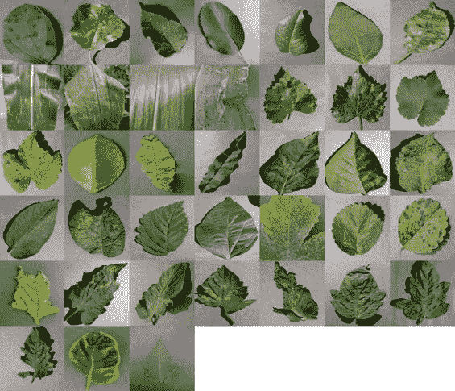

[https://www . crowd ai . org/challenges/plant village-disease-class ification-challenge](https://www.crowdai.org/challenges/plantvillage-disease-classification-challenge)

该数据集包含大约 **54k 张植物叶片的图像**。这些植物图像包括以下 14 种不同的物种:

苹果、蓝莓、樱桃、玉米、甜椒、土豆、覆盆子、葡萄、橙子、桃子、大豆、南瓜、草莓和番茄

以下是 38 类植物病害的列表，

1.苹果黑星病

2.苹果黑腐病

3.苹果雪松锈病

4.苹果健康

5.蓝莓健康

6.樱桃健康

7.樱桃白粉病

8.玉米灰斑病

9.玉米普通锈病

10.玉米健康

11.玉米大斑病

12.葡萄黑腐病

13.葡萄黑麻疹

14.葡萄叶枯病

15.葡萄健康

16.橘子黄龙饼

17.桃细菌性斑点病

18.桃子健康

19.甜椒细菌性斑点病

20.甜椒健康

21.马铃薯早疫病

22.土豆健康

23.马铃薯晚疫病

24.树莓健康

25.大豆健康

26.南瓜白粉病

27.草莓健康

28.草莓叶烧焦

29.番茄细菌性斑点病

30.番茄早疫病

31.番茄晚疫病

32.番茄叶霉病

33.番茄黑斑病

34.番茄二斑叶螨

35.番茄靶斑

36.番茄花叶病毒

37.番茄黄化曲叶病毒

38.番茄健康

[https://meme generator . net/instance/65149889/Mr-bean-well-then-let-get-started](https://memegenerator.net/instance/65149889/mr-bean-well-then-lets-get-started)

因为在云中训练模型有许多优点，因为训练需要巨大的计算能力。(如果你有一个好的 GPU，那么你就可以开始了，你也可以在你的本地计算机上训练)

我会使用谷歌 colab，但你可以根据自己的选择使用。

(Google colab 是一项免费的云服务，提供免费的图形处理单元(GPU — 12 GB RAM)。这是训练模型最快的方法之一)

下载植物村数据集并上传到 Google Drive。

登录到 Colab 并创建一个新的 *IPython 笔记本* (ipynb)

切换到 GPU，准备飞行！

> 从 google drive 装载数据。

从 google.colab 导入驱动
drive . mount('/content/your path ')

> 导入库

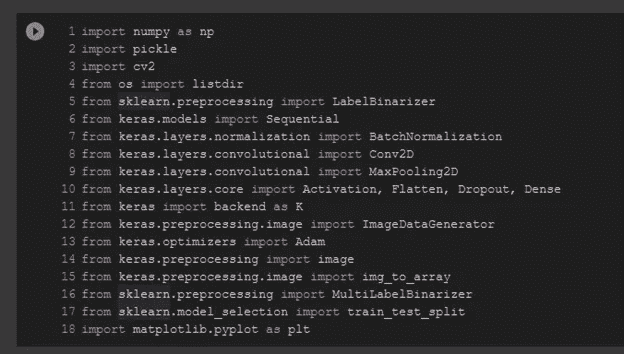

现在，创建一个函数来转换或调整输入数据集影像的大小，以便它们适合训练。

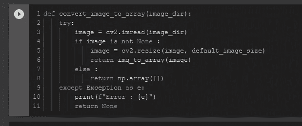

之后，遍历数据集文件夹，调整每个文件夹中的图像大小，并将它们加载到 numpy 数组中。

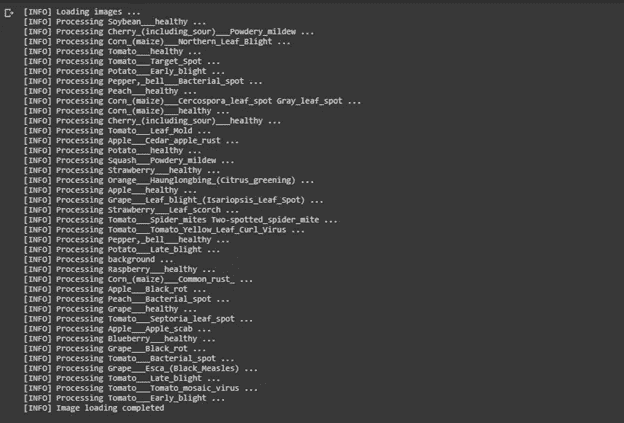

由于有成千上万的图像，它将需要时间来加载。加载数据集后，将每个植物病害映射到训练任务的唯一值。另外，将这个转换保存到 pickle 文件中。

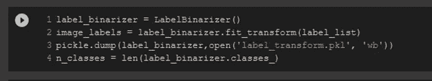

> 训练-测试-分离

然后，我们用 0.2 的拆分比率将加载的数据集与训练集和测试集进行拆分。

(即 80%的培训和 20%的测试)

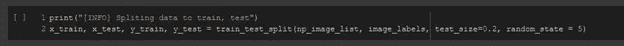

> 数据扩充

数据扩充用于通过在数据集中创建图像的修改版本(例如旋转、缩放、翻转旋转)来人为地扩大训练数据集的大小。这将有助于模型有效地学习特征。此外，它可以更好地处理验证数据。

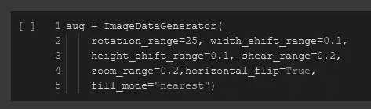

> 模型

现在，为分类任务创建一个顺序模型。

> 模型-超参数

定义所有的超参数。将它单独保存在单个单元格中，以便以后更容易编辑它。

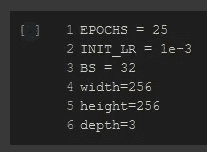

> 模型-培训

选择优化技术并编译它。

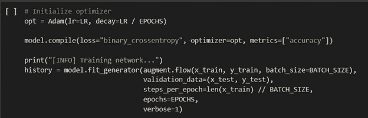

休息一下伙计们…！！！

[https://www.meme-arsenal.com/en/create/meme/2495515](https://www.meme-arsenal.com/en/create/meme/2495515)

> 模型评估

性能很好，但是模型学到了什么？

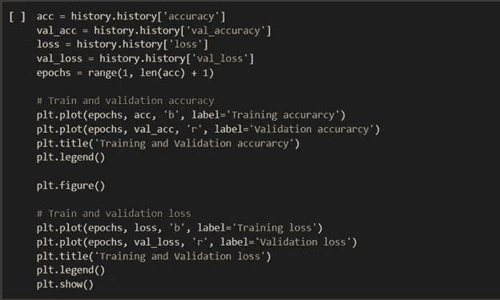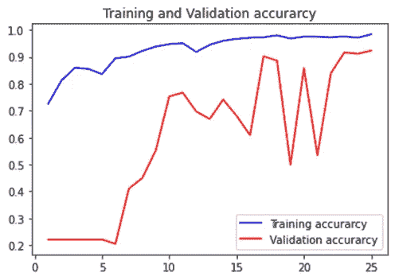

从上面的图中，我们可以看到，随着最近几个时期准确性的趋势上升，我们可以对模型进行更多的训练。

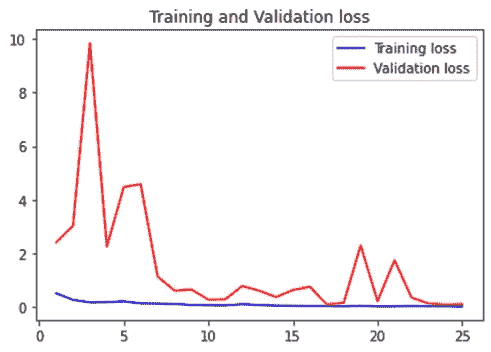

从上面的损失图中，我们可以看到，最初的验证损失很高，但最终损失在很大程度上减少了。

通过查看上面的两个图表，可以清楚地看到，随着训练精度的增加，验证精度也增加。同样，随着训练损失的减少，验证损失也会减少。

> 评估()并检查

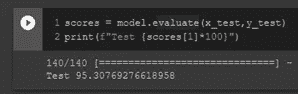

嘣！

准确率:95.31%！！

该模型对看不见的数据也有很好的性能。

> 是真正考验的时候了

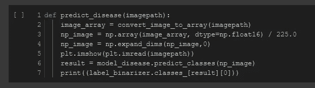

从数据集中选择随机图像，并尝试预测植物图像的病害。

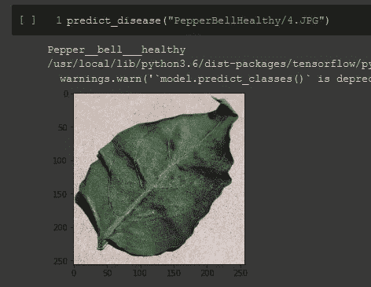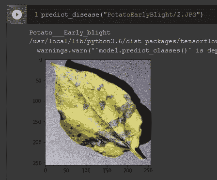

> 模型—重用

保存模型使用，

model.save("modelname.h5 ")

负载模型，

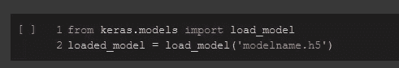

这就是如何加载模型并使用训练好的模型进行预测。

# 参考资料:

[http://www.ijareeie.com/upload/2019/march/14_Plant.pdf](http://www.ijareeie.com/upload/2019/march/14_Plant.pdf)

[https://towards data science . com/plant-ai-plant-disease-detection-using-convolutionary-neural-network-9b 58 a 96 f 2289](https://towardsdatascience.com/plant-ai-plant-disease-detection-using-convolutional-neural-network-9b58a96f2289)