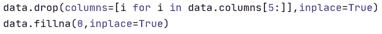

# 疾病预测者

> 原文：<https://medium.com/analytics-vidhya/disease-symptom-predictor-97942c31c3b7?source=collection_archive---------12----------------------->

这是我的深度学习项目；根据数据中给出的症状对 41 种疾病进行数据分析和预测。我使用了 Pandas、NumPy、Seaborn、TensorFlow、Keras 和 Scikit learn 库来分析数据和建立模型。

在 pandas 库的帮助下，我将 CSV 作为“数据”变量导入并分析了它。

data.head()。转置()

data . description()。转置()

data.isna()。总和()

在分析数据之后，我们可以看到在“症状 _5”特征之后大部分是 NaN 值，所以我移除了那些特征，并用 0 替换剩余的 NaN 值。

现在是特征工程，我用数值代替了症状，用数字(0 到 40)代替了疾病。

data.head(15)

sns.countplot(数据['疾病'])

我将数据分为 x 和 y 变量，并将它们分为训练测试数据，即“x_train”、“x_test”、“y_train”、“y_test”。在通过人工神经网络发送之前，我对它们进行了缩放，以使数据标准化。我在“y_train”和“y_test”上进行了一次性编码。

我建立了一个人工神经网络对这些疾病进行分类，并做了一个分类报告，对 41 种疾病的平均准确率为 91%。

结论

我做这些都是为了练习人工神经网络，以下是我在做这个项目时学到的所有东西:

> *学会了如何使用以及何时使用人工神经网络。*
> 
> *了解了深度学习相对于其他基本机器学习算法的优势和劣势。*

Github 项目:[疾病预测](https://github.com/codename-hyper/Disease-Prediction)