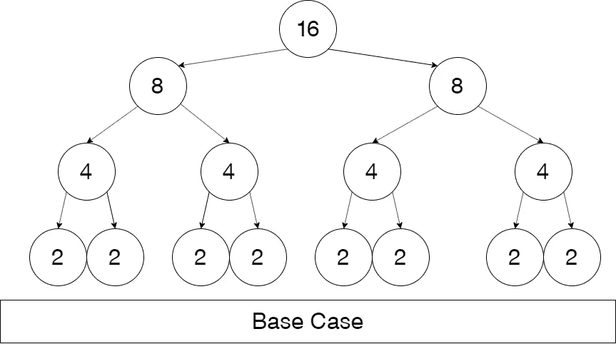

# 剖析主定理第一部分:递推关系

> 原文：<https://medium.com/analytics-vidhya/dissecting-the-master-theorem-part-1-recurrence-relation-4c3deb36097e?source=collection_archive---------16----------------------->

主定理用于分析分治算法。我发现，起初，主定理可能看起来令人困惑或模棱两可。所以在这篇文章中，我希望我能尽可能地简化这个定理。

首先，让我们从递归关系的公式开始，我们将使用合并排序作为我们的实际例子，所以它不是唯一的定理。所以公式是:
*T(n) ≤ a T(n/b) + c nᵈ*
我们来试着理解一下每一项代表什么意思。所以*“a”*代表递归调用的次数，在归并排序中我们进行了两次递归调用。

所以这意味着*“a”*等于 2。接下来是*【n】**【b】*。*【n】*是输入的大小，所以例如在归并排序中，如果我们要对一个数组大小为 *100000* 的元素进行排序，那么 ***n = 100000。*** 对于*【b】*其对每个递归调用，我们如何划分输入？分成几块？回想一下，这些递归算法被称为分治算法。所以在我们的 MergeSort 例子中，每次递归调用我们都把输入分成两部分。所以 ***b = 2。*** 注意，我们一直进行划分，直到输入足够小，使得排序的代价为 T(2) = 1。这意味着左= 1 和右= 1 的大小，我们只是比较和重新排列它们。

最后，我们只剩下非常简单的表达方式“nᵈ”。为了理解这一点，让我们回忆一下我们在这里试图做什么。我们试图把一个大问题分成小问题，然后用更少的时间解决小问题，并把它们结合起来。因此，在我们完成拆分数组和排序 2 个元素后，我们需要将排序后的小块元素加在一起。回想在 MergeSort 中，合并步骤的总时间被视为 ***线性。***

正如我们在前面的“MergeStep.py”中看到的，我们的工作度是线性的，所以 ***d = 1*** 和 ***c*** 是基本情况的运行时间，也等于 1。于是我们剩下了 ***n.*** 合并排序的最终公式是***:*** *T(n)≤2t(n/2)+n*

观察这个公式可以通过递归树来完成。此树显示了分治算法的扩展，并记录了花费的时间。让我们来构建这棵树。首先让我们考虑一个大小为 16 的数组。

如果我们仔细观察的话，我们会发现每一级要解决的问题增加了 2 倍，然而我们要解决的问题却减少了一半。如果我们仔细观察，我们会发现每一层都有一系列 2ʲ问题，其中 j 是层数。而输入的大小等于 16/(2ʲ)每一级。最后，树的长度是 log₂(16) + 1(根)。所以我们可以把这些数字推广到，每一层都有 aʲ子问题，每一层都有 log(n) base b 层的 n/bʲ大小的问题。这些公式是为了帮助在主定理的证明下一部分使用。

希望这篇文章对你有用。非常感谢您的反馈。下一部分见。