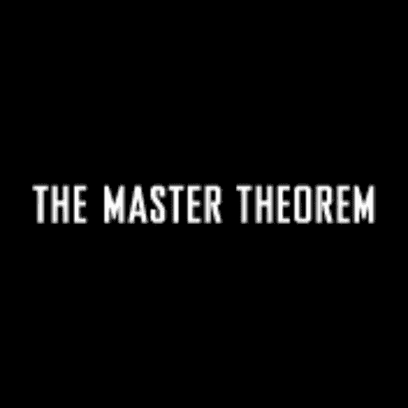

# 剖析主定理

> 原文：<https://medium.com/analytics-vidhya/dissecting-the-master-theorem-part-2-proof-993b47b643b2?source=collection_archive---------27----------------------->

## 第 2 部分:证据

所以正如我们在[第 1 部分](/analytics-vidhya/dissecting-the-master-theorem-part-1-recurrence-relation-4c3deb36097e?source=your_stories_page---------------------------)中所看到的，理解了递归关系的概念。我们现在可以理解主定理是如何工作的了。回想一下，在上一篇文章中，我们将“a”定义为循环的次数，“b”定义为输入的除数，“d”定义为循环之外的工作的复杂程度，“n”定义为输入的大小。我们还定义了通常在递归树的 j 层有 **aʲ** 子问题的数量和每个子问题的大小 **n/bʲ** (如果你不记得递归树是什么意思，请参考第 1 部分)。

现在，我们想计算在 j 级完成了多少工作。假设我们有一个由 4 个问题组成的作业，我们想计算出我们需要多少时间/工作。我们可以把每个问题乘以它所花费的时间/工作，对吗？这和我们的案子有什么关系？我们想计算递归树中所做的总功。所以我们用问题的大小乘以问题的数量。用我们得到的定义替换英语: **aʲ。cnᵈ** 。回想一下 **cnᵈ** 是递归关系定义中递归之外所做的工作。但实际上输入在 j 级**的大小并不是“n”，它的**是 n/bʲ.所以我们得到了 aʲ。c[n/bʲ]ᵈ** 这是有意义的，当我们深入递归时，输入的大小除以我们将问题除以幂的因子。**

不过，这是针对某个级别的 **j** 。我们想计算所做的全部工作。因此，首先让我们重新安排我们的方程，通过分离依赖于水平的项和独立项，我们得到 cnᵈ.【a/bᵈ]ʲ 。所以对所有能级所做的功将是所有 j 的总和。由于 n 是 b 的幂，所以树的长度为 **logb(n)。**所以我们求和∑从 0 到树的长度 **logb(n)** 。最后我们有了 **cnᵈ.∑ⱼ[a/bᵈ]ʲ** 其中 j = 0 到 logb(n)。

根据递归关系解释一般情况:

***【t(n)≤a t(n/b)+cnᵈ***

无论是 bᵈ、bᵈ还是 bᵈ.让我们分别攻克每一项，然后理解每一项的真正含义。对于 **a = bᵈ，**让我们用 **cnᵈ.代替∑ⱼ[a/bᵈ]ʲ** 在这里我们发现,**项,**将等于 1，1 的任何次方等于 1。因此，总和将是 1⁰和求和的其余部分，直到 **logb(n)** 。我们以 **[logb(n) +1]结束。因此，我们最终选择了 cnᵈ。[logb(n)+1]即 O(nlogn)。**回想一下，这是合并排序中的情况，其中 a = 2，bᵈ = 2。

其次，对于一个< bᵈ and a > bᵈ，这些情况分别表明 a/bᵈ是小于还是大于 1。让我们用一个很好的证明来说明任何求和 1 + a + a + a ……..aᵏ = aᵏ⁺ -1 / a-1。我们可以用归纳法迅速而容易地证明这一点。如果你不记得什么是归纳证明，请访问这个 [youtube 讲座](https://www.youtube.com/watch?v=z8HKWUWS-lA)。

归纳证明由两部分组成:证明

1.  基本情况是真实的
2.  归纳步骤是正确的，我们将看到如何。

基本情况我们归纳为 0，并检查我们的要求的正确性。

a⁰ -1 / a-1 = 1，所以对于基本情况是正确的。

然后，归纳步骤是假设对于 k 个数字，要求为真，然后检查 k+1 是否也为真。因此，我们将替换每个 k，并把 k+1: 1 + a + a + a ……..aᵏ + aᵏ⁺和 aᵏ⁺ -1 / a-1。

用这个求和就是 1 + a + a + a ……..aᵏ = aᵏ⁺ -1 / a-1，我们得到 aᵏ⁺ -1 / a-1 + aᵏ⁺。

然后，我们将独立项 aᵏ⁺乘以 a-1/a-1，得到:

aᵏ⁺。a- aᵏ⁺ / a-1 等于 aᵏ⁺ -aᵏ⁺ /a-1。

加上我们得到的条件:

aᵏ⁺ -aᵏ⁺ +-aᵏ⁺ -1/a-1 得到 aᵏ⁺ -1/a-1。

所以归纳是真的。在使用归纳法时，一个非常宝贵的建议是，总是使用 F(k)来证明 F(k+1 ),如果你不使用它，你就是在用错误的方法做事情。

回到我们的主要定理:对于 a/bᵈ小于 1 的情况，我们发现 aᵏ⁺ -1/a-1 被 1/1-a 所有界，1/1-a 是一个常数，与我们有多少项无关。所以 **cnᵈ.∑ⱼ[a/bᵈ]ʲ** 将等于 **cnᵈ.(1/1-a)** 哪个是 **O(nᵈ).这是我们的第二个案例。最后我们只剩下比 1 大的 a/bᵈ。**回到我们的求和，这个求和会被最大项所支配，最大项等于 logb(n ),所以我们以 **cnᵈ.结束(a/bᵈ)ˡᵒᵍᵇⁿ.**

为了简化这个可怕的术语，我们首先取 **(b⁻ᵈ)ˡᵒᵍᵇⁿ** ，用 **logb(n)** 代替 d，得到 **(bˡᵒᵍᵇⁿ)⁻ᵈ** ，用 logb 取消 b 的幂，得到 **n⁻ᵈ.**然后我们用 **n⁻ᵈ** 取消 **nᵈ** 并留下 **aˡᵒᵍᵇⁿ(也可以公式化为 nˡᵒᵍᵇᵃ** 其中事实上是递归树的叶子数，递归调用的次数幂最后一级是树中的最后几个节点，这些节点是叶子。

这三种情况是:

1.  O(nlogn)
2.  O(nᵈ)
3.  O(nˡᵒᵍᵇᵃ).

让我们分别总结一下各自的含义。在第一种情况下，进行的递归调用等于输入的划分，这表明每一级都做了相同的工作。在第二种情况下，递归调用少于输入的划分，这意味着我们在树中越深入，我们做的工作就越少，可以想象我们有两个递归调用，将输入分成两半，但我们在递归调用之外做二次工作。这意味着递归每一级只节省我们 25%的工作。所以递归之外的工作支配着 big-O 符号。对于最后一种情况，递归调用比我们对问题的划分多，所以大 O 符号被树叶支配。

你不需要记住这些价值观，只要理解这个 **cnᵈ.就行了∑ⱼ[a/bᵈ]ʲ** 你将在几秒钟内得到公式。我试过了，100%有效。

希望这篇文章对你有用。非常感谢您的反馈。