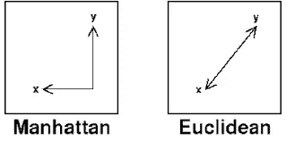

# 模式识别中的距离度量。

> 原文：<https://medium.com/analytics-vidhya/distance-measures-in-pattern-recognition-b9bd10140b64?source=collection_archive---------11----------------------->

为了理解一个特征的各个方面，我们需要理解和分离那些属于所选特征的点和那些不属于所选特征的点。

距离度量是将未知模式分类到其最近类别的邻近度量之一。换句话说，它发现了模式之间的不同之处。

距离函数可以是公制的或非公制的。

相似性函数具有如下属性:

1.  正自反性:- f(x，x)=0
2.  对称性:- f(x，y)=f(y，x)
3.  三角不等式 f(x，y)≤ f(x，z)+f(z，y)

任何满足上述所有条件的相似性函数被称为 ***度量*** & 其他不满足三角不等式或对称性的函数被称为 ***非度量*** 。


公制度量有以下几种类型

**闵可夫斯基距离** :-


当 p=1 时，称为曼哈顿距离。

当 p=2 时，称为欧氏距离。

为了更好地理解它，请看这张图片。



**马氏距离** :-


```
where, 
 - D^2        is the square of the Mahalanobis distance. 
 - x          is the vector of the observation (row in a dataset), 
 - m          is the vector of mean values of independent variables (mean of each column), 
 - C^(-1)     is the inverse covariance matrix of independent variables.
```

(x — m)本质上是向量与平均值的距离。然后，我们将它除以协方差矩阵。

如果数据集中的变量高度相关，那么协方差会很高。除以一个大的协方差将有效地减少距离。

同样，如果 X 不相关，那么协方差不高，距离也不会减少很多。

**加权欧氏距离** :-


这里 W 是对应于点 x 和 y 之间距离的权重。

非公制距离将在下一篇文章中讨论。

在此之前，您可以通过访问给定的链接手动模拟上述措施:-

[](http://rosalind.info/glossary/euclidean-distance/) [## 词汇表

### 平面或三维空间中两点之间的欧几里得距离测量线段的长度…

rosalind.info](http://rosalind.info/glossary/euclidean-distance/) 

[https://people . revoledu . com/kardi/tutorial/Similarity/minkowskidistance . html](https://people.revoledu.com/kardi/tutorial/Similarity/MinkowskiDistance.html)

— — — — — — — — —