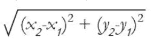
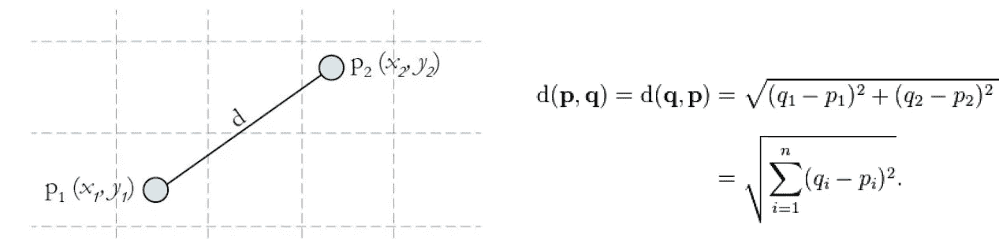
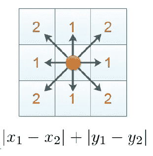
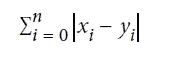
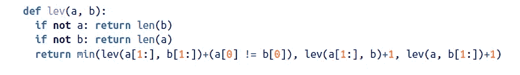
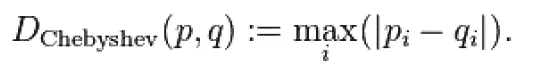
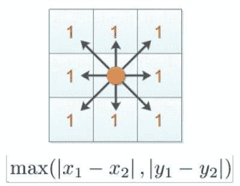
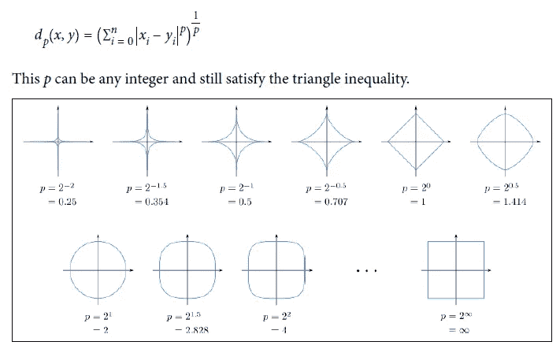
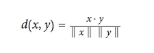
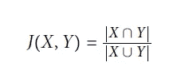

# 距离度量:机器学习模型中的概念和用途

> 原文：<https://medium.com/analytics-vidhya/distance-metrics-concepts-and-uses-in-machine-learning-models-97e102b5ccfc?source=collection_archive---------25----------------------->

当我开始机器学习之旅时，我只知道 2D 平面上 A 点和 B 点之间的一个简单的距离公式

2D 平面上两点之间的距离

但是一旦我开始了解更多，我发现这叫做欧几里德距离。但令我惊讶的是，有许多类型的距离度量，而不仅仅是这一种。所以我开始探索它们。这是我在机器学习过程中学到的所有距离度量。

# **计算距离**

1.  **欧几里德距离:**

N 维空间中两点之间的普通距离。

欧几里得距离

几乎在大多数基本机器学习算法中使用，用于计算点之间的距离。不考虑地理因素时使用。

涉及城市 A 到城市 B 之间航班数据的问题

**2。曼哈顿距离:**

也被称为直线距离、城市街区距离，出租车度量被定义为点之间的线段在坐标轴上的投影长度之和。

图像只允许通过边缘移动，而不能在矩形的两个相对顶点之间对角移动。

曼哈顿距离

对于 N 维空间

用于几乎大多数遍历有约束的问题，如遍历受限于边的图，或道路围绕房屋街区的驾驶问题。

## 3.莱文斯坦距离:

对于文本分析和 NLP 问题来说，使用插入、删除或更新将一个字符串转换成另一个字符串需要很多步骤。

使用递归的 Levenshtein 距离

主要用于基于语法的相似性匹配算法。

## 4.汉明距离:

汉明距离或信号距离是比较两个二进制数据串的度量。在比较两个等长的二进制字符串时，汉明距离是两个位不相同的位数。

它更像 XOR 运算和计算不匹配。

约翰和简将有海明距离 3

从未使用过，但听说它用于电信和 DNA 测序。

## 5.切比雪夫距离；

如果你下过国际象棋，那么你可能已经用过国王棋了，它可以向所有可能的方向移动。

切比雪夫距离

切比雪夫距离

如果您有图像处理的经验，卷积图层的工作原理与图像矩阵的距离原理相同。

# **几何距离:**

## 1.闵可夫斯基距离:

我们已经知道三角形不等式:斜边的长度总是小于每条边的长度之和。

||x||+||y||≤||x||+||y||

其中||x||是涉及 x 坐标的欧几里德距离，而||y||是涉及 y 坐标的欧几里德距离

满足三角形不等式的可能性有无限多种。

闵可夫斯基距离

## 2.余弦距离:

这是我的最爱之一。我用它解决了大部分的自然语言处理和文本分析问题，这种距离的美妙之处在于它利用高维空间中两点之间的余弦角来捕捉它们的相似性。角度越小，距离越小(因为余弦值会增加)。

余弦相似性

余弦距离=一维(x，y)

在大多数基于文本分析的算法中使用，用于相似性匹配或简单匹配，比如说两个句子相似或不相似。

# **统计距离:**

当我们一起使用一组数据点，并试图衡量相对于其他组波动性或方差时，我们就使用这种距离。

## 1.Jaccard 距离:

基于两组数据点之间的重叠特征，它可以用于识别组之间的相似性(换句话说，距离)。

雅克卡距离

x 和 Y 是数据点组。

可用于分组，例如根据词频查找两个段落或文档的相似程度。

## 2.马哈拉诺比斯距离:

Mahalanobis 距离测量相对于质心的距离，质心是一个基点或中心点，可视为多元数据的整体平均值。形心是多元空间中的一个点，所有变量的所有平均值都在该点相交。MD 越大，数据点离质心越远。

马哈拉诺比斯距离

用例包括识别多元异常值、聚类分析和分类技术。

如果你喜欢这篇文章，别忘了用掌声鼓励我，下一篇文章将会是不同的。