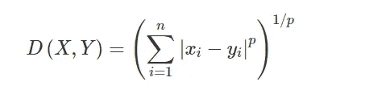
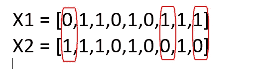

# 机器学习中的距离

> 原文：<https://medium.com/analytics-vidhya/distances-in-machine-learning-ec8c6cebbc7f?source=collection_archive---------26----------------------->

机器学习中计算距离的方法有很多。在这里，我们将讨论其中的一些。

*   欧几里得距离
*   马汉塔距离
*   闵可夫斯基距离
*   汉明距离
*   余弦距离和余弦相似度

## 欧几里得距离

它是 x 和 y 在 *n* 维度上的距离。这里，我们正在计算数据点 p1 和 p2 之间的距离 d。


**代号:**

```
from sklearn.metrics.pairwise import euclidean_distances
X = [[0, 1], [1, 1]]**#distance between rows of X**
euclidean_distances(X, X)**#get distance to origin**
euclidean_distances(X, [[0, 0]])**output:** array([[1\.        ],
       [1.41421356]])
```

## 马汉塔距离

它是所有坐标的绝对差之和。假设我们必须告诉某人 A 到 b 之间的距离。所以，这里我们说直走 3 个街区，再向左走 3 个街区，那么距离将是 *6 个街区。*


需要提到的一点是，我们不能走对角线。


**方程式**


**代码:**

```
import math
p1 = [4, 0]
p2 = [6, 6]
distance = math.sqrt( ((p1[0]-p2[0])**2)+((p1[1]-p2[1])**2) )print(distance)**output:**
6.324555320336759
```

## 闵可夫斯基距离

在赋范向量空间中，度量 A 点到 B 点的相似性的距离。向量空间有两个术语，赋范向量空间，我们简单说一下。

*   向量空间——它是向量的集合，可以像标量一样相加和相乘。
*   赋范向量空间-它是实数或复数上的向量空间，在其上定义了范数(在距离可以表示为具有长度的向量的空间中)。



如果看公式有两件事

*   如果 p =1，它变成马汉塔距离
*   如果 p = 2，它就变成了欧几里德距离

X1 = [0，1，1，0，1，0，1，1，1]

X2 = [1，1，1，0，1，0，1，0]



**代码:**

```
from scipy.spatial import distance
distance.minkowski([0,1,1,0,1,0,1,1,1], [1,1,1,0,1,0,0,1,0], 1)**output:** 3
```

## 汉娩距

它用于测量文本中的距离。这里我们采用一个布尔向量来学习更多关于汉明距离的知识。假设我们有 X1，X2 两个布尔向量。

***汉明距离(X1，X2) =二进制值不同的位置的数量***

**代码**:

```
from scipy.spatial import distancedistance.hamming(['a','b','c','d'], ['d', 'b','c', 'd'])**code:**
0.25
```

## 余弦距离和余弦相似度

余弦相似性是衡量两个或多个文档的相似性，而不考虑它们的大小。它使用余弦距离来计算相似度。

余弦相似度定义为


和

**余弦距离=1 余弦相似度**

在数学上，它测量的是在多维空间中投影的两个向量之间的角度余弦。


那么，哪个值对定义什么有用呢？

cos(0) = 1，cos(360) = 1 ( *有相似之处)*

cos(90) = 0，cos(270) = 0(相似之处很少:可以忽略不计)

cos(180) = -1(完全不相似)

**代码**:

```
from scipy.spatial import distance
distance.cosine([1, 0, 0], [0, 1, 0])**output:** 1.0
```

[笔记本附在这里。](https://github.com/namratesh/Machine-Learning/blob/master/Distances.ipynb)

感谢阅读，欢迎建议！！！

## 参考资料:

[](https://www.machinelearningplus.com/nlp/cosine-similarity/) [## 余弦相似性-理解数学及其工作原理？(使用 python)

### 余弦相似性是一种度量标准，用于衡量文档的相似程度，而不考虑文档的大小。数学上…

www.machinelearningplus.com](https://www.machinelearningplus.com/nlp/cosine-similarity/) [](https://www.mikulskibartosz.name/minkowski-distance-explained/) [## 闵可夫斯基距离解释说

### 有时候我们想衡量事物之间有多少相似之处，或者有多少不同之处。它不仅发生在…

www.mikulskibartosz.name](https://www.mikulskibartosz.name/minkowski-distance-explained/) [](https://towardsdatascience.com/how-to-measure-distances-in-machine-learning-13a396aa34ce) [## 机器学习中如何测量距离

### 这完全取决于你的观点

towardsdatascience.com](https://towardsdatascience.com/how-to-measure-distances-in-machine-learning-13a396aa34ce) 

https://towards data science . com/importance-of-distance-metrics-in-machine-learning-modeling-e 51395 FFE 60d