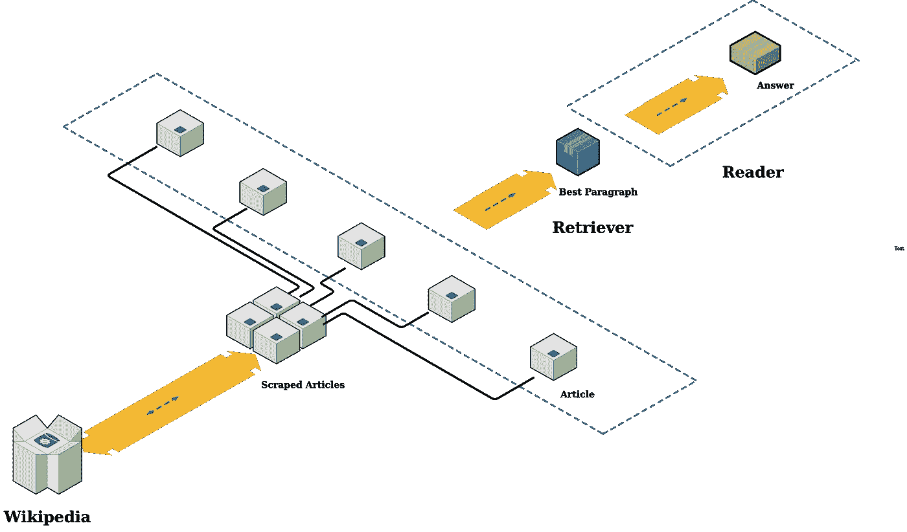
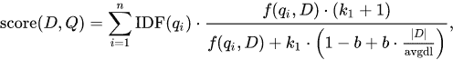
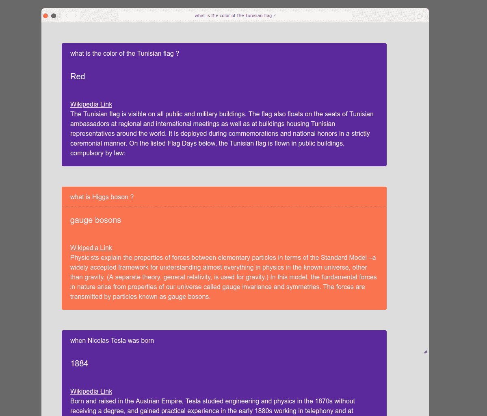

# 问答系统蒸馏瓶

> 原文：<https://medium.com/analytics-vidhya/distilbert-for-question-answer-system-e00954c37f13?source=collection_archive---------18----------------------->

在这篇文章中，我将介绍如何使用 bm25 和 DistilBert 创建一个开放域问答机器人。

任何人在搜索一条信息时，他会输入问题或关键词，然后在谷歌上搜索这个话题。他将首先点击提供的第一个链接。然后会发现自己面对着几个隐藏了所需信息的长段落。这可能是一项既累又没吸引力的任务，尤其是对一个赶时间的人来说。这就是为什么我们的项目将通过回答您的问题并为您检查整个流程来处理所有这些问题。由于自然语言处理的革命性技术和机器学习模型，现在可以给出比以往更好的结果，这是可能的，可以方便你的生活。

那是如何运作的？

让我们回到那个急着要信息的人身上。首先，他需要阅读几乎所有的段落，以找到包含相关信息的最佳段落，然后他将专注于更多地理解它，然后提取准确的答案。这与我们的管道中发生的事情非常相似:T2 排名器 T3 将负责搜索最佳段落，而 T4 阅读器 T5 将提取准确的答案。我们可以清楚地看到寻找正确答案的人类互动与我们的管道之间的相似之处。但是让我解释更多。

**问答机器人:**

构建问答机器人机制的三个主要组件是**检索器**、**排序器**和**阅读器**。下图显示了我们的管道架构。

高层建筑

更明确地说，我们需要进行 3 种排序；搜索最好的维基百科文章，然后是最好的段落，最后是最好的句子或段落块。

所以，让我们更深入地了解每一个问题:

**检索器:**它在早期阶段发挥作用，当一个问题被提出，然后被发送到系统时，它主要外包给谷歌搜索引擎，以找到最好的维基百科文章，通常这一步会返回管道其余部分所需的链接。一旦到了那里，我们将抓取网页并提取所有段落，将它们存储在一个列表中，稍后将对其进行清理。因为文本格式非常重要，我们真的需要关注如何删除噪音和 HTML 标签，无用的特殊字符或 Unicode 错误。

实际上，在这个阶段，我们有一个段落列表，在某些情况下这个列表可能会很大，还有我们需要匹配的问题。这样的任务是最难的部分，因为最终的输出在很大程度上取决于此。我们使用了一个名为 BM25 的词包检索功能，它根据每个文档中出现的查询词对一组文档进行排序，而不考虑它们在文档中的接近程度。

**读者:**最后一步是从我们问题的答案所在的段落中获取最后一部分。这种任务可能需要一个语言模型与 NLU 和班训练。事实上，即使使用大模型，跳过排名阶段也容易出错，并将极大地影响结果，因为这种模型可能会在大文本数据中丢失，但在涉及平均/小段落时非常强大。

如你所知，有许多 OD QA 解决方案可以解决同样的问题。结果的准确性取决于选择的模型和使用的 NLP 任务。但是我们这个项目的动机是测试 DistilBERT 作为一个问题回答模型，以获得高精度和相关的结果。我们还考虑为我们的解决方案构建一个 web 界面，我们将在文章的最后展示这个界面。

**兰克使用的 bm25 是什么？我们为什么要用它？**

**Bm25** 是一个排位函数。它代表了文档检索中使用的最先进的 [TF-IDF](https://en.wikipedia.org/wiki/TF-IDF) 式检索功能。它不仅仅是一种术语评分方法，而是一种根据查询对文档进行评分的方法。
我们选择使用它，因为它在排名时比 TF-IDF 有更好的结果，并且更健壮。(2)

实际上 BM25 代表“最佳匹配 25”。发布于 [1994](http://trec.nist.gov/pubs/trec3/t3_proceedings.html) ，这是调整相关性计算的第 25 次迭代。BM25 源于[概率信息检索](http://nlp.stanford.edu/IR-book/html/htmledition/probabilistic-information-retrieval-1.html)。概率信息检索本身就是一个迷人的领域。基本上，它将相关性视为一个概率问题。根据概率信息检索，相关性分数应该反映用户认为结果相关的概率。

**排名功能:**

排名功能将计算每个段落和问题的分数，然后对其进行排序，并返回最高分。

对于问题 Q，文档为 D，我们使用此公式:

其中 IDF:逆项频率，其中 f (qi，D)是 qi 的[项频率](https://en.wikipedia.org/wiki/Term_frequency)在文档 D 中，k1 和 *b* 是自由参数，通常在没有高级优化的情况下选择，如 k1 ∈ [ 1.2，2.0 ]和 b = 0.75。

不要被这背后的数学吓倒。我们想展示的是这款跨座式 TF-IDF，就我们所使用的而言，它给出了有希望的结果。对于一般知识来说，这种方法在 O'Reilly 图书馆项目中用于搜索图书组块。

**为什么把 Distilbert 作为一个 QA 模型？**

DistilBERT 是蒸馏技术的一个参考，用于使 BERT 模型更小，从而更快。事实上，**蒸馏**是一种用于将一个叫做老师的大模型压缩成一个叫做学生的小模型来重现相同行为的技术。因为其他模型非常大；今天我们谈论具有[83 亿参数](https://venturebeat.com/2019/08/13/nvidia-trains-worlds-largest-transformer-based-language-model/)的模型:比 BERT-large 大 24 倍，比 GPT-2 大 5 倍，而来自脸书 AI 的最新作品 [RoBERTa](https://arxiv.org/abs/1907.11692) 是在 160 GB 的文本上训练的。这是巨大的，而且对于生产来说不是一个好的选择，即使使用 GPU，这在大小和响应时间方面仍然很难实现。

所以问题是我们如何驯服这些大模型？

事实上，有几份报纸关注这个问题。大多数论文不是学术论文，因为模型变得如此之大，需要巨大的计算能力，而且训练这些模型的环境成本也很昂贵:它们需要大量的能源，因此排放大量的二氧化碳。

要制作更小的模型，有 3 种主要方法:

*   **修剪**:

简而言之，模型修剪就是消除权重张量中的表面值。将神经网络参数值设置为零，以移除被估计为神经网络各层之间不必要的连接。
修剪过程发生在训练过程中，以允许神经网络适应变化。事实上，这允许我们将 MNIST 12 MB 的稀疏模型的 90%减少到 2 MB。此外，这种技术适用于跨不同任务的任何神经网络类型。

*   **量化**:

量化也是一种在较低位宽下执行计算和存储张量的简单技术。实际上，一个量子化的模型已经把张量上的一些或全部值变成了整数，而不是浮点值。这允许更紧凑的模型表示和在许多硬件平台上使用高性能的矢量化运算。与正常模型相比，量化模型的大小可以减少 4 倍，内存带宽需求可以减少 4 倍。因此，更简单的计算消耗更少的能量。但是，在后训练期间量化权重，可能会有精度损失，特别是对于较小的网络，这是要付出的代价。

*   **蒸馏**:

知识提炼是一种模型压缩方法，通过训练一个小模型来模仿一个预先训练好的更大的模型。这种培训设置有时被称为“教师-学生”，其中大模型是教师，小模型是学生。

作为蒸馏的一个很好的例子，我们有 DistilBert，如果我们将其性能与:BERT base(不是一个，而是 DistilBERT 的老师)进行比较，我们显然可以说 DistilBERT **与 BERT** 相比令人惊讶地好:我们能够用少 40%的参数保留 95%以上的性能。在推理时间方面，DistilBERT 比 BERT 快 60%，比 BERT 小 60%，比 ELMo+BiLSTM 快 120%，比 ELMo+BiLSTM 小 120%。

问答系统界面:

经过一些额外的工作，我设法把我的问题回答系统包装成一个 API。幸运是，我创建了一个很好的 HTML 页面，它使用 API 来发送查询并接收主要答案、获取答案的段落以及来自 Wikipedia 的文章链接。

质量保证系统的 Web 界面

**结论:**

这个项目最初只是为了好玩，也是为了投资酿酒师的力量。你可以在[这里](https://github.com/dimwael/QuestionAnsweringDistilbert/tree/master)查看整个项目。请注意，欢迎拉取请求。如果您有任何意见，请随时联系我。