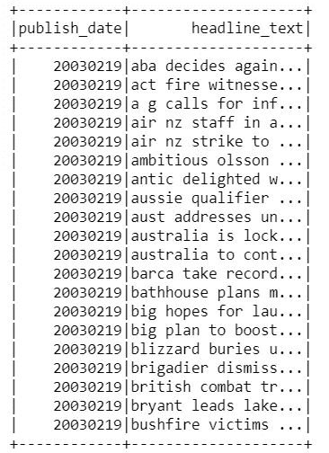
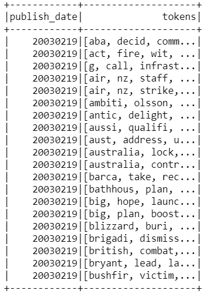
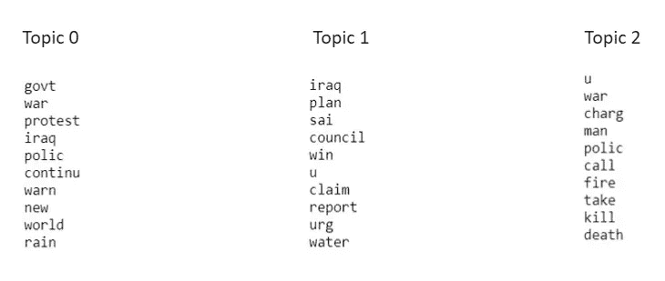

# 使用 Spark NLP 和 Spark MLLib(LDA)的分布式主题建模

> 原文：<https://medium.com/analytics-vidhya/distributed-topic-modelling-using-spark-nlp-and-spark-mllib-lda-6db3f06a4da3?source=collection_archive---------6----------------------->


图片来源:大英百科全书

主题建模是自然语言处理中最常见的任务之一。从数以百万计的文档中提取主题分布在许多方面都是有用的，例如识别对特定产品或所有产品的投诉的原因，或者识别新闻文章中的主题的更经典的例子。我们不会深究什么是主题建模或者它是如何工作的细节。互联网上有很多关于它的好文章，但我发现[这篇](https://www.analyticsvidhya.com/blog/2016/08/beginners-guide-to-topic-modeling-in-python/)文章来自 Analytics Vidhya comprehensive。因此，如果您不熟悉主题建模，或者需要刷新您的记忆，请继续查看。

这个博客的目的是熟悉主题建模的分布式方法。假设您的数据湖(例如 Hadoop)中有数十亿个文档，您希望更好地理解其中的主题。用 python 处理数十亿个文档会遇到一些计算限制和瓶颈。幸运的是，Spark MLlib 提供了 LDA 的优化版本，它是专门为在分布式环境中工作而设计的。我们将构建一个简单的主题建模管道，使用 Spark NLP 预处理数据，使用 Spark MLlib 的 ld a 从数据中提取主题。

我们将使用新闻文章数据。你可以从[这个](https://github.com/ravishchawla/topic_modeling/blob/master/data/abcnews-date-text.csv)链接下载数据集。让我们开始写一些代码。

## 初始化 Spark 会话

首先，我们将导入所有需要的包并初始化 spark 会话。您还可以在使用 spark-submit 调用 spark 应用程序时传递配置。

```
*# Import Spark NLP*
**from** **sparknlp.base** **import** *
**from** **sparknlp.annotator** **import** *
**from** **sparknlp.pretrained** **import** PretrainedPipeline
**import** **sparknlp**
**from** **pyspark.sql** **import** SparkSession
**from** **pyspark.ml** **import** Pipelinespark = SparkSession.builder \
    .appName("Spark NLP")\
    .config("spark.driver.memory","8G")\ #change accordingly
    .config("spark.driver.maxResultSize", "2G") \
    .config("spark.jars.packages", "com.johnsnowlabs.nlp:spark-nlp_2.11:2.4.5")\
    .config("spark.kryoserializer.buffer.max", "1000M")\
    .getOrCreate()
```

## 读取数据

我们可以从三个来源读取数据，即。本地、HDFS 和 S3。如果你的数据存储在 S3，我建议你使用分布式拷贝，使用 [S3DistCp](https://docs.aws.amazon.com/emr/latest/ReleaseGuide/UsingEMR_s3distcp.html) 将数据传输到 HDFS，然后从 HDFS 加载数据。这种方法减少了从 S3 读取所有数据、将数据分发到所有工作节点以及将数据加载到内存中所需的网络 IO。

```
# if you are reading file from local storage
file_location = r'path\to\abcnews_date_txt.csv'# if you are reading file from hdfs
file_location = r'hdfs:\\\user\path\to\abcnews_date_txt.csv'file_type = "csv"*# CSV options*
infer_schema = "true"
first_row_is_header = "true"
delimiter = ","df = spark.read.format(file_type) \
  .option("inferSchema", infer_schema) \
  .option("header", first_row_is_header) \
  .option("sep", delimiter) \
  .load(file_location)*# Verify the count*
df.count()
```

数据由两列组成，即发布日期和标题文本。



## 使用 Spark NLP 的预处理流水线

```
*# Spark NLP requires the input dataframe or column to be converted to document.* 
document_assembler = DocumentAssembler() \
    .setInputCol("headline_text") \
    .setOutputCol("document") \
    .setCleanupMode("shrink")*# Split sentence to tokens(array)*
tokenizer = Tokenizer() \
  .setInputCols(["document"]) \
  .setOutputCol("token")*# clean unwanted characters and garbage*
normalizer = Normalizer() \
    .setInputCols(["token"]) \
    .setOutputCol("normalized")*# remove stopwords*
stopwords_cleaner = StopWordsCleaner()\
      .setInputCols("normalized")\
      .setOutputCol("cleanTokens")\
      .setCaseSensitive(**False**)*# stem the words to bring them to the root form.*
stemmer = Stemmer() \
    .setInputCols(["cleanTokens"]) \
    .setOutputCol("stem")*# Finisher is the most important annotator. Spark NLP adds its own structure when we convert each row in the dataframe to document. Finisher helps us to bring back the expected structure viz. array of tokens.*finisher = Finisher() \
    .setInputCols(["stem"]) \
    .setOutputCols(["tokens"]) \
    .setOutputAsArray(**True**) \
    .setCleanAnnotations(**False**)*# We build a ml pipeline so that each phase can be executed in sequence. This pipeline can also be used to test the model.* 
nlp_pipeline = Pipeline(
    stages=[document_assembler, 
            tokenizer,
            normalizer,
            stopwords_cleaner, 
            stemmer, 
            finisher])*# train the pipeline*
nlp_model = nlp_pipeline.fit(df)*# apply the pipeline to transform dataframe.*
processed_df  = nlp_model.transform(df)# nlp pipeline create intermediary columns that we dont need. So lets select the columns that we needtokens_df = processed_df.select('publish_date','tokens').limit(10000)tokens_df.show()
```

Spark NLP 管道的输出是一个经过清理和词干处理的标记列表。



## 特征工程

我们将使用 Spark MLlib 的[计数矢量器](https://spark.apache.org/docs/latest/ml-features#countvectorizer)从文本数据中生成特征。潜在的狄利克雷分配需要特定于数据的词汇表来执行主题建模。

```
**from** **pyspark.ml.feature** **import** CountVectorizercv = CountVectorizer(inputCol="tokens", outputCol="features", vocabSize=500, minDF=3.0)# train the model
cv_model = cv.fit(tokens_df)# transform the data. Output column name will be features.
vectorized_tokens = cv_model.transform(tokens_df)
```

## 构建 LDA 模型

LDA 模型至少需要 2 个超参数，即 k(主题数)和 maxIter(迭代次数)。尝试不同的 k 值和 maxIter 值，看看哪种组合最适合您的数据。

```
**from** **pyspark.ml.clustering** **import** LDAnum_topics = 3lda = LDA(k=num_topics, maxIter=10)
model = lda.fit(vectorized_tokens)ll = model.logLikelihood(vectorized_tokens)
lp = model.logPerplexity(vectorized_tokens)print("The lower bound on the log likelihood of the entire corpus: " + str(ll))
print("The upper bound on perplexity: " + str(lp))
```

## 将主题可视化

完成训练后，我们可以使用下面的代码查看代表每个主题的单词；

```
# extract vocabulary from CountVectorizer
vocab = cv_model.vocabularytopics = model.describeTopics()   
topics_rdd = topics.rddtopics_words = topics_rdd\
       .map(**lambda** row: row['termIndices'])\
       .map(**lambda** idx_list: [vocab[idx] **for** idx **in** idx_list])\
       .collect()**for** idx, topic **in** enumerate(topics_words):
    print("topic: **{}**".format(idx))
    print("*"*25)
    **for** word **in** topic:
       print(word)
    print("*"*25)
```

以下是输出，



## 结论

从机器学习能力的单一角度来看，Spark MLlib 不如通过 Python 直接获得的大量机器学习库丰富。Spark MLlib 增加价值的地方是，通过为大型数据集上的基本 ML 任务提供分布式计算能力。随着每个版本的重大改进，Apache Spark 正在慢慢弥合大数据和机器学习之间的差距。

感谢您的阅读！喜欢并留下评论，如果你觉得有趣和有用。