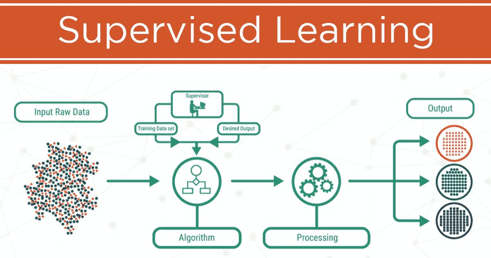

# 深入监督机器学习

> 原文：<https://medium.com/analytics-vidhya/dive-into-supervised-machine-learning-90eaeeb8b8bd?source=collection_archive---------26----------------------->

这是一种既提供输入数据又提供期望输出数据的学习。输入和输出数据被标记用于分类，以便为将来的数据处理提供学习基础。该算法由一个目标/结果变量(或因变量)组成，该变量由一组给定预测器(独立变量)预测。使用这组变量，我们生成一个函数，将输入映射到…