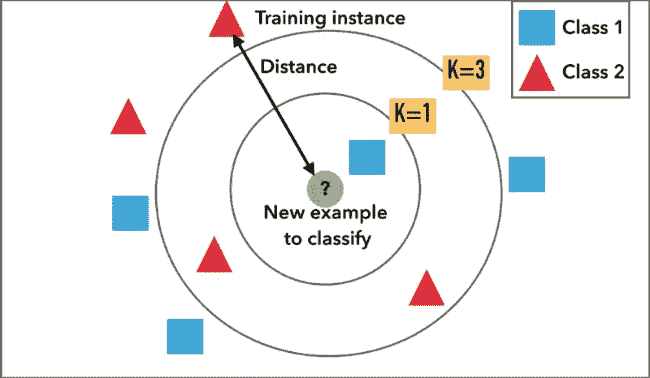
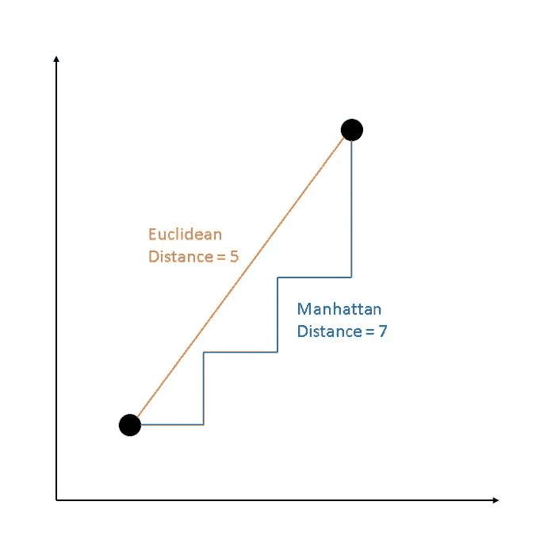

# 深入探究 KNN 的算法

> 原文：<https://medium.com/analytics-vidhya/diving-deeper-into-knns-algorithm-7f61fd90149d?source=collection_archive---------13----------------------->

## 打开“黑匣子”并理解其中的算法


数据科学家经常将机器学习算法称为“黑盒”模型。也就是说，特别是当你理解算法的用例及实现，但不理解它们如何工作和计算我们的预测时。我们可能无法控制大部分预测结果，但更深入的了解可以帮助您选择哪种算法更好地解决特定问题，并建立更通用的正确模型。

## 什么是 K 近邻分类器？

K-nearest-neighbors 是 Thomas Cover 在 [1967](https://ecommons.cornell.edu/bitstream/handle/1813/31637/BU-1065-MA.pdf;jsessionid=BDCA31242E5904EE3EE7417EB73FF1C7?sequence=1) 提出的最简单的机器学习算法之一。该算法被认为是“[懒惰学习](https://en.wikipedia.org/wiki/Lazy_learning)，因为它在训练时不学习模式，而是根据计算的模式进行预测。相反，它会计算数据点之间的距离，并找出距离它最近的 k 个点(通常为 3 个)。然后，它对列表中最常见的元素进行预测。



该算法找到了最接近我们试图预测的 3 个数据点。在 3 个最近的邻居中，类别 2 似乎是最常见的，因此，该算法将预测新的数据点为类别 2

## 我们如何计算距离？

在 knn 中，我们使用欧几里德距离来计算数据点之间的距离。它基本上是一条直线，是欧几里得空间中两点之间最短的距离。假设数据集中的每个要素(列)都是不同的维度，那么无论我们有多少个要素(维度)，我们都可以使用下面的公式来计算两点之间的欧几里德距离。


计算两个数据点之间欧几里德距离的公式



## B 从头开始构建 k 近邻

我们要把我们的模型建成一个面向对象的编程类。我们首先需要的是一些辅助函数。这些函数存在于我们的类之外，我们可以调用它们来帮助我们计算一些东西。在我们的例子中，我们正在构建自己的公式来计算欧几里德距离、列表中最常见的元素以及分类模型的准确度分数。

如上所述，欧几里德距离本质上是两条数据之间的直线。该函数只是简单地将两行之间的每一列的值之间的距离相加，然后求出该和的平方根。

接下来我们将编写我们的 knn 函数。类中的方法应该是模仿 sklearn 的库 knn 模型。我们有`.fit_model()`方法来定义 X 特征和 y 目标，因为 knn 没有主动训练，而是基于欧几里德距离进行预测。我们还有`._predict()`方法，它对单个新数据点执行预测，还有`.predict()`方法，它对给定数据集中的每一行应用预测。

## 用 scikit-learn 的库测试我们的 k-最近邻算法

现在到了关键时刻，让我们用 sklearn 的 KNN 分类器来测试我们的模型的性能。但首先，我们需要导入一个数据集。在这种情况下，我使用 sklearn 的数据集库中的 iris 数据集。然后，我们必须将它分为训练和测试数据集，如下所示。之后，我们将拟合模型，获得预测列表，并计算相对于真实 y_test 目标的准确性分数。

模型的输出应该是这样的。它根据花的特征来预测我们数据集中每一行的花的类型。每个数字代表虹膜数据集中的一种特定类型的花，我们这里有 3 种不同的类型。你可以在这里了解更多关于我们正在与[合作的虹膜数据集的信息。](https://archive.ics.uci.edu/ml/datasets/iris)

```
array([1, 0, 2, 1, 1, 0, 1, 2, 2, 1, 2, 0, 0, 0, 0, 1, 2, 1, 1, 2, 0, 2, 0, 2, 2, 2, 2, 2, 0, 0])
```

让我们看看是否可以像调用 scikit-learn 模型一样调用我们的模型:

而结果是:
`- Our KNN classification accuracy 0.9666666666666667
- sklearn’s KNN classification accuracy 0.9666666666666667`

即使我们的 knn 模型与 sklearn 的模型得分相同，我们仍然需要针对多个其他数据集对其进行测试，以更好地了解我们的模型相对于 sklearn 的模型的性能。

揭开算法中的“黑盒”可能是有趣的、有教育意义的，并且总是巩固这些模型的知识。通常情况下，它会帮助您做出更好的决策，并了解哪种算法更适合您手头的问题。