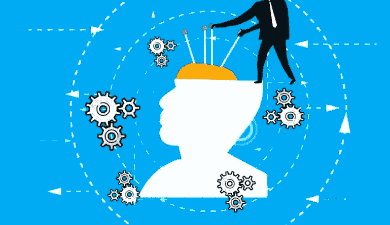

# 深入研究下一代决策

> 原文：<https://medium.com/analytics-vidhya/diving-deeper-into-the-next-generation-of-decision-making-ebd62b9035ab?source=collection_archive---------20----------------------->

作为一名专攻人工智能的硕士生，每天都在研究算法并改进它们，以做出更好的决策和明智的选择。在思考我们的生活在不久的将来会是怎样的时候，我感到很惊讶。我们将不得不控制我们在生活中做出的决定，还是由机器来控制？在计算机发明出现后，人类一直试图通过制作算法和软件来减少人工工作，这些算法和软件可以在日常生活中帮助我们。这些算法是根据过去发生的数据训练的。因此，这些算法的决策仅限于过去发生的事件类别。当处理像疫情危机这样的不确定性时，这些算法会惨败。人类容易产生各种各样的偏见，但算法在处理这一问题时也有自己的挑战。

机器学习爱好者倾向于找到人类过去所做决策的例子，并将这些例子提供给算法，但只有已知结果的数据才能提供给算法。

**从推荐系统开始**

举个例子，一个刚有了孩子的人开始从 Amazon.com 购买婴儿用品和必需品。这些过去的购买记录都存在他的账户里。将来，该人开始接收与婴儿产品相关的产品推荐，并且随着婴儿的成长，该推荐继续学习该人的需求和属性。来到脸书和 Instagram，我们的 feeds 会根据我们过去的阅读和我们访问过的页面来填充内容。接下来，谷歌地图会让你知道当天的路线。它控制着我们的方向，间接地让我们成为他们的奴隶。

所有这些活动都依赖于预测建模算法和推荐系统。

**谁将是未来决策的权威？**

观察人类和机器是如何做出决定的，将有助于我们更好地理解这一点。人类和机器决策的主要区别在于算法和机器没有意识。机器不容易受到阻碍和影响我们做出选择的感觉和情绪的影响。不像在机器的情况下，有一个绝对的意识空白。我们的生活已经被人工智能取代了。如果我们周围的一切都被算法取代，我们将开始失去决策的权威。人类更有可能在不久的将来很快被改造成超人。

**机器擅长处理不确定性吗？**

例如，为了更好地理解这一点，让我们以亚马逊的在线购物推荐系统为例。在像 COVID-19 这样的时候，推荐系统缺少客户的购物历史，这确实使我们很难对未来做出推荐。尽管认识到存在不确定性和模糊性，但这些系统通常会自信地处理新的场景，与它们预先训练的数据没有什么不同，这可能会将机器和人类置于风险的边缘。

总之，现在是我们思考人工智能的缺点，并开始制定技术政策的时候了，这些政策需要到位，以监控进入机器的数据。

感谢阅读！

参考:[https://towards data science . com/the-hidden-dangeries-in-algorithmic-decision-making-27722d 716 a49](https://towardsdatascience.com/the-hidden-dangers-in-algorithmic-decision-making-27722d716a49)

[https://futureo flife . org/2018/03/15/how-ai-handles-uncertainty-Brian-zie Bart/？cn-reloaded=1](https://futureoflife.org/2018/03/15/how-ai-handles-uncertainty-brian-ziebart/?cn-reloaded=1)