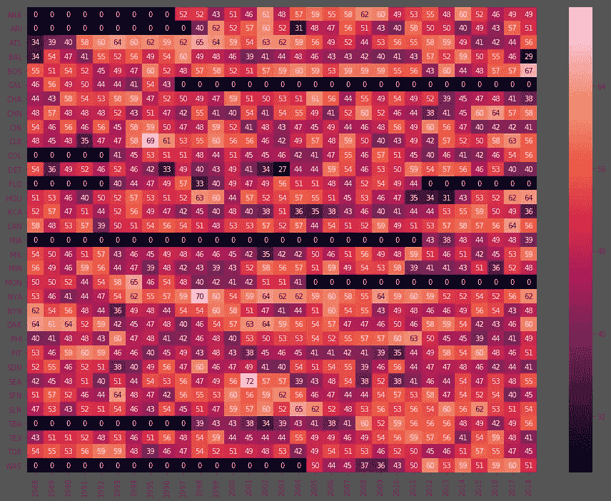
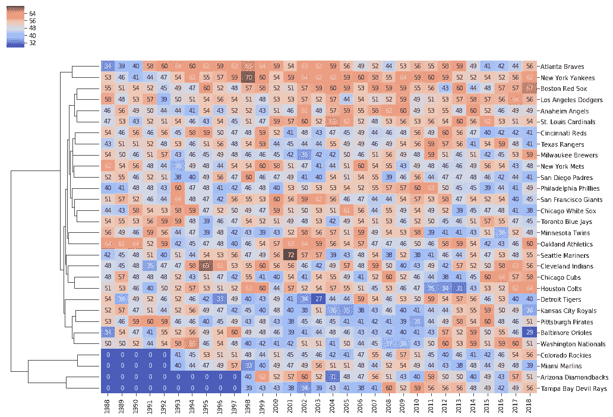

# 钻研棒球数据

> 原文：<https://medium.com/analytics-vidhya/diving-into-baseball-data-day-2-visualizing-the-historical-performance-for-each-team-1e9636fc69ab?source=collection_archive---------11----------------------->

## 第 2 天:可视化每个团队的历史表现

现在我们已经有了每个赛季的团队表现(检查[第 1 天](/@jiashun.zheng/diving-into-baseball-data-day-1-55d34ae95ca3))，我们可以在如下表格中显示单个团队的表现:

```
# check the last 10 year of SF Giants
team_results1[team_results1['team']=='SFN'].tail(n=10)
```

然而，如果我们可以一起展示所有团队，热图将是一个完美的工具。我们首先需要将数据框转换成另一种格式，列是不同的年份，行是相应年份每个团队的绩效(胜率)。我们将再次首先构建一个以团队名称为关键字的字典。所以最终的字典是这样的:

```
{'SFN':{2010:92, 2011:86, ...},'LAN':{...}}
```

让我们检查一下刚刚制作的数据框:

```
team_percentage.shape() # (148, 151) 148 years, 151 teams
```

等等，得到的数据框有这么多的团队和这么多的零(意味着该团队在该年不存在)。作为一个拥有超过 [116 年历史的联盟](https://en.wikipedia.org/wiki/Major_League_Baseball)，球队来来去去或者从一个城市搬到另一个城市。但是，我们更熟悉现在的球队。让我们看看现代社会:

现在，新的数据框架有 33 个团队，这与今天的团队数量非常接近。先把它画出来。我在用 seaborn 制作热图。

```
import matplotlib as mpl
import matplotlib.pyplot as plt#so the font can be handle by illustrator
mpl.rcParams['pdf.fonttype'] = 42
plt.style.use('ggplot')import seaborn as snsvalues = team_percentage.values[team_percentage.values>0]
plt.figure(figsize=(12,8))
sns.heatmap(team_percentage.transpose(), vmin=np.min(values))
```


使用颜色很酷，但我们也可以添加百分比的注释。

```
values = team_percentage.values[team_percentage.values>0]#make it bigger so we can fit the annotations
plt.figure(figsize=(16,12))#add annotation, format the percentage to show 2 digits
sns.heatmap(team_percentage.transpose(), vmin=np.min(values), \
    annot=True, fmt=".2g")
```



有些球队只是改变了他们的名字:例如，2005 年 MON 改成了 WAS，1997 年 CAL 改成了 ANA。我会把他们合并在一起，这样我们就有了所有的现代球队。

合并团队

此外，更容易显示完整的球队名称，如“旧金山巨人”，而不是缩写“SFN”。在这之后，我将根据历史成绩，按照相似性对队伍进行分组，并使用更好的配色方案。

将团队分组



马上，你可能会注意到三个红色方框，只有扬基队、水手队和印第安人队的胜率都达到了 69%以上。四支球队聚集在一起:勇士队、扬基队、红袜队、道奇队:这些球队多年来保持着 50%以上的胜率。另一方面，皇家队、海盗队、金莺队和国民队在 2000 年代经历了低迷，在 2010 年代中期反弹。

那么你能看到其他有趣的模式吗？谁和你最喜欢的球队在一起？请在回复中分享你的想法。