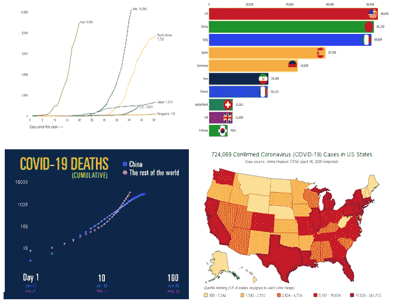
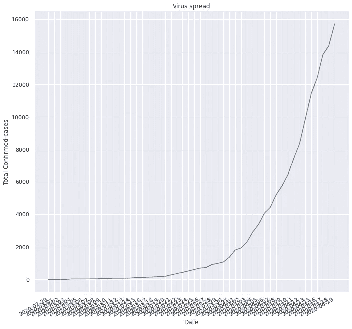
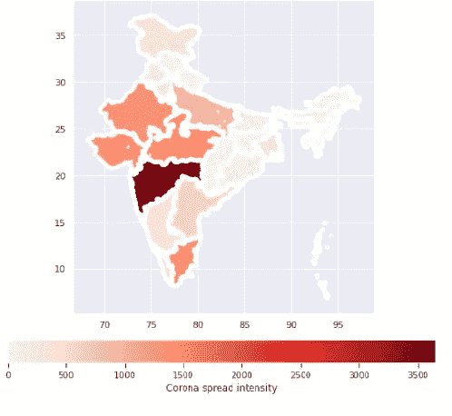

# 新冠肺炎 DIY 数据分析

> 原文：<https://medium.com/analytics-vidhya/diy-data-analysis-of-covid-19-da6cd0c99cd8?source=collection_archive---------27----------------------->



来源:谷歌图片

新冠肺炎·疫情把世界带入了一个反乌托邦的境地。

世界各地的政府和医学专家正在采取严厉的措施来控制病毒的传播，每个新闻频道都使用如上图所示的图表来更新该国的每日传播状况。有没有想过绘制这样的图表或者分析/可视化你家里的传播统计数据？

在本帖中，我将向您展示如何使用新冠肺炎数据集通过逐步说明和解释来绘制图表。我们将使用 Kaggle 的数据集，可以从下面的链接下载，我们将使用 Google Colab 来运行我们的代码。所以打开 Google Colab，新建一个 Python3 笔记本。

[](https://www.kaggle.com/imdevskp/covid19-corona-virus-india-dataset) [## 新冠肺炎冠状病毒印度数据集

### 州/UT/NCR wise 新冠肺炎数据

www.kaggle.com](https://www.kaggle.com/imdevskp/covid19-corona-virus-india-dataset) 

首先，我们将为我们的分析安装必要的库。

```
!pip install fastai2 -q
from fastai2.tabular.all import *
```

这将安装 fastai2 库以及 pandas 和 matplotlib，下一行将导入我们将使用的 Fastai2 的表格模块。

现在我们需要将下载的数据集上传到实例的内存中。我们可以通过点击左侧菜单栏中的文件->上传，或者使用下面的代码来创建一个文件上传 GUI。现在，我们将只使用“complete.csv”文件。

```
from google.colab import files
files.upload()
```

上传后，可以使用 Pandas 的 read_csv 函数查看我们的数据，df.head()显示数据帧的前 5 行。

```
df=pd.read_csv('complete.csv')
df.head()
```

我们现在将导入 seaborn，一个专门用于数据可视化的库。每当我们访问该库时，我们可以将 seaborn 称为“sns”。

```
import seaborn  as  sns
```

最初，我们会在各州和确诊病例总数之间做一个散点图。

```
sns.relplot(x="Total Confirmed cases",y="Name of State / UT",height=10,data=df).*set*(title="State-wise spread scatter plot")
```

重要且相当困难的一步是转换数据以适应我们的目的，即预处理。在我们的数据集中，在特定日期在两个不同地方检测到的阳性病例被记录为两个不同的行。我们必须以这样一种方式创建一个数据框，每一行对应一个日期。我们将通过按日期对数据框的内容进行分组并对该日期检测到的所有阳性病例进行求和来实现这一点。使用相同的过程，我们将获得死亡和治愈数据，并创建一个新的数据框。

```
grp=df.groupby(by="Date")
dates=df['Date'].unique()
date_list=[]
for i in dates:
date_list.append(i)
ddf=pd.DataFrame(date_list, columns=['Date'])
```

既然我们已经创建了一个仅包含日期的数据框，我们可以将所需的数据添加到该数据框中。

```
n=1
count_list=[]
labels=['Death','Total Confirmed cases','Cured/Discharged/Migrated']
for l in labels:
  for i in dates:
    d=grp.get_group(i)[l]
    count=d.sum()
    count_list.append(count) ddf.insert(n,l,count_list)
  n+=1
  count=0
  count_list=[]
```

现在，我们的新数据框(ddf)已经可以查看了。

此外，我碰巧注意到对应于日期 13/04/2020 的记录是错误的，因此我们将用上一个和下一个值的平均值替换该值。

```
*def* avg_val(*l*,*val*=74):
  new_val=(array(ddf[l])[val-1] + array(ddf[l])[val+1] )/2
  return *int*(new_val)
change_label=['Death','Total Confirmed cases','Cured/Discharged/Migrated']for l in change_label:
  ddf.replace(to_replace=array(ddf[l])[74], value=avg_val(l)   ,inplace=True )
```

现在，我们的数据框已准备好进行绘制。我们将使用 Seaborn 的 relplot()函数创建一个线形图，x 轴表示日期，y 轴表示案例总数。

```
plot=sns.relplot(x="Date",y="Total Confirmed cases" ,data=ddf,kind="line",height=10, estimator=None).*set*(title="Death Rate")
plot.fig.autofmt_xdate()
```



类似地，我们可以通过改变“y”值来绘制死亡数据和治愈数据相对于日期的图表。

从图中可以明显看出，尽管封锁了 21 天，但曲线似乎在稳步上升，这使得有必要延长印度的封锁期，以有效遏制病毒传播。

为了比较所有这三个参数的趋势，我们可以使用多个 lineplot()函数将它们绘制在一个图形中。

```
plt.figure(figsize=(15,15))
sns.lineplot(x="Date",y="Death",data=ddf,estimator=None)
sns.lineplot(x="Date",y="Cured/Discharged/Migrated",data=ddf,estimator=None)
sns.lineplot(x="Date",y="Total Confirmed cases",data=ddf,estimator=None)
```

可以通过更改 figsize 中的 x 和 y 值来调整图形的大小。

为了绘制各州的分布图，我们需要创建一个新的数据框，以便该数据框包含所有州的列表以及与该州相对应的确诊病例数。

为此，我们将按状态对数据框进行分组，获取与状态对应的最新记录数据，并创建一个新的数据框。

```
state_group=df.groupby(by='Name of State / UT')
states=df['Name of State / UT'].unique()state_case,state_death=[],[]
for s in states:
c=df.loc[df['Name of State / UT']==s].iloc[-1]['Total Confirmed cases']
d=df.loc[df['Name of State / UT']==s].iloc[-1]['Death']
c=*int*(c)
d=*int*(d)
state_case.append(c)
state_death.append(d)
c,d=0,0
```

现在我们已经获得了数据，我们可以创建一个新的数据帧——state _ df

```
state_df=pd.DataFrame(states, columns=['States'])
state_df.insert(1,'case_count',state_case)
state_df.insert(2,'Deaths',state_death)
```

有了这个数据框，我们将使用 catplot()函数创建一个条形图。

```
sns.catplot(y="States",x="case_count",data=state_df, kind="bar", height=10).*set*(title="state-wise spread")
```

我们的数据集有一些小故障，首先，数据集有相同 states/UT 的多个副本。为了在印度地图上绘制扩散强度，我们必须删除这些重复。

```
for d in (7,11,18): state_df.drop(index=d,inplace=True)
```

为了在印度地图上绘制这些数据，我们必须获得印度地图的 shapefile。可以从下面的链接下载。

[https://www . ArcGIS . com/home/item . html id = cf9b 387 de 48248 a 687 aafdd 4 cdff 1127](https://www.arcgis.com/home/item.html?id=cf9b387de48248a687aafdd4cdff1127)

我们将导入 geopandas 库来在地图上绘制数据。

```
!pip install geopandas 
import geopandas as gpd
import matplotlib.pyplot as plt
```

上传下载的。shp 文件上传到 Colab 实例，就像我们上传“complete.csv”文件一样。上传后，获取文件的路径并保存在一个变量中，用 read_file()函数打开文件。

```
gpath="/content/INDIA.shp"
map_df=gpd.read_file(gpath)
mad_df.head()
map_df.plot(figsize=(5,5))
```

这应该输出一个印度地图的图像。接下来，我们将创建一个仅包含州列表和 case_count 的数据框副本。

```
gdf=state_df[['States','case_count']]
```

我们下载的 shapefile 具有一个状态列表和用于绘制状态的相应几何图形，该状态列表应与我们的数据框中的状态列表相匹配，以便可以合并它们。因此，我们将替换数据框中的州名以匹配 shapefile。

```
index=(22,1,14,20,28,15)
value=['Jammu And Kashmir','Nct Of Delhi','Orissa','CHANDIGARH','ANDAMAN AND NICOBAR ISLANDS','Pondicherry']
for i,v in zip(index,value):
  gdf=gdf.replace(to_replace=gdf['States'][i], value=v)
```

现在可以合并 shapefile 和我们的数据框了。

```
merge=map_df.set_index('ST_NAME').join(gdf.set_index('States'))
merge.head()
```

我们的合并数据框已经准备好进行绘制了！！

```
merge.plot(column=var, cmap='Reds',legend=True, figsize=(10,10),linewidth=5,legend_kwds=
{'label': "Corona spread intensity",'orientation':"horizontal"})
```

我们的最终输出应该如下所示:



您可以从下面的 GitHub 链接获得完整的代码。

[](https://github.com/ajaykumaar/Deep-learning/blob/master/plot_india_covid.ipynb) [## ajaykumaar/深度学习

### permalink dissolve GitHub 是 4000 多万开发人员的家园，他们一起工作来托管和审查代码，管理…

github.com](https://github.com/ajaykumaar/Deep-learning/blob/master/plot_india_covid.ipynb) 

此外，要了解 Fastai 库的更多信息，请点击下面的链接查看杰瑞米·霍华德的课程——“程序员的深度学习”。

[](https://course.fast.ai/) [## 程序员实用深度学习，v3

### 欢迎光临！如果你是所有这些深度学习的新手，那么不要担心-我们将带你一步一步地完成它…

course.fast.ai](https://course.fast.ai/) 

感谢，继续学习；)