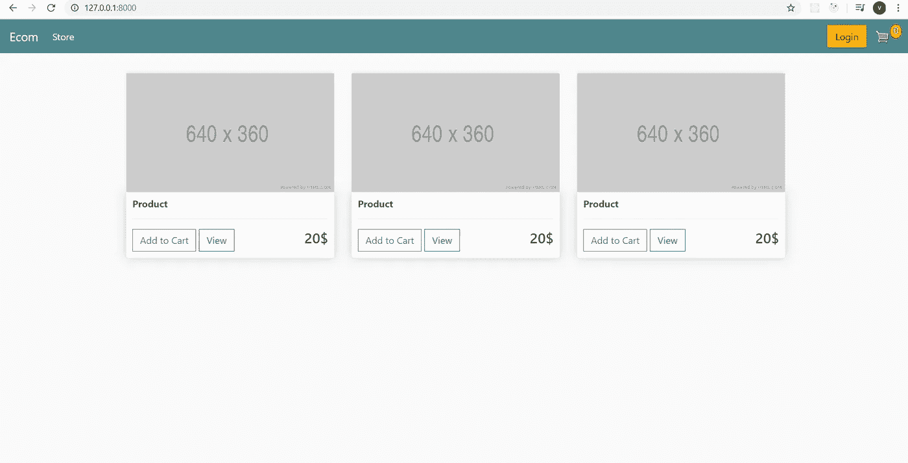
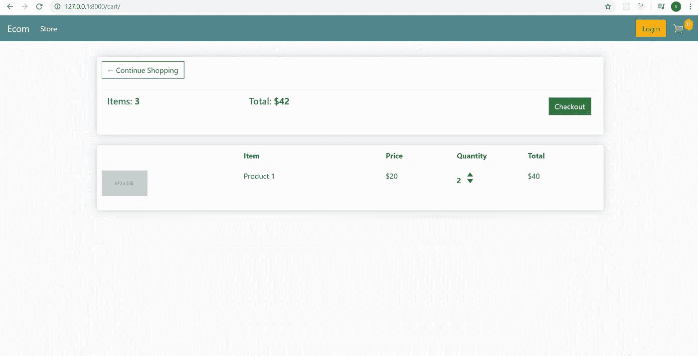
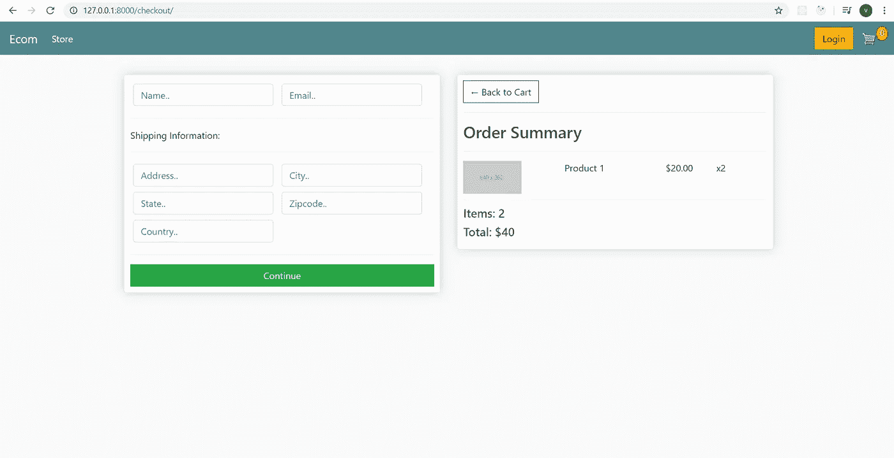

# Django 电子商务网站前端(下)

> 原文：<https://medium.com/analytics-vidhya/django-e-commerce-website-frontend-part-2-a1eb220d4b66?source=collection_archive---------17----------------------->

现在让我们继续我们的教程。在本教程中，我们将对 store.html、cart.html 和 checkout.html 进行编码。我的灵感来自丹尼斯·艾维的 Django 电子商务教程。可以在[https://www.youtube.com/watch?v=_ELCMngbM0E&list = PL-51 wblyftg 0omnamujl 1 tcvo 7 ydtrng&index = 2](https://www.youtube.com/watch?v=_ELCMngbM0E&list=PL-51WBLyFTg0omnamUjL1TCVov7yDTRng&index=2)上查看。


首先你要下载这张图片供我们参考我们的网站:[https://steps with code . S3-us-west-2 . Amazon AWS . com/m1-PRT 7/2+placeholder . png](https://stepswithcode.s3-us-west-2.amazonaws.com/m1-prt7/2+placeholder.png)。将它保存在静态/图像中，与之前的购物车图像相同。在 store.html 上键入以下代码:

```



 **<div class="row">
        <div class="col-lg-4">
            
            <div class="box-element product">
                <h6><strong>Product</strong></h6>
                <hr>
            </div>
        </div>

        <div class="col-lg-4">
            
            <div class="box-element product">
                <h6><strong>Product</strong></h6>
                <hr>
            </div>
        </div>

        <div class="col-lg-4">
            
            <div class="box-element product">
                <h6><strong>Product</strong></h6>
                <hr>
            </div>
        </div>
    </div>**

```

接下来，我们想添加一个按钮来完成它。在 store.html 上键入粗体部分:

```



    <div class="row">
        <div class="col-lg-4">
            
            <div class="box-element product">
                <h6><strong>Product</strong></h6>
                <hr>
                **<button class="btn btn-outline-secondary add-btn">Add to Cart</button>**
            </div>
        </div>

        <div class="col-lg-4">
            
            <div class="box-element product">
                <h6><strong>Product</strong></h6>
                <hr>
               ** <button class="btn btn-outline-secondary add-btn">Add to Cart</button>**
            </div>
        </div>

        <div class="col-lg-4">
            
            <div class="box-element product">
                <h6><strong>Product</strong></h6>
                <hr>
                **<button class="btn btn-outline-secondary add-btn">Add to Cart</button>**
            </div>
        </div>
    </div>

```

接下来，我们要添加查看按钮和虚拟价格。在 store.html 上键入粗体部分:

```



    <div class="row">
        <div class="col-lg-4">
            
            <div class="box-element product">
                <h6><strong>Product</strong></h6>
                <hr>
                <button class="btn btn-outline-secondary add-btn">Add to Cart</button>
                **<a class="btn btn-outline-success" href="#">View</a>
                <h4 style="display: inline-block;float: right">20$</h4>**
            </div>
        </div>

        <div class="col-lg-4">
            
            <div class="box-element product">
                <h6><strong>Product</strong></h6>
                <hr>
                <button class="btn btn-outline-secondary add-btn">Add to Cart</button>
                **<a class="btn btn-outline-success" href="#">View</a>
                <h4 style="display: inline-block;float: right">20$</h4>**
            </div>
        </div>

        <div class="col-lg-4">
            
            <div class="box-element product">
                <h6><strong>Product</strong></h6>
                <hr>
                <button class="btn btn-outline-secondary add-btn">Add to Cart</button>
                <a class="btn btn-outline-success" href="#">View</a>
                **<h4 style="display: inline-block;float: right">20$</h4>**
            </div>
        </div>
    </div>

```

现在，我们要去 cart.html。不过首先你得在这个网址上下载上下箭头图标[https://steps with code . S3-us-west-2 . Amazon AWS . com/m1-PRT 8/2+arrow-down . png](https://stepswithcode.s3-us-west-2.amazonaws.com/m1-prt8/2+arrow-down.png)，[https://steps with code . S3-us-west-2 . Amazon AWS . com/m1-PRT 8/3+arrow-up . png](https://stepswithcode.s3-us-west-2.amazonaws.com/m1-prt8/3+arrow-up.png)。将它保存在静态/图像中，与之前的购物车图像相同。我们将在购物车页面上制作两个部分。对于第一部分，在 cart.html 上键入以下代码:

```




**<div class="row">
    <div class="col-lg-12">
        <div class="box-element">
            <a class="btn btn-outline-dark" href="&#x2190;
            Continue Shopping</a>

            <br>
            <br>
            <table class="table">
                <tr>
                    <th><h5>Items: <strong>3</strong></h5></th>
                    <th><h5>Total: <strong>43$</strong></h5></th>
                    <th>
                        <a style="float:right; margin:5px" class="btn btn-success"
                           href="">Checkout</a>
                    </th>
                </tr>
            </table>
        </div>

        <br>

        <div class="box-element">

        </div>

    </div>
</div>**


```

在这段代码中有一个“☆符号，这是一个 html 代码的向左箭头。你可以在[https://www.w3schools.com/charsets/ref_utf_arrows.asp](https://www.w3schools.com/charsets/ref_utf_arrows.asp)上查看其他的。尝试运行代码。接下来我们要做第二部分。在您的 cart.html 上键入粗体部分:

```



<div class="row">
    <div class="col-lg-12">
        <div class="box-element">

            <a  class="btn btn-outline-dark" href="">&#x2190; Continue Shopping</a>

            <br>
            <br>
            <table class="table">
                <tr>
                    <th><h5>Items: <strong>3</strong></h5></th>
                    <th><h5>Total:<strong> $42</strong></h5></th>
                    <th>
                        <a  style="float:right; margin:5px;" class="btn btn-success" href="">Checkout</a>
                    </th>
                </tr>
            </table>

        </div>

        <br>
 **<div class="box-element">
            <div class="cart-row">
                <div style="flex:2"></div>
                <div style="flex:2"><strong>Item</strong></div>
                <div style="flex:1"><strong>Price</strong></div>
                <div style="flex:1"><strong>Quantity</strong></div>
                <div style="flex:1"><strong>Total</strong></div>
            </div>

            <div class="cart-row">
                <div style="flex:2"></div>
                <div style="flex:2"><p>Product 1</p></div>
                <div style="flex:1"><p>$20</p></div>
                <div style="flex:1">
                    <p class="quantity">2</p>
                    <div class="quantity">
                        

                        
                    </div>
                </div>
                <div style="flex:1"><p>$40</p></div>
            </div>

        </div>
    </div>
</div>**

```

接下来我们要去 checkout.html。我们将在上面做两个部分。一部分是姓名、电子邮件和运输信息，另一部分包含订单信息。对于第一部分，在 checkout.html 上键入以下代码:

```



 **<div class="row">
        <div class="col-lg-6">
            <div class="box-element" id="form-wrapper">
                <form id="form">
                    <div id="user-info">
                        <div class="form-field">
                            <input required class="form-control" type="text" name="name" placeholder="Name..">
                        </div>
                        <div class="form-field">
                            <input required class="form-control" type="text" name="email" placeholder="Email..">
                        </div>
                    </div>
                    <div id="shipping-info">
                        <hr>
                        <p>Shipping Information:</p>
                        <hr>
                        <div class="form-field">
                            <input class="form-control" type="text" name="address" placeholder="Address..">
                        </div>
                        <div class="form-field">
                            <input class="form-control" type="text" name="city" placeholder="City..">
                        </div>
                        <div class="form-field">
                            <input class="form-control" type="text" name="state" placeholder="State..">
                        </div>
                        <div class="form-field">
                            <input class="form-control" type="text" name="zipcode" placeholder="Zipcode..">
                        </div>
                        <div class="form-field">
                            <input class="form-control" type="text" name="country" placeholder="Country..">
                        </div>
                    </div>
                    <hr>
                    <input id="form-button" class="btn btn-success btn-block" type="submit" value="Continue">
                </form>
            </div>
        </div>

        <div class="col-lg-6">
            <div class="box-element">

            </div>
        </div>
    </div>**

```

对于包含订单信息的第二部分，在 checkout.html 上键入以下代码:

```



    <div class="row">
        <div class="col-lg-6">
            <div class="box-element" id="form-wrapper">
                <form id="form">
                    <div id="user-info">
                        <div class="form-field">
                            <input required class="form-control" type="text" name="name" placeholder="Name..">
                        </div>
                        <div class="form-field">
                            <input required class="form-control" type="text" name="email" placeholder="Email..">
                        </div>
                    </div>
                    <div id="shipping-info">
                        <hr>
                        <p>Shipping Information:</p>
                        <hr>
                        <div class="form-field">
                            <input class="form-control" type="text" name="address" placeholder="Address..">
                        </div>
                        <div class="form-field">
                            <input class="form-control" type="text" name="city" placeholder="City..">
                        </div>
                        <div class="form-field">
                            <input class="form-control" type="text" name="state" placeholder="State..">
                        </div>
                        <div class="form-field">
                            <input class="form-control" type="text" name="zipcode" placeholder="Zipcode..">
                        </div>
                        <div class="form-field">
                            <input class="form-control" type="text" name="country" placeholder="Country..">
                        </div>
                    </div>
                    <hr>
                    <input id="form-button" class="btn btn-success btn-block" type="submit" value="Continue">
                </form>
            </div>
 **<br>

            <div class="box-element hidden" id="payment-info">
                <small>Paypal Options</small>
            </div>
        </div>

        <div class="col-lg-6">
            <div class="box-element">
                <a class="btn btn-outline-dark" href="">&#x2190;
                Back to Cart</a>
                <hr>
                <h3>Order Summary</h3>
                <hr>

                <div class="cart-row">
                    <div style="flex:2"></div>
                    <div style="flex:2"><p>Product 1</p></div>
                    <div style="flex:1"><p>$20.00</p></div>
                    <div style="flex:1"><p>x2</p></div>
                </div>

                <h5>Items: 2</h5>
                <h5>Total: $40</h5>
            </div>
        </div>
    </div>**

```

那么我们的网站页面将看起来像这样



主页



购物车页面



结帐页面

这就是本教程，现在你有一个电子商务网站的前端模板。当然，我们仍然有很多工作要做，以设置后端部分。我不知道我是否会继续这个后端部分的教程，所以如果你们想要的话，可以提到我。我希望你们喜欢这个教程。不断提升自己！！

鸣谢:丹尼斯·艾维的 Youtube[https://www.youtube.com/watch?v=_ELCMngbM0E&list = PL-51 wblyftg 0omnamujl 1 tcvo 7 ydtrng&index = 2](https://www.youtube.com/watch?v=_ELCMngbM0E&list=PL-51WBLyFTg0omnamUjL1TCVov7yDTRng&index=2)。