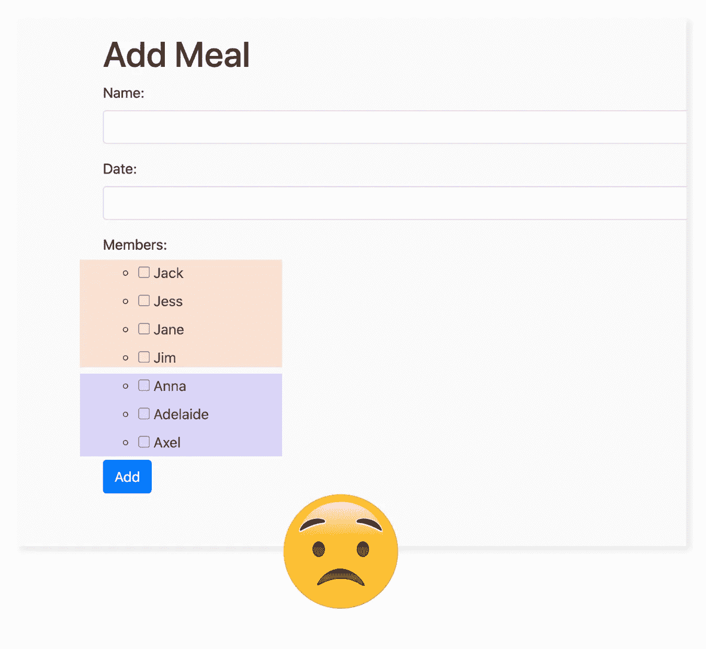
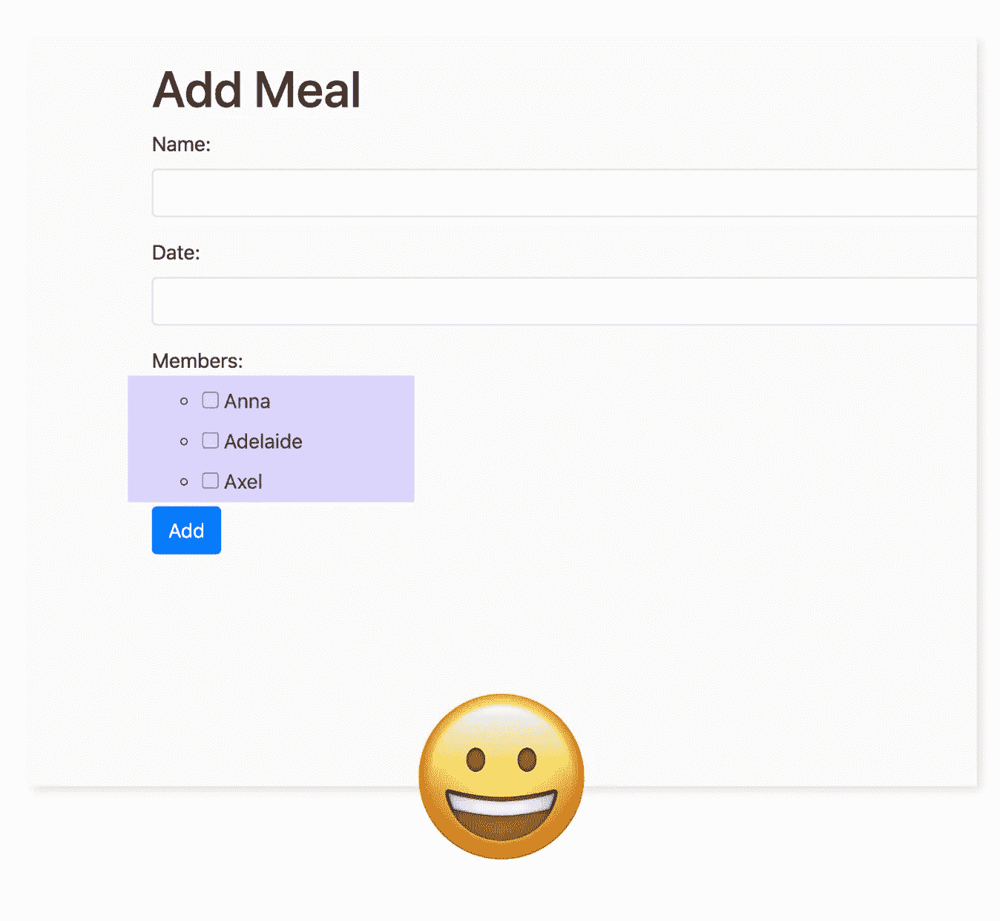

# Django:如何将用户对象传递给表单类

> 原文：<https://medium.com/analytics-vidhya/django-how-to-pass-the-user-object-into-form-classes-ee322f02948c?source=collection_archive---------2----------------------->


*更新(2022 年 6 月):我现在发布 Django 教程到* [*我自己的网站*](https://ctrlzblog.com/) *。如果你对这篇文章感兴趣(或者迷失在这篇文章中)，那么你可能会发现我的* [*指南对许多领域*](https://ctrlzblog.com/how-to-use-the-many-to-many-field-in-your-django-models/) *有用。*

昨天，我发表了一篇关于如何构建多字段表单的教程。后端工作几乎已经完成，除了一个我们将在本文中修复的错误。

## 一些背景:

我目前正在构建一个膳食规划应用程序。当用户创建新的一餐，我希望他们有复选框来选择哪些家庭成员将加入这一餐。每个用户的家庭成员列表都是唯一的。

在上一篇文章中，我使用 ModelMultipleChoiceField 类实现了表单功能，并用复选框替换了默认的小部件。你可以在这里了解更多。

[](/@alicecampkin/django-forms-for-many-to-many-fields-d977dec4b024) [## 多对多字段的 Django 表单

### 如果您的字段是像文本字段这样的简单输入，那么用 Django 构建表单很简单，但是如果您的表单…

medium.com](/@alicecampkin/django-forms-for-many-to-many-fields-d977dec4b024) 

## 问题是

ModelMultipleChoiceField 是一个 Django 表单类，设计用于多项选择输入，其中的选择来自另一个模型。

该类采用一个名为 Queryset 的强制参数。Queryset 允许开发人员从其他模型中筛选选择。在这种情况下，我只希望与当前用户相关联的成员显示为选项。

```
 ***forms.py***class CreateMealForm(forms.ModelForm):    
    class Meta:
        model = Meal
        fields = [‘name’, ‘date’, ‘members’] 

    name = forms.CharField()
    date = forms.DateInput()        members = forms.ModelMultipleChoiceField(
        **queryset=Member.objects.all(),**
        widget=forms.CheckboxSelectMultiple
    )
```

未能从成员模型中过滤出对象给了我这样的结果:



queryset=member.objects.all()不起作用，因为我们可以看到所有用户的成员

这不起作用，因为我可以看到另一个用户的家庭成员的名字。当前登录的用户有三个家庭成员:Anna、Adelaide 和 Axel。我的用户也不想看到杰克、杰斯、简和吉姆。

# 我们需要从表单类内部访问用户对象

我一定能做到吗？

```
queryset=Member.objects.filter(user=self.request.user),
```

可惜没有。

尝试这样做时，Django 提出了无法识别*‘self’*对象的错误。

另一个问题是请求不是表单类的默认属性。

## 我们需要做什么？

1.  将请求对象从视图传递到表单实例。
2.  定义为用户筛选的查询集。

## 解决办法

首先，在您的**视图**(我使用的是基于类的)中，添加一个名为‘get _ form _ kwargs(self)’的方法。

我们覆盖了 get_form_kwargs 方法，这样我们可以添加额外的关键字参数传递给表单实例。

然后，在您的表单类中，我们覆盖 __init__ 函数来从 kwargs 中解包请求对象。

## 这是怎么回事？

在 views.py 中，我们通过覆盖 get_form_kwargs 方法将请求对象添加到关键字参数(kwargs)列表中。

通过将*‘request’*添加到 *kwargs* ，forms.py 现在可以访问它了。

我们仍然不能直接从 Queryset 调用'*请求'*。 *Request'* 附加在' self '上，' self '是指类的单个实例。Queryset 是更广泛的类定义的一部分(就像一个蓝图)，所以放在那里的任何东西都将应用于所有实例(表单)，这对于每个用户来说都是不同的。

相反，我们可以在 __init__ 函数中设置 Queryset。这是类构造函数，类被实例化时调用的方法。__init__ 内部运行的代码是特定于一个实例(和一个用户)的，所以我们可以使用*‘self’*对象。

我们在 __init__ 函数中指定我们的 Queryset:

```
self.fields[‘members’].queryset = Member.objects.filter( user=self.request.user)
```

我们的 CustomModelMultipleChoiceField 仍然需要一个 Queryset 参数，但是我们可以只说' *None'* 。*“无”*将被 __init__ 中的查询集覆盖。



现在我们只看到单个用户的成员。

感谢阅读。