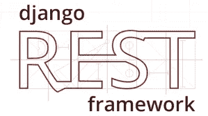

# Django rest 框架:嵌套序列化程序。

> 原文：<https://medium.com/analytics-vidhya/django-rest-framework-nested-serializer-6bebb5f9289e?source=collection_archive---------9----------------------->

Django REST framework 是一个很棒的包，它让您在创建 REST APIs 方面有了一个良好的开端，它让将想法开发成代码比以往任何时候都更快更容易。然而，当你开始定制你的应用程序来满足你的需求时，事情就变得更棘手了。

例如，如果您需要一个端点来产生和消费不同模型的嵌套实例，Django-rest-framework 要求您编写一个关于如何处理数据的逻辑。

在本文中，我们将了解如何定义嵌套的序列化程序。

为了定制一个序列化器，我们必须重写两个不同的方法:创建和更新。这两种方法都用于反序列化提交给 API 的 JSON 数据。两者之间的区别在于，create 方法获取用户通过 POST 请求发送的信息，并创建所需模型的实例，而 update 方法用于客户端使用 PATCH 或 PUT 来编辑数据库中已存储的某个对象的数据。

# *设置*

为了便于解释，我们将使用两个模型；第一个是 Django 自带的内置用户模型。第二个是客户端模型，它通过一对一关系扩展了用户模型，客户端模型将用于存储关于用户的额外信息。

客户端模型将被定义如下:

为了通过 API 使用客户机模型，我们在 urls.py 文件中有两个不同的端点路径；一个用于创建客户端，一个用于更新现有的客户端。

处理这些端点路径的视图将位于“views.py”中。这两个视图是 rest-framework 的通用视图；它将负责创建和更新客户端的所有细节。我们所要做的就是为他们提供一个数据库中存储的所有客户机的查询集，并将他们指向将处理 JSON 数据的序列化器。

# 现在到了重要的部分:序列化器。

如果我们再深入一点，我们会发现问题并不在于序列化程序本身，而在于反序列化过程。这意味着，如果我们仅对安全的 Http 方法或 delete 方法使用嵌套的 serialize(因为它不发送任何要处理的数据),将不会发生错误。并且模型之间的嵌套关系会被翻译成嵌套的 JSON 对象。但是如果我们使用 Http 请求方法，将数据发送到 API 进行处理(POST、PATCH 和 PUT ),就会面临问题。

为了克服这个问题，我们必须在外部模型的创建和更新方法中处理嵌套模型的创建和更新。这就是为什么我们必须重写处理反序列化的方法:创建和更新。就像下面这样:

正如我们所见。两种方法的区别；create 方法创建一个新的客户机实例并返回它。当 update 方法在更新所提供的客户端实例的字段时，update generic 视图会重试此实例，并将其与提交的数据一起传递给序列化程序。

*感谢阅读。*