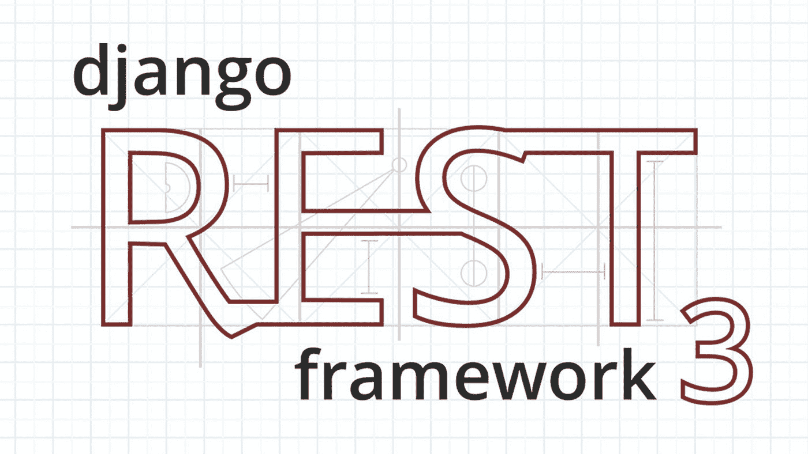

# Django Rest 框架——简化的视图、通用视图和视图集

> 原文：<https://medium.com/analytics-vidhya/django-rest-framework-views-generic-views-viewsets-simplified-ff997ea3205f?source=collection_archive---------4----------------------->

Django REST 框架

# 介绍

如果您是从 DRF (Django REST 框架)开始的，那么掌握视图、通用视图和视图集的概念以及所有可能使用和滥用它们的不同方式可能会有点难。本教程是为 DRF 的初学者编写的，帮助他们浏览视图的一般概念，并详细介绍每个视图的一些潜在用例。

整篇文章分为 3 个部分— **概念**(概述)**实现**(代码)& **结论**(参考)，这些不必按顺序阅读。你可以直接跳到任何一个看起来对你有用的章节，从那里继续！建议对 REST APIs 和 Django 视图& url 配置有一个基本的了解。

*免责声明:我并不自称是 Django 的专家。这个指南基本上是一些帮助我构建更好的 API 的概念，我希望它在某些方面对你也有用。*

# 概念

## 视图

这些是最基本的请求处理形式:

*   基于类的视图—继承了`APIView`类
*   基于函数的视图——使用`@api_view`装饰器

这两种视图都有不同的方式来指定它们将如何执行某些任务，如身份验证、处理请求(例如`get`、`post`)、检查权限，但它们都可以处理视图的大多数用例。这里的缺点是你需要更多的代码。

## 通用视图

> Django 的通用视图……是作为通用使用模式的捷径开发的……它们采用了视图开发中的某些通用习惯用法和模式，并对它们进行了抽象，这样您就可以快速编写数据的通用视图，而无需重复。

这直接来自 Django 文档，我认为这是一个很好的解释了通用视图！这里的主要目标是避免编写常见的用例(例如，列表、删除、更新资源)，而是使用类和混合，这让您可以继承这些开箱即用的功能。你只需要设置一些职业属性——`queryset`，`serializer_class`——来定义你想要的资源，然后你就可以开始了！

## 视图集

`ViewSet`与`Router`结合使用，主要目的是制作一套一致的 URL 配置，并确保[不会影响](https://en.wikipedia.org/wiki/Don%27t_repeat_yourself)。这基本上给了你一组动作，如`list`、`update`，而不是处理程序，如`get`、`post`，`Router`自动为所有动作创建 URL。你可以自己定义这些动作(`GenericViewSet`)或者使用一些现成的东西来实现普通的读&写动作(`ModelViewSet`)。

# 履行

考虑以下模型

和相应的序列化程序(由请求/响应用作中介来读取/写入数据库中的数据)

## 现在让我们来看看风景吧！

基本视图类和函数定义如下

## 现在用更少的代码做同样的事情(使用通用视图)！

就是这样！

一些带有示例的常见用例(考虑一组资源—书籍):

*   (GET /books/)-列出一些/所有书籍的信息
*   `create` (POST /books/) -添加一本新书的信息
*   `retrieve` (GET /books/{pk}) -获取关于某本书的信息
*   `update` (PUT /books/{pk}) -更新某本书的信息
*   `partial_update` (PATCH /books/{pk}) -更新关于特定图书的信息(不验证所有字段)
*   `destroy` (DELETE /books/{pk}) -删除某本书的信息

从上面的例子来看，`ListCreateAPIView`通过简单地继承`ListModelMixin` & `CreateModelMixin`将两个功能`list` & `create`结合在一起。所有通用视图都继承自`GenericAPIView`。

所有这些功能也可以被覆盖:

# 现在添加更多的功能(引入视图集)！

这就产生了上面提到的所有 6 种常见的读写操作！

一次为`ViewSet`注册所有 URL 配置的简单方法是使用一个`Router`:

您也可以添加其他操作:

这将打开一个允许附加功能的`person/{pk}/some_action/`端点。

# 结论

> 如果编写一个视图就像建造一把椅子，那么使用 **API 视图**就像自己建造椅子的每一个组件，使用**通用视图**就是把已经做好的组件组装成一把椅子，而**视图集**是一个框架，你可以在上面构建以确保你的椅子总是一致的。

根据我的个人经验，我收集到:

*   创建视图的主要权衡是*速度和可扩展性*。您可以使用 ***视图集&路由器*** 来实现更快更可读的实现，或者使用简单的 ***视图& URL 配置*** 来提供更具可扩展性的手工编码实现。
*   一般规则是，如果您开始项目，使用视图集，因为它提供了大量现成的功能，只涉及很少的代码，并开始覆盖方法，以允许更专业的功能。当您的需求扩展时，开始覆盖标准的视图集函数以逐渐满足您的需求。
*   将视图用于非常具体的用例，或者在必要时构建一些快速端点。
*   当您需要一些开箱即用的特性，但不想实现视图集提供的所有操作时，请使用通用视图和混合视图

***这些并不是您必须遵守的硬性规则，而是一些您可以轻松实施的常见用例的指南。我还想说，官方文档(链接如下)绝对是最好的资源，你应该读一读，以便更深入地理解上面简要解释的概念。*

**参考文献**:

*   经典的 Django REST 框架 —一个可浏览的参考
*   [视图](https://www.django-rest-framework.org/api-guide/views/)、[通用视图](https://www.django-rest-framework.org/api-guide/generic-views/)、[视图集](https://www.django-rest-framework.org/api-guide/viewsets/)、[路由器](https://www.django-rest-framework.org/api-guide/routers/) —官方文档

*如果您对本指南有任何疑问，或者有任何其他问题，请随时联系我，电话:****tahmeedtarek@gmail.com****。感谢您的宝贵时间！*