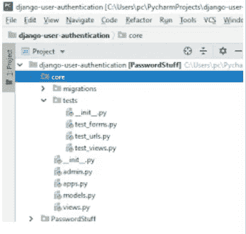
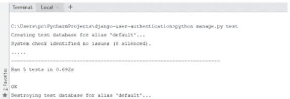
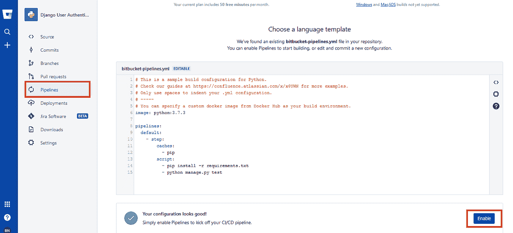

# 用 BITBUCKET 进行 DJANGO 测试驱动开发

> 原文：<https://medium.com/analytics-vidhya/django-test-driven-development-with-bitbucket-85f9f897663c?source=collection_archive---------18----------------------->

*由*发布[布莱恩·恩乔罗格](http://brianjoroge.herokuapp.com/)和 DLMade。


假设你制作了一个烟雾探测器报警器，一旦它探测到烟雾就会触发警报，你不能直接开始出售它，或者把它安装在你的房子里，等着你的房子着火的那一天，看看它是否能工作。你必须测试它的功能。为了简单起见，您需要做两个测试。第一，确保没有烟雾时不会触发警报，从而引发假警报。第二，确保烟雾出现时警报被触发。

就像烟雾探测器一样，不经过测试就不能将软件部署到生产环境中。据我所知，本科计算机科学课程每个学期都催促学生学习新的编程语言，而没有利用足够的时间来教授他们软件测试。大的 IT 公司已经把测试的需要看作是软件开发的一个主要步骤，并且强调在发布软件之前要对软件进行彻底的测试。

在本文中，我们将强调 Django 的测试驱动开发(TDD)和 Bitbucket 的持续开发——持续集成(CD-CI)。因此，在这篇由两部分组成的文章中加入我们的行列吧。

**第 1 部分:带 DJANGO 的 TDD**

随着网站的发展，手动测试变得越来越困难。Andrea Koutifaris 有句老话“所有代码都是有罪的，直到被证明是无辜的”。测试 - **驱动开发**是为了通过之前设计的测试而修改代码的过程。就像烟雾探测器警报类比一样，我们编写故意失败的测试用例，我们也会编写应用程序代码来使测试用例通过。

出于演示的目的，我们将使用这个 [repo](https://bitbucket.org/BriaNjoroge/django-user-authentication/src/master/) 简单的 Django 用户认证项目。否则，您可以自由地在您的应用程序中实现这个项目模板。

**第一步:克隆回购**

要克隆 repo，请在您的终端中粘贴以下命令:

`git clone [https://BriaNjoroge@bitbucket.org/BriaNjoroge/django-user-authentication.git](https://BriaNjoroge@bitbucket.org/BriaNjoroge/django-user-authentication.git)`

**第二步:编写测试用例**

在项目文件夹中，导航到核心文件夹，然后导航到测试文件夹。这是我写测试用例的地方。



Django 使用单元测试模块的[内置测试发现](https://docs.python.org/3/library/unittest.html#unittest-test-discovery)，它将发现当前工作目录下任何以模式 **test*命名的文件中的测试。py** 。好的经验法则是，在进行单元测试时，最好测试 URL、视图、表单和模型。

为了更好的理解，我对代码做了很好的注释，它更容易解释。

**测试网址:**

代码有很好的文档，但是简单地说，文件测试了相关的 URL 指向它们相关的视图功能。

**测试视图**

**测试表格**

**步骤 3:运行测试**

为了运行测试，我们使用下面的命令。

```
python manage.py test
```

目前，回购只有 5 个测试功能全部通过。运行命令后，接受的结果是 as；



**第 2 部分:与位桶管道的持续集成**

Linus Torvalds 是创造 git 的天才。Git 版本控制系统在系统集成中很受欢迎，尤其是当你作为一个团队工作时。很多平台已经提供了 GitHub、Bitbucket、Gitlab 等 git 服务。

持续集成(CI)是将来自多个参与者的代码变更自动集成到单个软件项目中的实践。CI 过程由自动工具组成，这些工具在集成之前断言新代码的正确性。

持续集成现已被广泛采用。在 **GitHub** 中的持续集成可以与 **Travis CI 协作完成。Bitbucket** 通过使用 Bitbucket 管道使 CI 变得容易。

这篇文章讲述了 Bitbucket，如果你还没有它的帐户，你可以创建一个。

在您的项目根目录中，创建一个**bit bucket-pipelines . yml**文件并粘贴下面的代码。

> 第 1 行:定义您希望运行项目的 python 版本
> 
> 第 3 行:定义你的管道
> 
> 第 6 行:缓存 pip 命令，提供更快的构建，并减少构建时间。
> 
> 第 9 行:在需求中安装所有的依赖项
> 
> 第 10 行:运行测试命令

最后，在 bitbucket 上创建一个远程存储库并推送代码之后，剩下的最后一步就是让管道启动您的 CI/CD 管道。



安装依赖项和运行命令需要一些时间。下次您推送代码时，管道将会运行，测试也将会执行。

这种方法非常有效。假设你在一个大项目中工作，你有大约 5 个团队成员，自动测试人员不需要等待你们所有人完成项目，这样他就可以编写测试用例。在并发中，他可以像开发人员编写代码一样编写测试用例。当团队使用 git VCS 推送代码时，测试运行，开发人员可以看到失败的测试用例，并立即处理它们。

这个应用程序的代码可以在[这里](https://bitbucket.org/BriaNjoroge/django-user-authentication/src/master/)找到。到那时，尝试这种 TDD 方法，以提升你作为高级开发人员的级别。

**如果你喜欢这篇文章，点击给我买杯咖啡！感谢阅读。**😊

[](https://www.payumoney.com/paybypayumoney/#/147695053B73CAB82672E715A52F9AA5)

你的每一个小小的贡献都会鼓励我创造更多这样的内容。