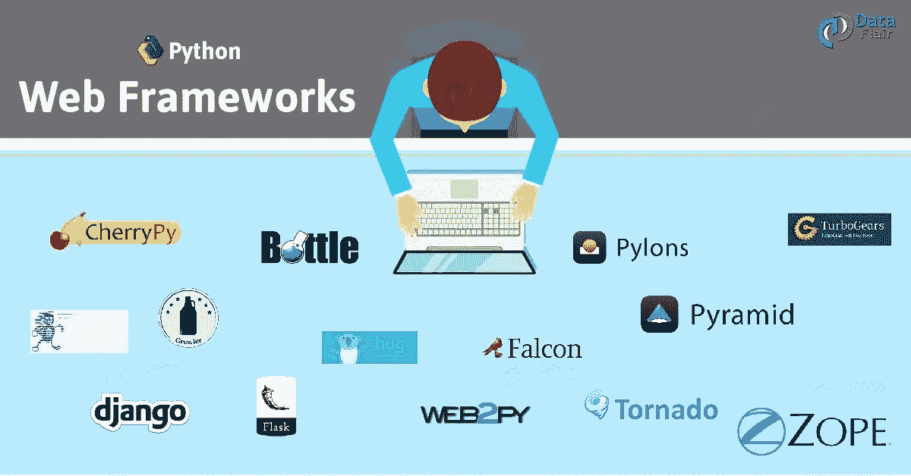
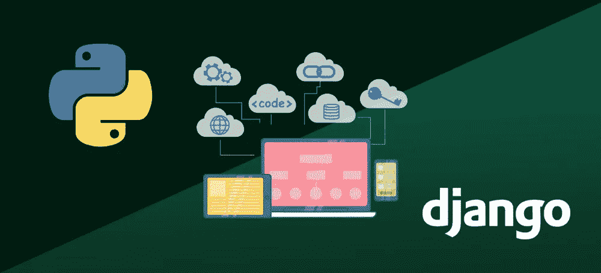
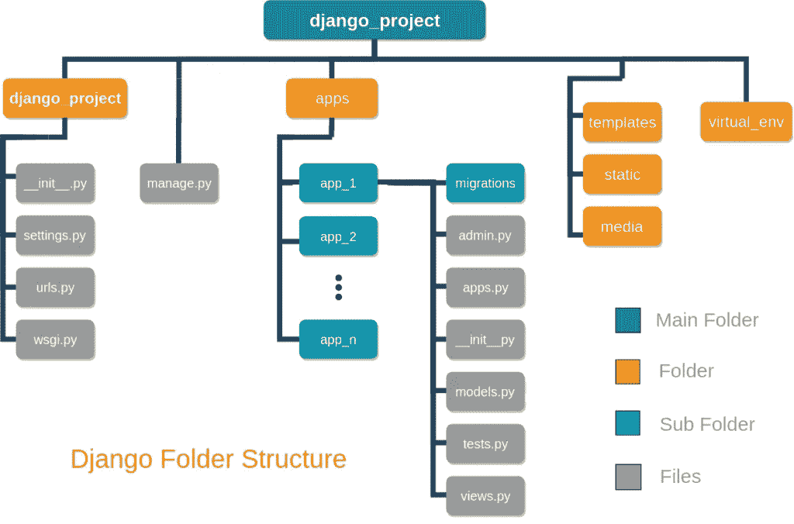

# django——网络框架

> 原文：<https://medium.com/analytics-vidhya/django-the-web-framework-5a4e22ea0579?source=collection_archive---------21----------------------->



读完博客后，你可以很容易地找到我们应该如何去做 Django，这是一个友好的工作框架。我会解释的

## 1.姜戈是什么？

## 2.为什么我们应该选择姜戈？

## 3.选择它有什么好处？

## 4.怎么动手？

**~~** 根据 **Django 的定义，** it 是一个高级 Python web 框架，能够快速开发安全且可维护的网站。Django 由经验丰富的开发人员构建，解决了 web 开发的许多麻烦，因此您可以专注于编写应用程序，而无需重新发明轮子。 **~~**

## 以上是正确的定义，让你感受到它的效率有多高。根据我的理解，django 是 python 中的一个包，就像其他包一样，它提供了特定的 python 文件来托管您的程序。

在读完我的定义后，你会发现它是 python，python 简单易学，干净利落，令人惊叹。现在 python 是一门要求很高的语言，每个行业都在向它努力。所以为什么不去争取呢。当你有一个大项目时，你可以选择 Django，因为它会给你带来很多好处。我在下面讨论 Django 的优势，让大家都清楚。



## 姜戈有很多优势。

1.  我们已经知道的第一个。它是用 python 写的。
2.  第二个是，像谷歌，脸书，美国宇航局等公司。正在做。
3.  第三个是包括电池，这意味着它有这么多的功能。它支持 Ajax、RSS、免费 API、URL 路由等等。
4.  第四个是它的大型社区和广泛可用的文档和教程。Django 提供的管理界面是最酷的东西之一。创建起来非常简单，这也是使用该框架的主要优势之一。只需编写几行代码，您就可以获得功能全面的管理界面。
5.  它是可扩展的、可定制的、健壮的。
6.  为了安全，它隐藏了你的网站的源代码。该框架可以抵御 XSS 和 CSRF 攻击、SQL 注入、点击劫持等。

在您的项目中启动 django。像 python 一样，第一步总是安装软件包。打开 anaconda 提示符，直接给出命令，或者创建一个虚拟环境，然后安装它。命令是

```
python -m pip install Django
```

现在我相信你已经安装了姜戈。以验证它是否已安装。在命令行上运行这个。

```
python -c "import django; print(django.get_version())"
```

如果安装了 Django，您应该会看到您的安装版本。如果不是，您将得到一个错误，告诉我们“没有名为 Django 的模块。

在 Django，我们需要创建项目。它需要自动生成一些代码，将你连接到一个 Django 项目。这个自动生成的代码是 Django 实例的设置集合，包括数据库配置、特定于 Django 的选项和特定于应用程序的设置。

首先，使用 cd 命令转到存储代码的文件夹。并在命令提示符下运行该命令。其中，mysite 是项目的名称。

```
django-admin startproject mysite
```

## *您可以在当前目录中看到，创建了一个 mysite 文件夹，其中包含了许多应用程序，默认情况下，为了方便起见。*

其中一些应用程序至少使用一个数据库表，所以我们需要在使用它们之前在数据库中创建表。为此，请运行以下命令。

```
python manage.py migrate
```

要验证您的项目，请运行以下命令

```
python manage.py runserver
```

你将会得到类似

*系统检查未发现任何问题(0 静音)。
2020 年 12 月 01 日–09:57:57
Django 版本 3.1，使用设置‘my site . settings’
在*[*http://127 . 0 . 0 . 1:8000/*](http://127.0.0.1:8000/) *启动开发服务器，按 CTRL-BREAK 退出服务器。*


好啊，如果你收到这个，那么你已经在姜戈建立了一个项目。如果你正在阅读这篇博客，那么我会认为你已经成功地创建了这个项目，现在你有兴趣做更多的事情。

既然我们已经建立了一个项目，让我们开始实际工作吧。

Django 帮助我们自动生成应用程序的基本目录结构，这样你就可以直接专注于编写代码，而不是创建目录。

让我们创建您的应用程序。在给出命令之前，只要确保你在可以看到`**manage.py**`的目录中，然后运行下面的命令。

```
python manage.py startapp dqapp
```

它将创建一个目录 dqapp，其中有一些自动生成的文件。你可以根据自己的需要制作一些文件夹作为模板，静态的，媒体的，下面是你整个项目的整体结构。



在我的下一篇博客中，我将告诉你如何在 HTML 和 python 代码之间建立 URL 和连接。谢谢你看完，也谢谢你陪我走了这么远。

带给你的是-

COE-AI(CET-BBSR)-由 CET-BBSR、Tech Mahindra 和 BPUT 发起，旨在通过 ML 和 IoT 提供现实世界问题的解决方案

[www.coeaibbsr.in](http://www.coeaibbsr.in/)

[https://coeai19.wixsite.com/](https://coeai19.wixsite.com/)

【https://www.facebook.com/CoEAIBBSR/】