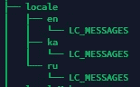
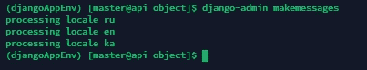
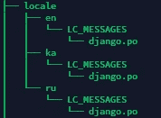
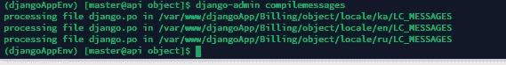
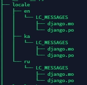
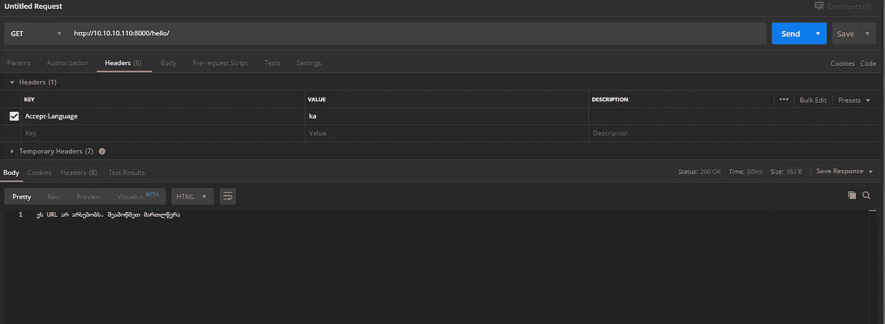

# Django 翻译工作示例

> 原文：<https://medium.com/analytics-vidhya/django-translations-working-example-70457372bd72?source=collection_archive---------5----------------------->


我在乔治亚州巴统市一家最大的公司做后端开发。

最近在工作中，我被要求在我的 Django 应用程序中提供翻译。我们希望用户阅读这 3 种语言:格鲁吉亚语，俄语，英语。我会写一本指南来帮你安装。随意添加更多的语言。
1)设置的第一步是从 Django.utils.translation 导入 settings.py
中的 gettext_lazy as _

我们将使用“_”(下划线)字符来标记可翻译的字符串。

2)接下来我们要做的是导入名为 ***LocaleMiddleware 的 Django 本地化中间件。*** 一定要遵循这个顺序，因为 localemiddleware 使用 sessionmiddleware，CommonMiddleware 也一样。
' django . contrib . sessions . middleware '，
' django . middleware . locale . localemiddleware '，
' django . middleware . common . common middleware '，

Django 开发者称这个过程为翻译激活

3)现在我们将在设置文件中添加一些变量，让 Django 知道我们将使用哪些语言

```
LANGUAGES = [
    ('ka', _('Georgian')),
    ('ru', _('Russian')),
    ('en', _('English')),
]

LANGUAGE_CODE = 'ka'

LOCALE_PATHS = (
    '/var/www/djangoApp/Billing/object/locale',
)
```

语言列表包含语言代码集及其名称，用“，”(逗号)分隔。
Language_code 变量包含首选语言代码。最后，我们添加 Locale_paths，它是 django-admin startapp 创建的应用程序内的文件夹。

4)确保在 app 的目录下创建此文件夹结构。



文件夹结构

这样，Django 将知道在哪里放置生成的。每种语言的 po 文件
PO 文件是一个基于文本的可移植对象文件。这些类型的文件通常在软件开发中使用。的。PO 文件可能被 Java 程序、GNU gettext 或其他软件程序作为属性文件引用。
Django 使用 gettext 与翻译 PO 和 mo 文件进行交互。

5)完成这些步骤后，我们将准备好要翻译的文件。我将展示一个端点

```
*def* hello_world(request):response_data = {'msg': _('This Url does not exist. Check spelling.')}
    *return* HttpResponse(response_data)
```

你可能已经注意到有 _('这个网址不存在。检查拼写。)
这个字符串是为翻译准备的。
为了让它工作，我们必须使用 Django-admin makemessages 命令生成翻译文件。



生成消息

姜戈创造了。每种语言的 po 文件。



。采购订单文件

让我们打开格鲁吉亚的。

```
*# SOME DESCRIPTIVE TITLE.
# Copyright (C) YEAR THE PACKAGE'S COPYRIGHT HOLDER
# This file is distributed under the same license as the PACKAGE package.
# FIRST AUTHOR <EMAIL@ADDRESS>, YEAR.
#
#, fuzzy 
msgid* ""
*msgstr* ""
"Project-Id-Version: PACKAGE VERSION\n"
"Report-Msgid-Bugs-To: \n"
"POT-Creation-Date: 2020-01-28 14:45+0400\n"
"PO-Revision-Date: YEAR-MO-DA HO:MI+ZONE\n"
"Last-Translator: FULL NAME <EMAIL@ADDRESS>\n"
"Language-Team: LANGUAGE <LL@li.org>\n"
"Language: \n"
"MIME-Version: 1.0\n"
"Content-Type: text/plain; charset=UTF-8\n"
"Content-Transfer-Encoding: 8bit\n"
"Plural-Forms: nplurals=2; plural=(n!=1);\n"

*#: views.py:4913
msgid* "This Url does not exist. Check spelling"
*msgstr* ""

*#: views.py:137
msgid* "Please add your authorisation token in header"
*msgstr* ""
```

正如你所看到的，Django 找到了一些翻译好的字符串并放在这里。采购订单文件。

**msgid** 下面是我们如何请求 **msgstr** —实际翻译的字符串。

确保您删除#模糊(第 7 行)从每。po 文件
“模糊”的意思是 django 应用程序正在增加对第二语言的支持。
现在翻译者可以将翻译后的字符串放在每个字符串的 msgstr 行中。在格鲁吉亚语中，应该是“ეს URL არ არსებობს.”შეამოწმეთ მართლწერა"

```
*#: views.py:4913
msgid* "This Url does not exist. Check spelling"
*msgstr* "ეს URL არ არსებობს. შეამოწმეთ მართლწერა"
```

6)现在我们可以使用 django-admin compilemessages 编译翻译。



django-管理编译消息

姜戈创造了。mo 文件，他用它来获得翻译后的字符串。MO 文件:MO 或机器对象是一个二进制数据文件，包含程序引用的对象数据。它通常用于翻译程序代码，并且可以加载或导入到 GNU gettext 程序中。



创建的文件

最后，让我们请求格鲁吉亚字符串。我们必须在请求头中添加
Accept-language 头。



给你

感谢阅读。也和我分享一些新员工。https://t.me/DevChro 电报组的:D
加入我的[讨论一些牛逼的工作人员](https://t.me/DevChro)