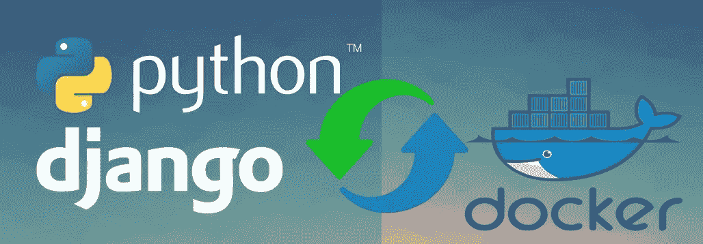
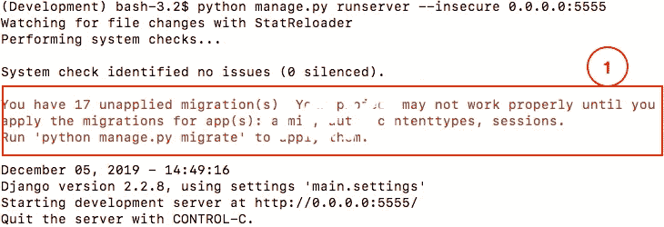
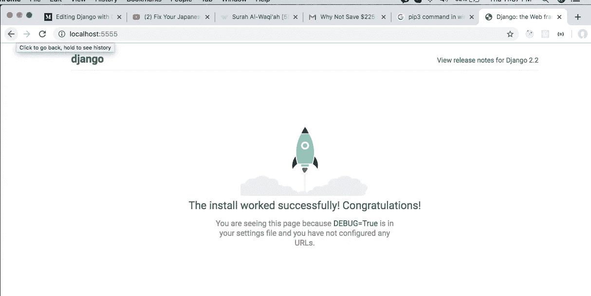
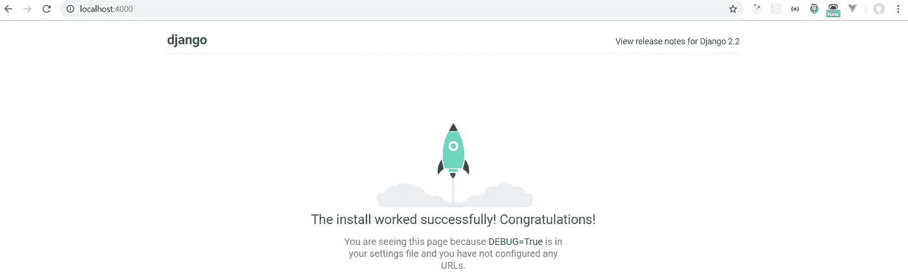

# Django 与 Docker 和 Docker Compose (Python 第 1 部分)

> 原文：<https://medium.com/analytics-vidhya/django-with-docker-and-docker-compose-python-part-1-da0ed3f61566?source=collection_archive---------3----------------------->



我写这篇文章的灵感来自于我尝试用 django 应用程序改变 docker 开发环境的经历。我会试着写一系列的文章，我会给你一些概念

1.  使用 docker 和 django 应用程序进行全栈开发
2.  用 Django 进行测试驱动开发
3.  自动部署数字海洋和自动气象站的 CI/CD 管道。

希望这篇文章能帮助那些对使用 docker 开发任何应用程序感到紧张的人。

**docker 是什么？**

Docker 是一个开源的自动化工具，它帮助我们将一个应用程序自动打包到一个容器中，容器中包含了运行应用程序所需的所有信息和依赖关系。它更灵活、更可移植、更资源友好、更独立于主机操作系统。

**什么是 django 框架？**

根据 django 文档定义，

“Django 是一个高级 Python Web 框架，它鼓励快速开发和干净、实用的设计。由经验丰富的开发人员构建，它解决了 Web 开发的许多麻烦，因此您可以专注于编写应用程序，而无需重新发明轮子。它是免费和开源的。”

构建开发环境的先决条件

```
**1\. python > 3.7
2\. pip3
3\. pipenv
4\. django 2.2
5\. Docker installed in (window or linux or mac os x)**
```

要将`pipenv`安装到开发环境中，我们需要遵循以下命令。

```
**For Mac OS x or Linux use this below command installed with python v3.7\. if the Mac OS x or Linux already has a python version 2\. You must use pip3 and python version 3 for django v2.2.****> pip3 install pipenv****For window use this command installed with python v3.7\. If you have version 2 installed in window pc. please use pip3 as default package manager.****> pip install pipenv**
```

创建文件夹名`**django-docker**`并通过。然后转到该文件夹或目录

```
**> mkdir django-docker
> cd django-docker**
```

在`**django-docker**`目录下创建另一个名为`**app**`的文件夹。然后去那个目录

```
**> mkdir app
> cd app**
```

然后用`**pipenv**`安装 Django (2.2.8)，使用 pipenv:

```
**> pipenv --python 3.7 install django==2.2.8**
```

***— python 3.7*** 的意思是，用 pipenv 创建虚拟环境时指定 python 版本。

然后，要激活虚拟环境，您需要在终端上运行以下命令

```
**> pipenv shell**
```

**Django** 已经作为包安装，你可以在`**Pipfile**`中找到定义。要创建 django 项目结构，您需要使用`**django-admin**`，并运行下面的命令来创建项目

```
**> django-admin startproject main .**
```

之后，您可以在您喜欢的代码编辑器或 IDE 中打开`**django-docker**`目录，我使用 vscode 作为本文的默认代码编辑器。你可以用你合适的。

创建文本文件`requirements.txt`到`app`文件夹，添加`Django==2.2.8`到文本文件。我使用来自`requirments.txt`文件构建时间用 django 构建 docker 映像和容器。

**requirements . txt**文件如下:

```
**#./django-docker/app/requirments.txt**
#Packages
**Django==2.2.8**
```

**项目结构为**

```
**└── app
    ├── main
    │   ├── __init__.py
    │   ├── settings.py
    │   ├── urls.py
    │   └── wsgi.py
    ├── manage.py
    └── requirements.txt
    └── Pipfile
    └── Pipfile.lock**
```

**每个生成的文件都是运行 django 项目的责任**

```
1. **__init__.py** (It tells the python, main is python module for this project and it's an empty file. so `main` will be access as python module)2\. **setting.py** (It contains all the configuration related to django project)3\. **urls.py** (It contains all the definition route information of every page of django application. it using for declare the url and route for each page of web application built with django)4\. **wsgi.py** (This file is use for run the application uwsgi supported server. we can use this file to configure gunicorn web server)5\. **manage.py** (It's an wizard for django application, to create app, module and views and manage migration, we will use this file)6\. **Pipfile** ( It's is a difination file where pip takes the meta information to download package and build, setup the python package(Django Application)
```

要运行项目，请转到终端或 cmd 来运行以下命令

```
**> python manage.py runserver --insecure 0.0.0.0:5555**
```



图 1.1 应用程序运行命令

***runserver*** 命令将运行 django 开发服务器。

***—不安全的*** 参数使 django 应用程序能够在本地开发环境中运行。并使用 static files 应用程序强制提供静态文件。

**0.0.0.0: <端口>** ，我们可以定义 django 开发服务器将服务于 django web 应用的端口。

我们可以看到图 1.1 中第(1)点的警告，该警告与数据库迁移有关。我们得到了警告，因为我们没有在运行应用程序之前迁移数据库。django 默认带有 sqlite 数据库，如果我们运行 migrate 命令，它会将所有数据和信息迁移到 sqlite 数据库。在本文的这一部分，我们现在不需要迁移。

所以我们可以…导航到浏览器，在浏览器中你会看到 django 欢迎页面。于是 django 成功安装在`pipenv`或者虚拟环境中。



图 1.2 django 应用程序成功运行

# 在 docker 中运行 Django 项目

**创建** `**Dockerfile**` **docker 文件**

首先，我们需要去根文件夹或目录的项目创建文件名`Dockerfile`。现在你对什么是 docker 文件有疑问了。

Docker 将通过读取来自`Dockerfile`的指令自动构建映像。它是一个文本文件，包含了所有组装成图像的命令。它包含必要的软件包，应用程序，命令和各种设置来创建 docker 镜像。为了对任何应用程序进行归档，我们需要在其中包含 dockerfile。

```
**From -->** *For build the docker image, From instraction must needed, because it will take the information from base image (OS base, other software package images) where to start building docker image.***WORKDIR -->** *It is used for switch to that directory for copy or add files or run some command in that directory in container. It also helps to create the new directory, which are used for building the image, copy the code and settings to it.***ENV -->** *It's use for environment variable of docker images. Docker image contains the lightweight operating system. we can push and override the environment variable from  calling it* **COPY -->** *Helps to copy the file from host machine to docker container.***ADD -->** *Helps to copy the file from host machine to docker image or container. It as like as copy instractions, it has extra functionality, it copy the file from remote also***RUN -->** *Run the command inside the docker image at image building time. It support valid operating system command.   executes command(s) in a new layer and creates a new image***CMD -->** *sets default command and/or parameters, which can be overwritten from command line when docker container runs***ENTRYPOINT -->** *used for configure the container that will run as an executable. We can add the multiple command shell file .sh file in entrypoint instructions. it will run* **EXPOSE -->** *It will help to expose the port for to in docker to access by other container or images. we also mapping with host computer port during run the docker container.*
```

下面是`Dockerfile`的格式:

```
# Comment
**INSTRUCTION** arguments
```

对于`django-docker`应用，我将`Dockerfile`添加到`app`目录:

```
django-docker
**└── app**
    ├── main
    │   ├── ......
   ** ├── Dockerfile**
```

`**Dockerfile**`以下为`django-docker`项目提供说明。出于开发目的，我使用***python:3 . 7 . 5-buster***作为构建 docker 映像和容器的基础映像。

```
**# ./django-docker/app/Dockerfile****FROM** python:3.7.5-buster**# set work directory**
**WORKDIR** /opt/app**# set environment variables**
**ENV** PYTHONDONTWRITEBYTECODE 1
**ENV** PYTHONUNBUFFERED 1**# install dependencies**
**RUN** pip install --upgrade pip
**COPY** ./requirements.txt /opt/app/requirements.txt 
**RUN** chmod +x /opt/app/requirements.txt
**RUN** pip install -r requirements.txt**# copy project**
**COPY** . /opt/app/
```

`**PYTHONDONTWRITEBYTECODE**`:防止 Python 将 pyc 文件写入光盘。`**PYTHONUNBUFFERED**`:防止 Python 缓冲 stdout 和 stderr。

# **将 Docker 合成添加到项目**

然后在`django-docker`目录下添加名为`docker-compose.yml`的 docker 合成文件。现在你对什么是 docker compose 以及为什么需要它有疑问了。根据`docs.docker.com.`中的 docker 编写文档

> Compose 是一个用于定义和运行多容器 Docker 应用程序或服务的工具。开发人员可以使用 YAML 文件来配置应用程序服务，只需一个命令，它就可以创建和启动所有服务，以从 yml 文件中获取信息。”

```
django-docker
└── app
│   ├── main
│      ├── ......
├── **docker-compose.yml**
```

我创建 docker compose yml 文件，下面提供了该文件的指令定义，以便为这个 web 应用程序项目创建`services and container`。

```
**#./django-docker/docker-compose.yml
version**: '3.7'

**services**:
  **web**:
    **build**:
         **context**: ./app 
         **dockerfile**: Dockerfile
    **command**: python manage.py runserver 0.0.0.0:8000
    **volumes**:
      - ./app/:/opt/app/
    **ports**:
      - 4000:8000
    **env_file**:
      - ./env/django.env
```

docker-compose 文件所有关键字的简单描述，这将在下面讨论，**如果您已经了解这些关键字或说明，请跳过该部分。**

```
**version**: contains docker compose file format version. There is several file format available form 1.x to 3.x.**services:** services blocks contains all the applications or services definition which is needed for run the applications successfully. for example if we want to run the web apps, we need a database and other services. so we can add multiple service or app definitions in services blocks.**web:** web is service for our django-docker project, docker compose build images or services with using name as **`web`** by docker-compose, which contains definition of django application to run and deploy.

     **services:
             web:
                build:****build:** there is a lot of option for build instruction. we can build image from another image. we can provide the target folder to build in `build` block. build has some sub blocks, those are

    **context:**  which will takes to a directory, which contains a Dockerfile, or a url to a git repository. where the value supplied with relative path, it will send to docker deamon to building process. ** build:
          context: ./<dir-name>** **dockerfile:** if we want to specify or use different docker file to build docker image by docker compose file. we need to use it.

     **build:
          context: ./<dir-name>
          dockerfile: <docker-filename>****command:** Run the command in docker container from the docker-compose.yml file. it can run any valid os and os application command inside the container.**volumes:** we can mount the specific host path or named volume to docker contains which contains the media files and other files needed for run the application. for my apps i have to mount the /app folder to container.**expose:** provide port access to docker system so other container can access the service by this port. expose only publish the port within docker system, so host computer service or app can not get this port to access service.**ports:** it use for mapping the ports between **HOST:DOCKERCONTAINER**. other docker container service and host computer service can get access to that port, to get service information. ** *if we run the our django application in 8000 port in DOCKERCONTAINER, we want to map 4000 port with host computer just follow the rules***
          ** ports:
               - HOST-PORT:DOCKERCONTAINER-PORT
           (e.g)
           ports:
               - 4000:8000****environment:** it will add and override the environment variable to docker container or image. which is then you can use it as environment variable to the specified docker container image.**env_file:** we can add environment variable file there. we can use it also define the or override the environment variable of the docker container or image. we can add the multiple env file in env_file block.
```

在`env`目录下为 docker 创建 env 文件。首先在`django-docker`目录下创建`env`目录。然后在`env`目录或文件夹中创建文件名`django.env`

```
**> mkdir env
> cd env**For Linux and max os x command
**> touch django.env**
For window you can create from IDE or code editor
```

env 文件的位置如下所示:

```
django-docker
└── app
│   ├── main
**├── env
│   ├── django.env**
```

`django-docker`图像和容器的环境文件

```
**# ./django-docker/env/django.env****SECRET_KEY**=FirstProjectSecrit 
**DEBUG**=1 
**ALLOWED_HOSTS**=localhost 127.0.0.1 [::1]
```

然后你需要在`main`项目文件夹中找到一些行并用下面的代码`settings.py`替换。

```
**#./app/main/setting.py****SECRET_KEY = os.environ.get("SECRET_KEY", default="forlocaltest")****DEBUG = int(os.environ.get("DEBUG", default=1))****ALLOWED_HOSTS = os.environ.get('ALLOWED_HOSTS').split(" ") if os.environ.get('ALLOWED_HOSTS') else ['localhost', '127.0.0.1']**
```

django 应用程序出于安全目的使用 SECRET_KEY = 。这用于提供加密签名，应该设置为唯一的、不可预测的值。使用已知的`**SECRET_KEY**`运行 Django 会破坏 Django 的许多安全保护，并可能导致权限提升和远程代码执行漏洞。

**DEBUG =** 在调试模式下运行应用程序，这样开发者可以在浏览器中浏览时发现错误。切勿在打开`**DEBUG**`的情况下将站点部署到生产环境中。当`Debug`是`True`时，就会出现异常，Django 会显示一个详细的回溯，包括很多关于你的环境的元数据，比如所有当前定义的 Django 设置。

**ALLOWED_HOSTS** =表示 Django 站点可以服务的主机/域名的字符串列表。

# os.environ 是做什么的？

> os.environ 是带有映射的 python 实用程序库，使用操作系统的用户环境变量设置对象。在上面，我创建了 env 文件，所以当应用程序在 docker 容器中运行时，env 文件中的 env 变量被添加到 docker 容器操作系统中。所以我们可以通过 os.environ 库使用 os.environ.get('env-variable ')函数获取 evn 环境变量数据。

使用 docker compose 构建 docker 映像的命令，它将构建映像并使用特定端口建立所有 docker 容器服务:

```
**> docker-compose up --build**
```

或者

您也可以运行下面的命令，它将构建所有服务或 docker 映像，并在后台运行服务 ***(-d 命令参数提供 docker 在后台运行服务的指令)*** ，因此我们在终端中看不到命令或日志信息。

```
**> docker-compose up --build -d**
```

进入浏览器并导航至 [http://localhost:4000/](http://localhost:8000/) 再次查看欢迎屏幕。



您在 github 资源库中找到的完整代码和资源

[](https://github.com/tariqulislam/django-docker.git) [## tariqulslam/django-docker

### 此时您不能执行该操作。您已使用另一个标签页或窗口登录。您已在另一个选项卡中注销，或者…

github.com](https://github.com/tariqulislam/django-docker.git)