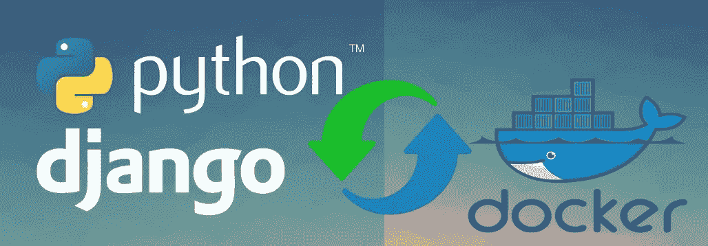

# Django 与 Docker 和 Docker Compose (Python 第 2 部分)

> 原文：<https://medium.com/analytics-vidhya/django-with-docker-and-docker-compose-python-part-2-8415976470cc?source=collection_archive---------3----------------------->



在文章的这一部分，介绍 docker composer 中的数据库服务。然后，我必须修改 Django 的一些配置，使项目与本地开发和 Docker 开发和部署兼容。展示本地环境和 Docker 环境的迁移过程。简要介绍 Django 交互式 Shell 以供开发使用。

文章系列的一部分

1.  [Django 与 Docker 和 Docker Compose (Python 第 1 部分)](/analytics-vidhya/django-with-docker-and-docker-compose-python-part-1-da0ed3f61566)

将被修改为连接的 PostgreSQL docker 服务的文件，其结构如下所示。

```
**django-docker
└──** app **│   ├── main 
│   │      ├── model.py
│   ├── docker-entrypoint.sh
│   ├── Dockerfile
└──** env **│   ├── django.env
│   ├── postgresql.env
└── docker-compose.yml**
```

检查模块的`main`在`setting.py`中是否在项目范围内可用，如果不可用，在`setting.py`文件中找到`INSTALLED_APPS`数组，像下面的代码片段那样添加它

```
# django-docker/app/main/setting.py**INSTALLED_APPS** = [
    'django.contrib.admin',
    'django.contrib.auth',
    'django.contrib.contenttypes',
    'django.contrib.sessions',
    'django.contrib.messages',
    'django.contrib.staticfiles',
    **'main',** ]
```

要将`django-docker` `web`服务连接到 Postgresql `db`服务，我们需要修改 docker 文件，如下所示，以添加`postgresql`依赖项。

```
**FROM** python:3.7.5-buster**# set up the psycopg2****# First RUN Statement: to install postgresql dependency****RUN** apt-get update && apt-get install -y **libpq-dev**  \
    ** gcc** \
     **postgresql-client****# Second RUN Statement: Install postgresql driver for django****RUN**pip install psycopg2==2.8.3**# Third RUN Statement: Remove the gcc compier after install the 
# driver****RUN** apt-get autoremove -y **gcc**
```

Dockerfile 中的"`FROM"`语句之后。添加上面提供的下列陈述。

**声明解释:**

第一个`RUN`指令，运行命令更新 docker 基本映像的存储库。然后安装 Postgresql 和 Postgresql-client 以及“gcc ”,作为设置 psycopg2 的依赖项。

第二条`RUN`指令安装了`psycopg2` PostgreSQL 驱动程序库，它将用于将 Django 应用程序连接到 PostgreSQL 服务器。

第三个`RUN`指令，解除`gcc`依赖，`gcc`的目的是完全完成`psycopg2`工艺库的构建。

**关于** `**env**` **文件？**

Env 文件用于配置应用程序和 docker 容器的外部化环境变量。这也有助于开发人员轻松地为不同用途的应用程序定义环境变量，以便在 docker 映像中运行应用程序。

**在** `**env**` **文件夹**中创建名为 `**postgresql.env**` **的 env 文件**

```
**# django-docker/env/postgresql.env****POSTGRES_USER=hello_django
POSTGRES_PASSWORD=hello_django
POSTGRES_DB=hello_django_dev**
```

**将与 Django 应用程序的 Postgresql 服务器连接相关的环境变量添加到** `**django.env**` **文件**

```
**# django-docker/env/django.env**DEBUG=1
SECRET_KEY=foo
DJANGO_ALLOWED_HOSTS=localhost 127.0.0.1 [::1]**# Environment Variable which is used in setting.py in django
# setting.py file to configure the database connection for
# application****SQL_ENGINE=django.db.backends.postgresql
SQL_DATABASE=django_docker
SQL_USER=django_docker
SQL_PASSWORD=django_docker
SQL_HOST=db
SQL_PORT=5432**
```

**重新配置** `**settings.py**` **文件中的** `**django-docker/app/main/settings.py**` **文件**

**图:配置 1.1**

*我已经在我文章的第一部分讨论过* `*os.environ*` *库了，这个库是 python 用来处理环境变量的。*

**什么是 docker 入口点 shell 文件？**

创建入口点外壳文件是为了在 docker 环境中的容器映像之后运行该命令。有时我们需要运行与应用程序配置、应用程序数据库迁移和应用程序状态检查相关的命令，创建调度程序来运行不同的任务，所有的指令我们都可以在入口点 shell 文件中声明，将那些入口点 shell 文件添加到“Dockerfile”中的“entry point”语句中。我们可以将多个入口点 sh (shell)文件作为数组格式添加到“ENTRYPOINT”语句中。

**创建** `**docker-entrypoint.sh**` **文件，用于在** `**django-docker**`开始之前做一些家务

第 3 行到第 8 行，用于在启动`django-docker`应用程序之前，刷新 Django 应用程序中任何先前未保存的`manage.py`命令。

在第 12 行到第 16 行，在`docker-container`中启动 Django 应用程序之前，用于迁移任何数据库更改的命令

在第 20 行中，exec“$ @”用于在手动访问 docker 映像或容器的容器后将其他命令作为参数。

**将这些行添加到 Dockerfile 文件的末尾**

```
**# django-docker/app/Dockerfile****# set the docker entry file****RUN chmod +x /opt/app/docker-entrypoint.sh
ENTRYPOINT [ "/opt/app/docker-entrypoint.sh" ]**
```

**修改** `**Dockerfile**` **后，最终的 docker 文件看起来像下面的一个**

**然后将** `**db**` **服务器添加到** `**docker-compose.yml**` **文件**

web 服务是如何工作的已经在前一篇文章中描述过了。你可以在我文章的第一部分找到它，下面，我只是讨论“db”服务如何与 docker-compose 一起工作

```
**volumes:
   postgres_data:
      driver: local****--------------------------------------------------------------------
Specify the  `postgres_data` volume use the local driver for mount in docker container 
--------------------------------------------------------------------**
```

docker-compose 文件中的服务部分。

```
**db:
  image: postgres:12.0-alpine
  volumes:
     - postgres_data:/var/postgres/data/
  env_file:
     - ./env/postgresql.env****--------------------------------------------------------------------
This difination means, db service use the base image as `postgres:12.0-alpine` image, using the `postgres_data` as volumne to save information and data of the server. using the `./env/postgresql.env` file to load the environment variable for configure the postgresql database.
--------------------------------------------------------------------**
```

**关于 Django 与本地环境和 Docker 容器的迁移和迁移过程**

我在创建迁移之前创建了`Company`模型，并将模型迁移到数据库中

我继承了`django.db`库`model`类来创建`Company`模型。班级。在`Meta`嵌套类中，我们可以定义与模型相关的不同`meta`信息，例如

`ordering`用于指定字段名的数组，你必须使用哪些字段进行排序。

`table_name`，指定您想要用于此模型的`database`的表名。

```
**def __str__(self):
    return self.name**
```

***这个函数是帮助返回***`***name***`*`***object***`***的模型的，如果我们想用 python 代码记录并打印对象名来我们需要这个函数。对于 Django 模板，如果我们想打印模型的对象名称，只需指定对象，我们就需要这个*** `***__str__"***` ***函数。****

***备注:***

*出于迁移的目的，我们需要使用本地环境，这是我用 pipenv 构建的，因为如果我们想要迁移一个新的模型或者更新 web 应用程序的一些字段，有时它会通过运行`**docker-compose up — build**`命令为构建映像创建一个新的自动迁移。并且自动迁移文件在主机的本地代码库中不可用。因此，在构建 docker 映像的过程中，它会在 docker 容器中产生错误。*

***为了简单起见，我在** `**settings.py**` [**处重新配置了代码。图:Config 1.1**](https://gist.github.com/tariqulislam/437938e351d9d225f8c883459d226573) **，这里我指定，在本地 pipenv 环境中，使用** `**sqlite3**` **作为数据库进行迁移。对于 docker 环境，使用 Postgresql 数据库进行迁移。***

*要创建迁移，迁移命令如下所示*

```
***> python manage.py makemigrations [module_name]***
```

*我在主模块中创建模型，因此迁移命令如下所示*

```
***> python manage.py makemigrations main***
```

*完成该命令后，文件夹结构将如下所示*

```
*django-docker **└──** app│   ├── main **
│   │      ├── migrations
│   │      │     ├── __inti__.py
│   │      │     ├── 0001_initial.py***
```

*该命令在`main`文件夹中自动生成，`migrations`文件夹包含`0001__initial.py`迁移文件，该文件包含`Company` `model`数据库中`company`表的`create`命令的所有`ddl`。*

*最后，使用下面的命令将模型迁移到数据库中*

```
***> python manage.py migrate***
```

***然后运行命令，通过使用** `**docker-compose**`在 `**docker**` **中构建应用程序***

```
***> docker-compose up --build***
```

# *检查`django` web 服务是否与`postgresql` web 服务连接*

***检查** `**django-docker**` **项目是否连接了** `**sqlite3**` **数据库中的本地环境***

*转到`app`目录，然后运行以下命令*

```
***> python manage.py shell***
```

*现在，您可以使用 Django 登录到项目的交互式 shell。然后运行下面的命令*

```
***To save the Company into database****>>> from main.models import Company
>>> company = Company()
>>> company.name = "New-Company-One"
>>> company.address = "new company address"
>>> company.country = "Japan"
>>> company.city = "Tokyo"
>>> company.save()****To Get Data from database****>>> Company.objects.all()
<QuerySet [<Company: New-Company-One>]>****To Exit the interactive shell****>>> exit()***
```

***检查** `**django-docker**` **一个容器从** `**django shell**`连接到 `**postgresql**` **数据库服务***

*您已经通过以下命令关闭了 docker 服务器*

```
***> docker-compose down****> docker-compose up --build -d***
```

*然后运行 Django 交互式 shell，从终端运行下面的命令*

```
***> docker-compose exec web /bin/bash***
```

*你现在在 Django docker 容器的外壳中*

```
***root@<image-no>:/opt/app# python manage.py shell***
```

*现在，您可以使用 DJANGO 登录到项目的交互式 shell。然后运行下面的命令*

```
***TO save the Company into database****>>> from main.models import Company
>>> company = Company()
>>> company.name = "New-Company-two"
>>> company.address = "new company address two"
>>> company.country = "Bangladesh"
>>> company.city = "Bangladesh"
>>> company.save()****To Get Data from database****>>> Company.objects.all()
<QuerySet [<Company: New-Company-two>]>****To Exit the interactive shell****>>> exit()***
```

***您需要在 docker 容器**中运行一次后刷新命令*

```
***> python manage.py flush --no-input****# Use exit to logout from docker container bash****> exit***
```

# ***你可以在 GitHub repositor 的“特性/自动迁移”分支**中找到完整的代码库*

*通过 git 克隆存储库*

1.  *git 克隆[https://github.com/tariqulislam/django-docker.git](https://github.com/tariqulislam/django-docker.git)*
2.  *签出到分支“git 签出[特性/自动化迁移](https://github.com/tariqulislam/django-docker/tree/feature/automated-migration)*

*[](https://github.com/tariqulislam/django-docker.git) [## tariqulslam/django-docker

### 此时您不能执行该操作。您已使用另一个标签页或窗口登录。您已在另一个选项卡中注销，或者…

github.com](https://github.com/tariqulislam/django-docker.git)*