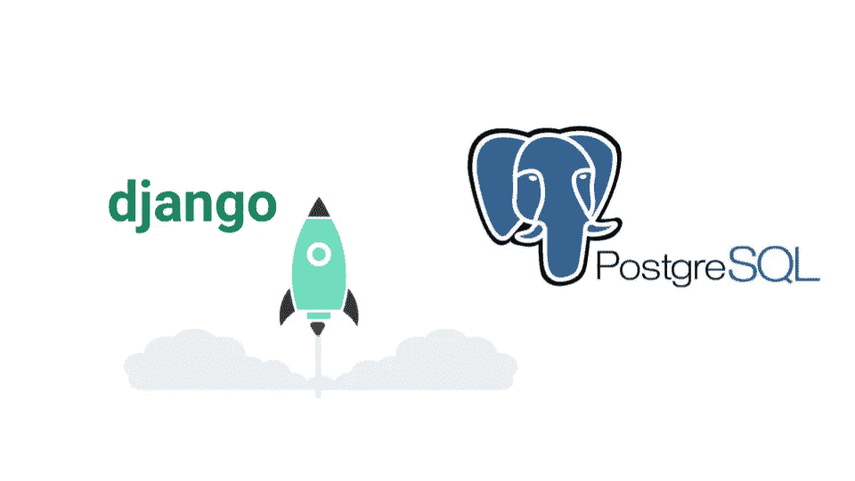

# Django 与 PostgreSQL

> 原文：<https://medium.com/analytics-vidhya/django-with-postgresql-34092de124ab?source=collection_archive---------15----------------------->



这是利用 PostgreSQL 作为数据库解决方案安装 Django 的实用指南。

关于 Django 安装步骤的详细指南，你也可以在 Django 网站上阅读官方文档:[https://docs.djangoproject.com/en/3.1/intro/install/](https://docs.djangoproject.com/en/3.1/intro/install/)

# 安装 PostgreSQL

首先，让我们用常用的快捷键 CTRL+ALT+T 打开一个新的终端会话。

然后只需粘贴以下代码:

```
# Create the file repository configuration:
**sudo sh -c 'echo "deb http://apt.postgresql.org/pub/repos/apt $(lsb_release -cs)-pgdg main" > /etc/apt/sources.list.d/pgdg.list'**# Import the repository signing key:
**wget --quiet -O - https://www.postgresql.org/media/keys/ACCC4CF8.asc | sudo apt-key add -**# Update the package lists:
**sudo apt-get update**#Install the latest version of PostgreSQL.
# If you want a specific version, use 'postgresql-12' or similar instead of 'postgresql':
**sudo apt-get -y install postgresql**
```

安装后，使用以下命令登录数据库:

```
**sudo -u postgres psql**
```

好的，没错！现在您已经登录，只需:

*   创建数据库；
*   创建一个用户帐户，让它成为“Django 友好的”；
*   授予用户访问数据库的特权。

```
# create database
**CREATE DATABASE your-project-name;**# create user
**CREATE USER your-username WITH PASSWORD 'your-password';**# change user settings to be more "Django-friendly"
**ALTER ROLE your-username SET client_encoding TO 'utf8';****ALTER ROLE your-username SET default_transaction_isolation TO 'read committed';****ALTER ROLE your-username SET timezone TO 'UTC';**# grant the user all the privileges on database
**GRANT ALL PRIVILEGES ON DATABASE your-project-name TO your-username;**
```

设置 PostgreSQL 数据库的工作已经完成。退出即可:

```
**\q**
```

然后使用以下命令关闭终端会话:

```
**EXIT**
```

# 安装虚拟环境

总是建议在虚拟环境中安装 Django。我强烈建议你去做。顺便说一下，最后这是你的项目，所以… ***如果你想改变你的全球环境，你可以跳到本教程的下一步。***

所以这里的第一步是安装 python3 venv 包(假设你已经安装了 python3)

```
# Install virtualenv **sudo apt-get install python3-venv**
```

安装完成后，只需为您的项目创建一个新环境

```
# create your virtual environment **python3 -m venv your-project-name_env**
```

如果您想利用所有已安装的软件包，请记住总是稍后启动您的虚拟环境。

```
# activate your virtual environment **source /home/your-username/your-project-name_env/bin/activate**
```

现在，您应该在用户名前的括号中看到(您的项目名称环境)。大概是这样的:

```
(your-project_env) your-username@your-machine:~$
```

# 安装 Django

```
# install Django **sudo apt install python3-django**
```

Django 项目的默认数据库是 SQLite，这对于测试来说很好，但对于生产模式来说不是最佳选择。

为了让 PostgreSQL 与 Django 配合使用，您需要安装 **pyscopg2** 包(参见 Django 文档以获取更多信息:[https://docs . Django project . com/en/3.1/topics/install/# database-installation](https://docs.djangoproject.com/en/3.1/topics/install/#database-installation))

```
# install pyscopg2 package**sudo apt install python3-dev libpq-dev
pip install psycopg2**
```

使用以下命令检查安装:

```
# check Django version **python3 -m django –version**
```

现在 Django 已经安装好了，是时候创建自己的全新 Django 项目了:

```
# create Django project **django-admin startproject your-project-name**
```

现在移动到项目文件夹(如果你想知道所有文件的意思，去 Django 文档:[https://docs.djangoproject.com/en/3.1/intro/tutorial01/](https://docs.djangoproject.com/en/3.1/intro/tutorial01/))。

并使用以下命令运行 Django 服务器:

```
# run django server **python3 manage.py runserver**
```

如果您点击终端中的链接或复制并粘贴 [http://127.0.0.1:8000/](http://127.0.0.1:8000/) 您应该会看到以下内容:


# 将 Django 连接到 PostgreSQL

我们已经接近本教程的结尾了！前方最后一步！

转到您之前创建的 Django 项目文件夹:

```
# open django project folder**:
cd path/to/your-django-project**# browse the files (you should find something like this):
**db.sqlite3  your-project-name  manage.py**# go to the sub-folder your-project-name:
**asgi.py  __init__.py  __pycache__  settings.py  urls.py  wsgi.py**
```

打开名为 **settings.py** 的文件:

滚动到数据库部分(你也可以用 CRTL+F 找到它),用你的数据库信息修改它:

```
DATABASES = {
    'default': {
        'ENGINE': 'django.db.backends.postgresql_psycopg2',
        'NAME': 'your-project-name',
        'USER': 'your-postgresql-username',
        'PASSWORD': 'your-postgresql-password',
        'HOST': 'localhost',
        'PORT': '',
    }
} 
```

将数据库更改迁移到 PostgreSQL 并运行 Django 服务器，一切都将正常工作！

```
# apply database changes **python3 manage.py migrate**# start server **python3 manage.py runserver**
```

给你！！！恭喜你。